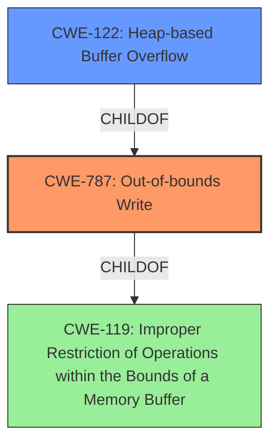

# Enhanced Analysis for CVE-2021-45940

# Summary
| CWE ID | CWE Name | Confidence | CWE Abstraction Level | CWE Vulnerability Mapping Label | CWE-Vulnerability Mapping Notes |
|---|---|---|---|---|---|
| CWE-787 | Out-of-bounds Write | 1.0 | Base | Allowed | Primary CWE |
| CWE-122 | Heap-based Buffer Overflow | 0.7 | Variant | Allowed | Secondary Candidate |
| CWE-119 | Improper Restriction of Operations within the Bounds of a Memory Buffer | 0.5 | Class | Discouraged | Secondary Candidate |

## Evidence and Confidence

*   **Confidence Score:** 0.9
*   **Evidence Strength:** HIGH

## Relationship Analysis
The primary CWE is CWE-787 **(Out-of-bounds Write)**, which is a base-level CWE. The vulnerability description explicitly mentions a **heap-based buffer overflow**, making CWE-122 **(Heap-based Buffer Overflow)** a strong secondary candidate as it is a variant of CWE-787. CWE-119 **(Improper Restriction of Operations within the Bounds of a Memory Buffer)** is a class-level CWE and a parent of both CWE-787 and CWE-122, but it is less specific. The relationships are as follows:



## Vulnerability Chain
The vulnerability chain starts with the **heap-based buffer overflow** in `__bpf_object__open`. This leads to an **out-of-bounds write**, which can corrupt memory and potentially lead to code execution or a denial of service.

## Summary of Analysis
The analysis is based on the vulnerability description, which clearly states a **heap-based buffer overflow** in libbpf 0.6.0 and 0.6.1. The CVE Reference Links Content Summary confirms this, stating the root cause as a "Heap-buffer-overflow in `__bpf_object__open`" and "A heap-buffer-overflow write of 4 bytes can be triggered." The primary CWE, CWE-787 **(Out-of-bounds Write)**, accurately describes the underlying weakness. While CWE-122 **(Heap-based Buffer Overflow)** is a more specific variant, CWE-787 is chosen as the primary because the description explicitly states an **out-of-bounds write**.

CWE-119 **(Improper Restriction of Operations within the Bounds of a Memory Buffer)** was considered but not chosen as the primary CWE because it is a higher-level class and less specific than CWE-787. The MITRE mapping guidance discourages the use of CWE-119 when more specific CWEs are available.

The selected CWEs are at the optimal level of specificity, with CWE-787 describing the core issue and CWE-122 providing additional context about the memory allocation location.

Relevant CWE Information:

# Enhanced Context (25 CWEs)
The following CWEs were identified as potentially relevant to this vulnerability:

## CWE-124: Buffer Underwrite ('Buffer Underflow')
**Abstraction Level**: Base
**Similarity Score**: 0.77
**Source**: dense

**Description**:
The product writes to a buffer using an index or pointer that references a memory location prior to the beginning of the buffer.
**NOT USED:** This is not the case since the description states there is a buffer overflow and not a buffer underflow.

## CWE-191: Integer Underflow (Wrap or Wraparound)
**Abstraction Level**: Base
**Similarity Score**: 0.77
**Source**: dense

**Description**:
The product subtracts one value from another, such that the result is less than the minimum allowable integer value, which produces a value that is not equal to the correct result.
**NOT USED:** This is not the case since the description states there is a buffer overflow and not an integer underflow.

## CWE-131: Incorrect Calculation of Buffer Size
**Abstraction Level**: Base
**Similarity Score**: 0.77
**Source**: dense

**Description**:
The product does not correctly calculate the size to be used when allocating a buffer, which could lead to a buffer overflow.
**NOT USED:** There is no information in the description to suggest that the buffer size was incorrectly calculated.

## CWE-126: Buffer Over-read
**Abstraction Level**: Variant
**Similarity Score**: 0.76
**Source**: dense

**Description**:
The product reads from a buffer using buffer access mechanisms such as indexes or pointers that reference memory locations after the targeted buffer.
**NOT USED:** This is not the case since the description states there is a buffer overflow and not a buffer over-read.

## CWE-805: Buffer Access with Incorrect Length Value
**Abstraction Level**: Base
**Similarity Score**: 0.75
**Source**: dense

**Description**:
The product uses a sequential operation to read or write a buffer, but it uses an incorrect length value that causes it to access memory that is outside of the bounds of the buffer.
**NOT USED:** This is not the case since the description states there is a buffer overflow and not a buffer access with incorrect length value.

## CWE-125: Out-of-bounds Read
**Abstraction Level**: Base
**Similarity Score**: 0.75
**Source**: dense

**Description**:
The product reads data past the end, or before the beginning, of the intended buffer.
**NOT USED:** This is not the case since the description states there is a buffer overflow and not a buffer out-of-bounds read.

## CWE-680: Integer Overflow to Buffer Overflow
**Abstraction Level**: Compound
**Similarity Score**: 0.74
**Source**: dense

**Description**:
The product performs a calculation to determine how much memory to allocate, but an integer overflow can occur that causes less memory to be allocated than expected, leading to a buffer overflow.
**NOT USED:** There is no information in the description to suggest that an integer overflow caused a buffer overflow.

## CWE-193: Off-by-one Error
**Abstraction Level**: Base
**Similarity Score**: 0.74
**Source**: dense

**Description**:
A product calculates or uses an incorrect maximum or minimum value that is 1 more, or 1 less, than the correct value.
**NOT USED:** There is no information in the description to suggest that an off-by-one error caused the buffer overflow.

## CWE-127: Buffer Under-read
**Abstraction Level**: Variant
**Similarity Score**: 0.74
**Source**: dense

**Description**:
The product reads from a buffer using buffer access mechanisms such as indexes or pointers that reference memory locations prior to the targeted buffer.
**NOT USED:** This is not the case since the description states there is a buffer overflow and not a buffer under-read.

## CWE-190: Integer Overflow or Wraparound
**Abstraction Level**: Base
**Similarity Score**: 0.74
**Source**: dense

**Description**:
The product performs a calculation that can
         produce an integer overflow or wraparound when the logic
         assumes that the resulting value will always be larger than
         the original value. This occurs when an integer value is
         incremented to a value that is too large to store in the
         associated representation. When this occurs, the value may
         become a very small or negative number.
**NOT USED:** This is not the case since the description states there is a buffer overflow and not an integer overflow.

## CWE-190: Integer Overflow or Wraparound
**Abstraction Level**: Base
**Similarity Score**: 6102.31
**Source**: sparse

**Description**:
The product performs a calculation that can
         produce an integer overflow or wraparound when the logic
         assumes that the resulting value will always be larger than
         the original value. This occurs when an integer value is
         incremented to a value that is too large to store in the
         associated representation. When this occurs, the value may
         become a very small or negative number.
**NOT USED:** This is not the case since the description states there is a buffer overflow and not an integer overflow.

## CWE-125: Out-of-bounds Read
**Abstraction Level**: Base
**Similarity Score**: 5775.13
**Source**: sparse

**Description**:
The product reads data past the end, or before the beginning, of the intended buffer.
**NOT USED:** This is not the case since


## CWE Relationship Analysis

Current CWEs represent these abstraction levels: .


### Vulnerability Chain Analysis

**Chain starting from CWE-131:**
- 131 (Incorrect Calculation of Buffer Size) - ROOT


**Chain starting from CWE-190:**
- 190 (Integer Overflow or Wraparound) - ROOT


### CWE Relationship Diagram

```mermaid
graph TD
    classDef primary fill:#f96,stroke:#333,stroke-width:2px
    classDef secondary fill:#69f,stroke:#333
    classDef tertiary fill:#9e9,stroke:#333
```