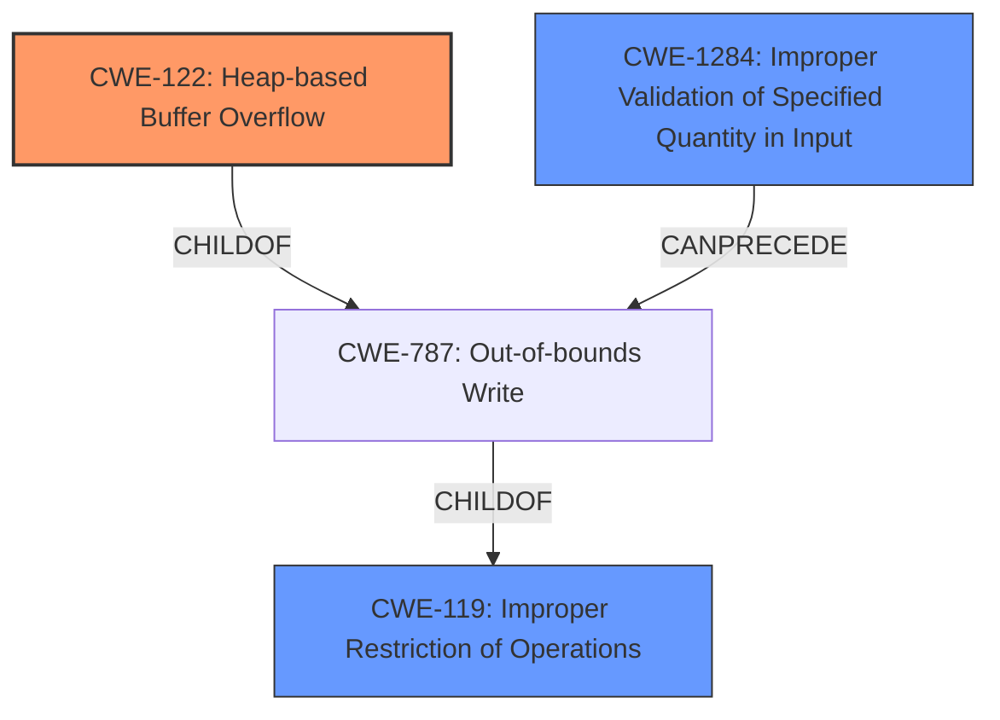

# Analysis for CVE-2021-45942

# Summary
| CWE ID | CWE Name | Confidence | CWE Abstraction Level | CWE Vulnerability Mapping Label | CWE-Vulnerability Mapping Notes |
|---|---|---|---|---|---|
| CWE-122 | Heap-based Buffer Overflow | 1.0 | Variant | Allowed | Primary CWE |
| CWE-119 | Improper Restriction of Operations within the Bounds of a Memory Buffer | 0.7 | Class | Discouraged | Secondary Candidate |
| CWE-1284 | Improper Validation of Specified Quantity in Input | 0.6 | Base | Allowed | Secondary Candidate |

## Evidence and Confidence

*   **Confidence Score:** 0.8
*   **Evidence Strength:** HIGH

## Relationship Analysis
The primary CWE, CWE-122, is a variant of CWE-787 (Out-of-bounds Write), which in turn is a child of CWE-119 (Improper Restriction of Operations within the Bounds of a Memory Buffer). This hierarchical relationship indicates that CWE-122 is a more specific case of a general buffer handling issue. CWE-1284 (Improper Validation of Specified Quantity in Input) can precede CWE-787, indicating a potential chain where **improper input validation** leads to an **out-of-bounds write**. This relationship helped refine the analysis to include the **missing input validation** as a contributing factor.

## Vulnerability Chain
The vulnerability chain starts with **missing input validation** (potentially CWE-1284), which leads to a **heap-based buffer overflow** (CWE-122) during the image processing. The final impact is a denial of service, and potentially arbitrary code execution.

## Summary of Analysis
The initial analysis identified a **heap-based buffer overflow**. The supporting evidence explicitly states: "The vulnerability is a **heap-based buffer overflow** that exists in the `Imf_3_1::LineCompositeTask::execute` function" and "The lack of proper input validation allows an attacker to provide a specially crafted EXR file where the sampling is not 1, which leads to writing data beyond the allocated buffer".

The retriever results also suggested CWE-119, CWE-190, CWE-126, CWE-125, and CWE-129 as potential matches. However, the explicit mention of "heap-based" makes CWE-122 the most specific and accurate choice. Further analysis of the CVE Reference Links Content Summary indicated **missing input validation** of the `xSampling` and `ySampling` values, suggesting CWE-1284 could be a contributing factor.

The graph relationships reinforced the selection of CWE-122 as the primary weakness, and the potential role of **improper input validation** (CWE-1284) in leading to the buffer overflow. The selected CWEs are at the optimal level of specificity, with CWE-122 being a variant that clearly describes the type of buffer overflow.

Relevant CWE Information:

# Enhanced Context (25 CWEs)
The following CWEs were identified as potentially relevant to this vulnerability:

## CWE-122: Heap-based Buffer Overflow
**Abstraction:** Variant
**Similarity Score**: 0.203
**Source**: sparse

**Description**:
A heap overflow condition is a buffer overflow, where the buffer that can be overwritten is allocated in the heap portion of memory, generally meaning that the buffer was allocated using a routine such as malloc().

**Mapping Guidance**:
- Usage: Allowed
- Rationale: This CWE entry is at the Variant level of abstraction, which is a preferred level of abstraction for mapping to the root causes of vulnerabilities.

### Technical Explanation for Selected CWEs:

*   **CWE-122: Heap-based Buffer Overflow**
    *   How the vulnerability's details match the CWE's characteristics: The vulnerability is explicitly described as a heap-based buffer overflow. This aligns perfectly with CWE-122's definition, where the overflow occurs in memory allocated on the heap. The vulnerability allows writing data beyond the allocated buffer, leading to memory corruption.
    *   The security implications and potential impact: A heap-based buffer overflow can lead to denial of service (application crash) and potentially arbitrary code execution if exploited successfully.
    *   Any parent-child relationships or chain patterns that influenced your mapping: CWE-122 is a variant of CWE-787 (Out-of-bounds Write), which is a child of CWE-119 (Improper Restriction of Operations within the Bounds of a Memory Buffer). This hierarchy indicates that CWE-122 is a specific type of buffer overflow.
    *   Whether the weakness is primary or secondary in the vulnerability: This is the primary weakness, as it is the direct cause of the vulnerability.
    *   How the official MITRE mapping guidance influenced your decision: The MITRE mapping guidance allows the use of CWE-122, as it is at the Variant level of abstraction.
*   **CWE-119: Improper Restriction of Operations within the Bounds of a Memory Buffer**
    *   How the vulnerability's details match the CWE's characteristics: While the vulnerability is specifically a heap-based buffer overflow (CWE-122), CWE-119 represents the more general class of buffer handling issues. The **lack of proper input validation** ultimately leads to operations outside the intended buffer boundaries.
    *   The security implications and potential impact: The impact is the same as CWE-122, but at a higher abstraction level.
    *   Any parent-child relationships or chain patterns that influenced your mapping: CWE-119 is a parent of CWE-787, indicating a general buffer handling issue.
    *   Whether the weakness is primary or secondary in the vulnerability: This is a secondary candidate, representing the broader class of the weakness.
    *   How the official MITRE mapping guidance influenced your decision: The MITRE mapping guidance discourages the use of CWE-119 when more specific CWEs are available. Since CWE-122 provides a more precise classification, CWE-119 is a secondary consideration.
*   **CWE-1284: Improper Validation of Specified Quantity in Input**
    *   How the vulnerability's details match the CWE's characteristics: The CVE Reference Links Content Summary states "The vulnerability occurs when the `CompositeDeepScanLine::setFrameBuffer` method doesn't properly validate the `xSampling` and `ySampling` values". This aligns with CWE-1284 which describes situations where input specifying a quantity is not validated. In this case the sampling values are the quantities that are not validated.
    *   The security implications and potential impact: The impact of **improper validation** is a heap buffer overflow if the other conditions are met.
    *   Any parent-child relationships or chain patterns that influenced your mapping: CWE-1284 can precede CWE-787 (out-of-bounds write). This can be visualized as an attack chain.
    *   Whether the weakness is primary or secondary in the vulnerability: This is a secondary candidate, the root cause that can lead to the heap buffer overflow (CWE-122).
    *   How the official MITRE mapping guidance influenced your decision: The MITRE mapping guidance allows the use of CWE-1284, as it is at the Base level of abstraction.

### Considered but not used:

*   **CWE-190: Integer Overflow or Wraparound:** While integer overflows can sometimes lead to buffer overflows, there is no direct evidence of an integer overflow in the provided vulnerability description.
*   **CWE-126: Buffer Over-read and CWE-125: Out-of-bounds Read:** The vulnerability is described as a buffer overflow (write), not a read.
*   **CWE-129: Improper Validation of Array Index:** While the vulnerability involves **improper validation**, it's not specifically related to array indices.
*   **CWE-193: Off-by-one Error:** There's no direct indication of an off-by-one error in the description.
*   **CWE-121: Stack-based Buffer Overflow:** The vulnerability is explicitly described as heap-based, not stack-based.
*   **CWE-131: Incorrect Calculation of Buffer Size:** There is no evidence in the description of an incorrect buffer calculation, only that input values

# Enhanced Query for CVE-2021-45942

## Vulnerability Description
OpenEXR 3.1.x before 3.1.4 has a **heap-based buffer overflow** in Imf_3_1LineCompositeTaskexecute (called from IlmThread_3_1NullThreadPoolProvideraddTask and IlmThread_3_1ThreadPooladdGlobalTask). NOTE db217f2 may be inapplicable.

### Vulnerability Description Key Phrases
- **weakness:** **heap-based buffer overflow**
- **product:** OpenEXR
- **version:** 3.1.x before 3.1.4
- **component:** Imf_3_1LineCompositeTaskexecute

## CVE Reference Links Content Summary
Based on the provided information, here's an analysis of CVE-2021-45942:

**Root Cause of Vulnerability:**
The vulnerability is a heap-based buffer overflow that exists in the `Imf_3_1::LineCompositeTask::execute` function within the OpenEXR library. This function is responsible for compositing deep scanline images. The vulnerability occurs when the `CompositeDeepScanLine::setFrameBuffer` method doesn't properly validate the `xSampling` and `ySampling` values of the input `FrameBuffer`. Specifically it assumes these must be equal to 1.

**Weaknesses/Vulnerabilities Present:**
- Heap-based buffer overflow: The lack of proper input validation allows an attacker to provide a specially crafted EXR file where the sampling is not 1, which leads to writing data beyond the allocated buffer in `Imf_3_1::LineCompositeTask::execute`.
- Missing input validation: The `CompositeDeepScanLine::setFrameBuffer` method fails to enforce the requirement that the FrameBuffer passed to it should have xSampling and ySampling set to 1.

**Impact of Exploitation:**
- Denial of Service (DoS): The buffer overflow can lead to a crash of the application processing the crafted OpenEXR file.
- Potential Arbitrary Code Execution: While not explicitly stated, a heap-based buffer overflow can potentially lead to arbitrary code execution if exploited carefully by an attacker.

**Attack Vectors:**
- Maliciously crafted OpenEXR files: An attacker can create a specially crafted EXR image file that triggers the vulnerability when opened by a vulnerable application or library.
- The vulnerability is present when reading deep scanline images with chroma subsampling. Specifically, files that have "Y" and "BY" channels, both with sampling set to 1, and the RgbaInputFile API composites the deep data to a regular scanline image, then attempts a FromYCA conversion, which requires "BY" and "RY" have sampling set to 2.

**Required Attacker Capabilities/Position:**
- Ability to create or modify EXR files.
- The attacker needs to be able to pass this malicious file to a vulnerable application for processing. This may be achieved through various means like file uploads, or processing in a server backend.

**Additional Details:**
- The vulnerability was discovered through OSS-Fuzz, a Google project that uses fuzzing to find bugs in software.
- The fix involves adding a check in  `CompositeDeepScanLine::setFrameBuffer` method to ensure that  `xSampling` and `ySampling` are both equal to 1.
- The fix was included in OpenEXR version 3.1.4.
- The vulnerability affects applications that use OpenEXR to process deep scanline images using the RgbaInputFile API or similar functionality.
- There are reports of the fix being backported to older versions of OpenEXR (e.g. 2.5.5-6.fc34 for Fedora 34).
- A related commit,  [db217f2](https://github.com/AcademySoftwareFoundation/openexr/commit/db217f29dfb24f6b4b5100c24ac5e7490e1c57d0), addresses a similar vulnerability by improving chunk size handling in `ImfDeepScanLineInputFile.cpp`. While not directly related to CVE-2021-45942, it does highlight an additional area of concern for buffer overflow vulnerabilities when processing OpenEXR files.

## Retriever Results

### Top Combined Results

| Rank | CWE ID | Name | Abstraction | Usage  | Retrievers | Individual Scores |
|------|--------|------|-------------|-------|------------|-------------------|
| 1 | 119 | Improper Restriction of Operations within the Bounds of a Memory Buffer | Class | Discouraged | alternate_terms | 0.800 |
| 2 | 190 | Integer Overflow or Wraparound | Base | Allowed | alternate_terms | 0.800 |
| 3 | 122 | Heap-based Buffer Overflow | Variant | Allowed | sparse | 0.203 |
| 4 | 126 | Buffer Over-read | Variant | Allowed | sparse | 0.171 |
| 5 | 125 | Out-of-bounds Read | Base | Allowed | sparse | 0.169 |
| 6 | 129 | Improper Validation of Array Index | Variant | Allowed | dense | 0.544 |
| 7 | 128 | Wrap-around Error | Base | Allowed | graph | 0.003 |
| 8 | 193 | Off-by-one Error | Base | Allowed | sparse | 0.164 |
| 9 | 1284 | Improper Validation of Specified Quantity in Input | Base | Allowed | sparse | 0.162 |
| 10 | 121 | Stack-based Buffer Overflow | Variant | Allowed | sparse | 0.159 |

# Complete CWE Specifications

## CWE-119: Improper Restriction of Operations within the Bounds of a Memory Buffer
**Abstraction:** Class
**Status:** Stable

### Description
The product performs operations on a memory buffer, but it reads from or writes to a memory location outside the buffer's intended boundary. This may result in read or write operations on unexpected memory locations that could be linked to other variables, data structures, or internal program data.

### Extended Description
Not provided

### Alternative Terms
Buffer Overflow: This term has many different meanings to different audiences. From a CWE mapping perspective, this term should be avoided where possible. Some researchers, developers, and tools intend for it to mean "write past the end of a buffer," whereas others use the same term to mean "any read or write outside the boundaries of a buffer, whether before the beginning of the buffer or after the end of the buffer." Others could mean "any action after the end of a buffer, whether it is a read or write." Since the term is commonly used for exploitation and for vulnerabilities, it further confuses things.
buffer overrun: Some prominent vendors and researchers use the term "buffer overrun," but most people use "buffer overflow." See the alternate term for "buffer overflow" for context.
memory safety: Generally used for techniques that avoid weaknesses related to memory access, such as those identified by CWE-119 and its descendants. However, the term is not formal, and there is likely disagreement between practitioners as to which weaknesses are implicitly covered by the "memory safety" term.

### Relationships
ChildOf -> CWE-118
ChildOf -> CWE-20

### Mapping Guidance
**Usage:** Discouraged
**Rationale:** CWE-119 is commonly misused in low-information vulnerability reports when lower-level CWEs could be used instead, or when more details about the vulnerability are available.
**Comments:** Look at CWE-119's children and consider mapping to CWEs such as CWE-787: Out-of-bounds Write, CWE-125: Out-of-bounds Read, or others.
**Reasons:**
- Frequent Misuse

### Additional Notes
**[Applicable Platform]** 

It is possible in any programming languages without memory management support to attempt an operation outside of the bounds of a memory buffer, but the consequences will vary widely depending on the language, platform, and chip architecture.

### Observed Examples
- **CVE-2021-22991:** Incorrect URI normalization in application traffic product leads to buffer overflow, as exploited in the wild per CISA KEV.
- **CVE-2020-29557:** Buffer overflow in Wi-Fi router web interface, as exploited in the wild per CISA KEV.
- **CVE-2009-2550:** Classic stack-based buffer overflow in media player using a long entry in a playlist

## CWE-190: Integer Overflow or Wraparound
**Abstraction:** Base
**Status:** Stable

### Description
The product performs a calculation that can
         produce an integer overflow or wraparound when the logic
         assumes that the resulting value will always be larger than
         the original value. This occurs when an integer value is
         incremented to a value that is too large to store in the
         associated representation. When this occurs, the value may
         become a very small or negative number.

### Extended Description
Not provided

### Alternative Terms
Overflow: The terms "overflow" and "wraparound" are used interchangeably by some people, but they can have more precise distinctions by others. See Terminology Notes.
Wraparound: The terms "overflow" and "wraparound" are used interchangeably by some people, but they can have more precise distinctions by others. See Terminology Notes.
wrap, wrap-around, wrap around: Alternate spellings of "wraparound"

### Relationships
ChildOf -> CWE-682
ChildOf -> CWE-682
ChildOf -> CWE-20
CanPrecede -> CWE-119

### Mapping Guidance
**Usage:** Allowed
**Rationale:** This CWE entry is at the Base level of abstraction, which is a preferred level of abstraction for mapping to the root causes of vulnerabilities.
**Comments:** Be careful of terminology problems with "overflow," "underflow," and "wraparound" - see Terminology Notes. Carefully read both the name and description to ensure that this mapping is an appropriate fit. Do not try to 'force' a mapping to a lower-level Base/Variant simply to comply with this preferred level of abstraction.
**Reasons:**
- Acceptable-Use
**Suggested Alternatives:**
- CWE-191: Integer Underflow (Wrap or Wraparound). Consider CWE-191 when the result is less than the minimum value that can be represented (sometimes called "underflows").

### Additional Notes
**[Relationship]** Integer overflows can be primary to buffer overflows when they cause less memory to be allocated than expected.

**[Terminology]** 

"Integer overflow" is sometimes used to cover several types of errors, including signedness errors, or buffer overflows that involve manipulation of integer data types instead of characters. Part of the confusion results from the fact that 0xffffffff is -1 in a signed context. Other confusion also arises because of the role that integer overflows have in chains.

A "wraparound" is a well-defined, standard behavior that follows specific rules for how to handle situations when the intended numeric value is too large or too small to be represented, as specified in standards such as C11.

"Overflow" is sometimes conflated with "wraparound" but typically indicates a non-standard or undefined behavior.

The "overflow" term is sometimes used to indicate cases where either the maximum or the minimum is exceeded, but others might only use "overflow" to indicate exceeding the maximum while using "underflow" for exceeding the minimum.

Some people use "overflow" to mean any value outside the representable range - whether greater than the maximum, or less than the minimum - but CWE uses "underflow" for cases in which the intended result is less than the minimum.

See [REF-1440] for additional explanation of the ambiguity of terminology.

**[Other]** While there may be circumstances in which the logic intentionally relies on wrapping - such as with modular arithmetic in timers or counters - it can have security consequences if the wrap is unexpected. This is especially the case if the integer overflow can be triggered using user-supplied inputs.

### Observed Examples
- **CVE-2021-43537:** Chain: in a web browser, an unsigned 64-bit integer is forcibly cast to a 32-bit integer (CWE-681) and potentially leading to an integer overflow (CWE-190). If an integer overflow occurs, this can cause heap memory corruption (CWE-122)
- **CVE-2022-21668:** Chain: Python library does not limit the resources used to process images that specify a very large number of bands (CWE-1284), leading to excessive memory consumption (CWE-789) or an integer overflow (CWE-190).
- **CVE-2022-0545:** Chain: 3D renderer has an integer overflow (CWE-190) leading to write-what-where condition (CWE-123) using a crafted image.

## CWE-122: Heap-based Buffer Overflow
**Abstraction:** Variant
**Status:** Draft

### Description
A heap overflow condition is a buffer overflow, where the buffer that can be overwritten is allocated in the heap portion of memory, generally meaning that the buffer was allocated using a routine such as malloc().

### Extended Description
Not provided

### Alternative Terms
None

### Relationships
ChildOf -> CWE-788
ChildOf -> CWE-787

### Mapping Guidance
**Usage:** Allowed
**Rationale:** This CWE entry is at the Variant level of abstraction, which is a preferred level of abstraction for mapping to the root causes of vulnerabilities.
**Comments:** Carefully read both the name and description to ensure that this mapping is an appropriate fit. Do not try to 'force' a mapping to a lower-level Base/Variant simply to comply with this preferred level of abstraction.
**Reasons:**
- Acceptable-Use

### Additional Notes
**[Relationship]** Heap-based buffer overflows are usually just as dangerous as stack-based buffer overflows.

### Observed Examples
- **CVE-2021-43537:** Chain: in a web browser, an unsigned 64-bit integer is forcibly cast to a 32-bit integer (CWE-681) and potentially leading to an integer overflow (CWE-190). If an integer overflow occurs, this can cause heap memory corruption (CWE-122)
- **CVE-2007-4268:** Chain: integer signedness error (CWE-195) passes signed comparison, leading to heap overflow (CWE-122)
- **CVE-2009-2523:** Chain: product does not handle when an input string is not NULL terminated (CWE-170), leading to buffer over-read (CWE-125) or heap-based buffer overflow (CWE-122).

## CWE-126: Buffer Over-read
**Abstraction:** Variant
**Status:** Draft

### Description
The product reads from a buffer using buffer access mechanisms such as indexes or pointers that reference memory locations after the targeted buffer.

### Extended Description
This typically occurs when the pointer or its index is incremented to a position beyond the bounds of the buffer or when pointer arithmetic results in a position outside of the valid memory location to name a few. This may result in exposure of sensitive information or possibly a crash.

### Alternative Terms
None

### Relationships
ChildOf -> CWE-125
ChildOf -> CWE-788

### Mapping Guidance
**Usage:** Allowed
**Rationale:** This CWE entry is at the Variant level of abstraction, which is a preferred level of abstraction for mapping to the root causes of vulnerabilities.
**Comments:** Carefully read both the name and description to ensure that this mapping is an appropriate fit. Do not try to 'force' a mapping to a lower-level Base/Variant simply to comply with this preferred level of abstraction.
**Reasons:**
- Acceptable-Use

### Additional Notes
**[Relationship]** These problems may be resultant from missing sentinel values (CWE-463) or trusting a user-influenced input length variable.

### Observed Examples
- **CVE-2022-1733:** Text editor has out-of-bounds read past end of line while indenting C code
- **CVE-2014-0160:** Chain: "Heartbleed" bug receives an inconsistent length parameter (CWE-130) enabling an out-of-bounds read (CWE-126), returning memory that could include private cryptographic keys and other sensitive data.
- **CVE-2009-2523:** Chain: product does not handle when an input string is not NULL terminated, leading to buffer over-read or heap-based buffer overflow.

## CWE-125: Out-of-bounds Read
**Abstraction:** Base
**Status:** Draft

### Description
The product reads data past the end, or before the beginning, of the intended buffer.

### Extended Description
Not provided

### Alternative Terms
OOB read: Shorthand for "Out of bounds" read

### Relationships
ChildOf -> CWE-119
ChildOf -> CWE-119
ChildOf -> CWE-119
ChildOf -> CWE-119

### Mapping Guidance
**Usage:** Allowed
**Rationale:** This CWE entry is at the Base level of abstraction, which is a preferred level of abstraction for mapping to the root causes of vulnerabilities.
**Comments:** Carefully read both the name and description to ensure that this mapping is an appropriate fit. Do not try to 'force' a mapping to a lower-level Base/Variant simply to comply with this preferred level of abstraction.
**Reasons:**
- Acceptable-Use

### Observed Examples
- **CVE-2023-1018:** The reference implementation code for a Trusted Platform Module does not implement length checks on data, allowing for an attacker to read 2 bytes past the end of a buffer.
- **CVE-2020-11899:** Out-of-bounds read in IP stack used in embedded systems, as exploited in the wild per CISA KEV.
- **CVE-2014-0160:** Chain: "Heartbleed" bug receives an inconsistent length parameter (CWE-130) enabling an out-of-bounds read (CWE-126), returning memory that could include private cryptographic keys and other sensitive data.

## CWE-129: Improper Validation of Array Index
**Abstraction:** Variant
**Status:** Draft

### Description
The product uses untrusted input when calculating or using an array index, but the product does not validate or incorrectly validates the index to ensure the index references a valid position within the array.

### Extended Description
Not provided

### Alternative Terms
out-of-bounds array index
index-out-of-range
array index underflow

### Relationships
ChildOf -> CWE-1285
ChildOf -> CWE-20
CanPrecede -> CWE-119
CanPrecede -> CWE-823
CanPrecede -> CWE-789

### Mapping Guidance
**Usage:** Allowed
**Rationale:** This CWE entry is at the Variant level of abstraction, which is a preferred level of abstraction for mapping to the root causes of vulnerabilities.
**Comments:** Carefully read both the name and description to ensure that this mapping is an appropriate fit. Do not try to 'force' a mapping to a lower-level Base/Variant simply to comply with this preferred level of abstraction.
**Reasons:**
- Acceptable-Use

### Additional Notes
**[Relationship]** This weakness can precede uncontrolled memory allocation (CWE-789) in languages that automatically expand an array when an index is used that is larger than the size of the array, such as JavaScript.

**[Theoretical]** An improperly validated array index might lead directly to the always-incorrect behavior of "access of array using out-of-bounds index."

### Observed Examples
- **CVE-2005-0369:** large ID in packet used as array index
- **CVE-2001-1009:** negative array index as argument to POP LIST command
- **CVE-2003-0721:** Integer signedness error leads to negative array index

## CWE-128: Wrap-around Error
**Abstraction:** Base
**Status:** Incomplete

### Description
Wrap around errors occur whenever a value is incremented past the maximum value for its type and therefore "wraps around" to a very small, negative, or undefined value.

### Extended Description
Not provided

### Alternative Terms
None

### Relationships
ChildOf -> CWE-682
CanPrecede -> CWE-119
PeerOf -> CWE-190

### Mapping Guidance
**Usage:** Allowed
**Rationale:** This CWE entry is at the Base level of abstraction, which is a preferred level of abstraction for mapping to the root causes of vulnerabilities.
**Comments:** Carefully read both the name and description to ensure that this mapping is an appropriate fit. Do not try to 'force' a mapping to a lower-level Base/Variant simply to comply with this preferred level of abstraction.
**Reasons:**
- Acceptable-Use

### Additional Notes
**[Relationship]** The relationship between overflow and wrap-around needs to be examined more closely, since several entries (including CWE-190) are closely related.

## CWE-193: Off-by-one Error
**Abstraction:** Base
**Status:** Draft

### Description
A product calculates or uses an incorrect maximum or minimum value that is 1 more, or 1 less, than the correct value.

### Extended Description
Not provided

### Alternative Terms
off-by-five: An "off-by-five" error was reported for sudo in 2002 (CVE-2002-0184), but that is more like a "length calculation" error.

### Relationships
ChildOf -> CWE-682
ChildOf -> CWE-682
CanPrecede -> CWE-617
CanPrecede -> CWE-170
CanPrecede -> CWE-119

### Mapping Guidance
**Usage:** Allowed
**Rationale:** This CWE entry is at the Base level of abstraction, which is a preferred level of abstraction for mapping to the root causes of vulnerabilities.
**Comments:** Carefully read both the name and description to ensure that this mapping is an appropriate fit. Do not try to 'force' a mapping to a lower-level Base/Variant simply to comply with this preferred level of abstraction.
**Reasons:**
- Acceptable-Use

### Additional Notes
**[Relationship]** This is not always a buffer overflow. For example, an off-by-one error could be a factor in a partial comparison, a read from the wrong memory location, an incorrect conditional, etc.

### Observed Examples
- **CVE-2003-0252:** Off-by-one error allows remote attackers to cause a denial of service and possibly execute arbitrary code via requests that do not contain newlines.
- **CVE-2001-1391:** Off-by-one vulnerability in driver allows users to modify kernel memory.
- **CVE-2002-0083:** Off-by-one error allows local users or remote malicious servers to gain privileges.

## CWE-1284: Improper Validation of Specified Quantity in Input
**Abstraction:** Base
**Status:** Incomplete

### Description
The product receives input that is expected to specify a quantity (such as size or length), but it does not validate or incorrectly validates that the quantity has the required properties.

### Extended Description

Specified quantities include size, length, frequency, price, rate, number of operations, time, and others. Code may rely on specified quantities to allocate resources, perform calculations, control iteration, etc. When the quantity is not properly validated, then attackers can specify malicious quantities to cause excessive resource allocation, trigger unexpected failures, enable buffer overflows, etc.

### Alternative Terms
None

### Relationships
ChildOf -> CWE-20
ChildOf -> CWE-20
CanPrecede -> CWE-789

### Mapping Guidance
**Usage:** Allowed
**Rationale:** This CWE entry is at the Base level of abstraction, which is a preferred level of abstraction for mapping to the root causes of vulnerabilities.
**Comments:** Carefully read both the name and description to ensure that this mapping is an appropriate fit. Do not try to 'force' a mapping to a lower-level Base/Variant simply to comply with this preferred level of abstraction.
**Reasons:**
- Acceptable-Use

### Additional Notes
**[Maintenance]** This entry is still under development and will continue to see updates and content improvements.

### Observed Examples
- **CVE-2022-21668:** Chain: Python library does not limit the resources used to process images that specify a very large number of bands (CWE-1284), leading to excessive memory consumption (CWE-789) or an integer overflow (CWE-190).
- **CVE-2008-1440:** lack of validation of length field leads to infinite loop
- **CVE-2008-2374:** lack of validation of string length fields allows memory consumption or buffer over-read

## CWE-121: Stack-based Buffer Overflow
**Abstraction:** Variant
**Status:** Draft

### Description
A stack-based buffer overflow condition is a condition where the buffer being overwritten is allocated on the stack (i.e., is a local variable or, rarely, a parameter to a function).

### Extended Description
Not provided

### Alternative Terms
Stack Overflow: "Stack Overflow" is often used to mean the same thing as stack-based buffer overflow, however it is also used on occasion to mean stack exhaustion, usually a result from an excessively recursive function call. Due to the ambiguity of the term, use of stack overflow to describe either circumstance is discouraged.

### Relationships
ChildOf -> CWE-788
ChildOf -> CWE-787

### Mapping Guidance
**Usage:** Allowed
**Rationale:** This CWE entry is at the Variant level of abstraction, which is a preferred level of abstraction for mapping to the root causes of vulnerabilities.
**Comments:** Carefully read both the name and description to ensure that this mapping is an appropriate fit. Do not try to 'force' a mapping to a lower-level Base/Variant simply to comply with this preferred level of abstraction.
**Reasons:**
- Acceptable-Use

### Additional Notes
**[Other]** Stack-based buffer overflows can instantiate in return address overwrites, stack pointer overwrites or frame pointer overwrites. They can also be considered function pointer overwrites, array indexer overwrites or write-what-where condition, etc.

### Observed Examples
- **CVE-2021-35395:** Stack-based buffer overflows in SFK for wifi chipset used for IoT/embedded devices, as exploited in the wild per CISA KEV.

