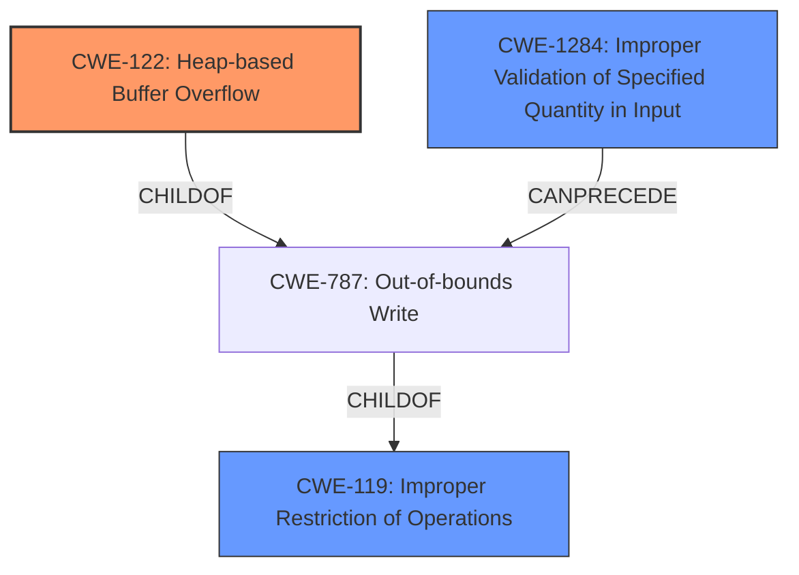

# Analysis Report for CVE-2021-45942

# Vulnerability Analysis Report: CVE-2021-45942

## Description


## Analysis (with Relationship Data)

# Summary
| CWE ID | CWE Name | Confidence | CWE Abstraction Level | CWE Vulnerability Mapping Label | CWE-Vulnerability Mapping Notes |
|---|---|---|---|---|---|
| CWE-122 | Heap-based Buffer Overflow | 1.0 | Variant | Allowed | Primary CWE |
| CWE-119 | Improper Restriction of Operations within the Bounds of a Memory Buffer | 0.7 | Class | Discouraged | Secondary Candidate |
| CWE-1284 | Improper Validation of Specified Quantity in Input | 0.6 | Base | Allowed | Secondary Candidate |

## Evidence and Confidence

*   **Confidence Score:** 0.8
*   **Evidence Strength:** HIGH

## Relationship Analysis
The primary CWE, CWE-122, is a variant of CWE-787 (Out-of-bounds Write), which in turn is a child of CWE-119 (Improper Restriction of Operations within the Bounds of a Memory Buffer). This hierarchical relationship indicates that CWE-122 is a more specific case of a general buffer handling issue. CWE-1284 (Improper Validation of Specified Quantity in Input) can precede CWE-787, indicating a potential chain where **improper input validation** leads to an **out-of-bounds write**. This relationship helped refine the analysis to include the **missing input validation** as a contributing factor.



## Vulnerability Chain
The vulnerability chain starts with **missing input validation** (potentially CWE-1284), which leads to a **heap-based buffer overflow** (CWE-122) during the image processing. The final impact is a denial of service, and potentially arbitrary code execution.

## Summary of Analysis
The initial analysis identified a **heap-based buffer overflow**. The supporting evidence explicitly states: "The vulnerability is a **heap-based buffer overflow** that exists in the `Imf_3_1::LineCompositeTask::execute` function" and "The lack of proper input validation allows an attacker to provide a specially crafted EXR file where the sampling is not 1, which leads to writing data beyond the allocated buffer".

The retriever results also suggested CWE-119, CWE-190, CWE-126, CWE-125, and CWE-129 as potential matches. However, the explicit mention of "heap-based" makes CWE-122 the most specific and accurate choice. Further analysis of the CVE Reference Links Content Summary indicated **missing input validation** of the `xSampling` and `ySampling` values, suggesting CWE-1284 could be a contributing factor.

The graph relationships reinforced the selection of CWE-122 as the primary weakness, and the potential role of **improper input validation** (CWE-1284) in leading to the buffer overflow. The selected CWEs are at the optimal level of specificity, with CWE-122 being a variant that clearly describes the type of buffer overflow.

Relevant CWE Information:

# Enhanced Context (25 CWEs)
The following CWEs were identified as potentially relevant to this vulnerability:

## CWE-122: Heap-based Buffer Overflow
**Abstraction:** Variant
**Similarity Score**: 0.203
**Source**: sparse

**Description**:
A heap overflow condition is a buffer overflow, where the buffer that can be overwritten is allocated in the heap portion of memory, generally meaning that the buffer was allocated using a routine such as malloc().

**Mapping Guidance**:
- Usage: Allowed
- Rationale: This CWE entry is at the Variant level of abstraction, which is a preferred level of abstraction for mapping to the root causes of vulnerabilities.

### Technical Explanation for Selected CWEs:

*   **CWE-122: Heap-based Buffer Overflow**
    *   How the vulnerability's details match the CWE's characteristics: The vulnerability is explicitly described as a heap-based buffer overflow. This aligns perfectly with CWE-122's definition, where the overflow occurs in memory allocated on the heap. The vulnerability allows writing data beyond the allocated buffer, leading to memory corruption.
    *   The security implications and potential impact: A heap-based buffer overflow can lead to denial of service (application crash) and potentially arbitrary code execution if exploited successfully.
    *   Any parent-child relationships or chain patterns that influenced your mapping: CWE-122 is a variant of CWE-787 (Out-of-bounds Write), which is a child of CWE-119 (Improper Restriction of Operations within the Bounds of a Memory Buffer). This hierarchy indicates that CWE-122 is a specific type of buffer overflow.
    *   Whether the weakness is primary or secondary in the vulnerability: This is the primary weakness, as it is the direct cause of the vulnerability.
    *   How the official MITRE mapping guidance influenced your decision: The MITRE mapping guidance allows the use of CWE-122, as it is at the Variant level of abstraction.
*   **CWE-119: Improper Restriction of Operations within the Bounds of a Memory Buffer**
    *   How the vulnerability's details match the CWE's characteristics: While the vulnerability is specifically a heap-based buffer overflow (CWE-122), CWE-119 represents the more general class of buffer handling issues. The **lack of proper input validation** ultimately leads to operations outside the intended buffer boundaries.
    *   The security implications and potential impact: The impact is the same as CWE-122, but at a higher abstraction level.
    *   Any parent-child relationships or chain patterns that influenced your mapping: CWE-119 is a parent of CWE-787, indicating a general buffer handling issue.
    *   Whether the weakness is primary or secondary in the vulnerability: This is a secondary candidate, representing the broader class of the weakness.
    *   How the official MITRE mapping guidance influenced your decision: The MITRE mapping guidance discourages the use of CWE-119 when more specific CWEs are available. Since CWE-122 provides a more precise classification, CWE-119 is a secondary consideration.
*   **CWE-1284: Improper Validation of Specified Quantity in Input**
    *   How the vulnerability's details match the CWE's characteristics: The CVE Reference Links Content Summary states "The vulnerability occurs when the `CompositeDeepScanLine::setFrameBuffer` method doesn't properly validate the `xSampling` and `ySampling` values". This aligns with CWE-1284 which describes situations where input specifying a quantity is not validated. In this case the sampling values are the quantities that are not validated.
    *   The security implications and potential impact: The impact of **improper validation** is a heap buffer overflow if the other conditions are met.
    *   Any parent-child relationships or chain patterns that influenced your mapping: CWE-1284 can precede CWE-787 (out-of-bounds write). This can be visualized as an attack chain.
    *   Whether the weakness is primary or secondary in the vulnerability: This is a secondary candidate, the root cause that can lead to the heap buffer overflow (CWE-122).
    *   How the official MITRE mapping guidance influenced your decision: The MITRE mapping guidance allows the use of CWE-1284, as it is at the Base level of abstraction.

### Considered but not used:

*   **CWE-190: Integer Overflow or Wraparound:** While integer overflows can sometimes lead to buffer overflows, there is no direct evidence of an integer overflow in the provided vulnerability description.
*   **CWE-126: Buffer Over-read and CWE-125: Out-of-bounds Read:** The vulnerability is described as a buffer overflow (write), not a read.
*   **CWE-129: Improper Validation of Array Index:** While the vulnerability involves **improper validation**, it's not specifically related to array indices.
*   **CWE-193: Off-by-one Error:** There's no direct indication of an off-by-one error in the description.
*   **CWE-121: Stack-based Buffer Overflow:** The vulnerability is explicitly described as heap-based, not stack-based.
*   **CWE-131: Incorrect Calculation of Buffer Size:** There is no evidence in the description of an incorrect buffer calculation, only that input values


## CWE Relationship Analysis

Current CWEs represent these abstraction levels: .


### Vulnerability Chain Analysis

**Chain starting from CWE-190:**
- 190 (Integer Overflow or Wraparound) - ROOT


**Chain starting from CWE-131:**
- 131 (Incorrect Calculation of Buffer Size) - ROOT


### CWE Relationship Diagram

```mermaid
graph TD
    classDef primary fill:#f96,stroke:#333,stroke-width:2px
    classDef secondary fill:#69f,stroke:#333
    classDef tertiary fill:#9e9,stroke:#333
```


*Report generated on 2025-03-31 06:11:21*
