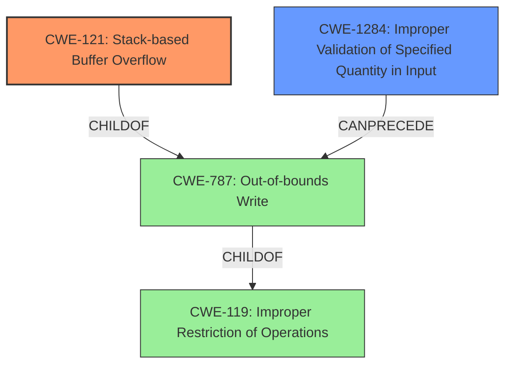

# Enhanced Analysis for CVE-2021-45972

# Summary
| CWE ID | CWE Name | Confidence | CWE Abstraction Level | CWE Vulnerability Mapping Label | CWE-Vulnerability Mapping Notes |
|---|---|---|---|---|---|
| CWE-121 | Stack-based Buffer Overflow | 1.00 | Variant | Allowed | Primary CWE |
| CWE-1284 | Improper Validation of Specified Quantity in Input | 0.75 | Base | Allowed | Secondary Candidate |

## Evidence and Confidence

*   **Confidence Score:** 0.90
*   **Evidence Strength:** HIGH

## Relationship Analysis
The primary relationship influencing the selection was the hierarchical structure. CWE-121 is a Variant of CWE-787 (Out-of-bounds Write), which is a parent of CWE-119 (Improper Restriction of Operations within the Bounds of a Memory Buffer). Choosing CWE-121 provides a more specific classification than either of its parents, aligning with the principle of selecting the most granular CWE when supported by evidence. CWE-1284 can precede CWE-787 according to relationship data.



## Vulnerability Chain
The vulnerability chain starts with **improper input validation** of the size field in the GIF file (CWE-1284), leading to a **stack-based buffer overflow** (CWE-121) when the application attempts to copy data into a fixed-size buffer on the stack without proper bounds checking.

## Summary of Analysis
The analysis is strongly based on the provided evidence, specifically the vulnerability description and the CVE Reference Links Content Summary. The vulnerability is clearly described as a "**stack-based buffer overflow**" in the `giftrans` function, where an attacker can "**overwrite up to 250 bytes outside of the allocated buffer with arbitrary data**". The root cause is the **lack of size validation** on the input data, which determines the amount of data to write. The CVE Reference Links Content Summary reinforces this, stating that "The size of the extension data is read directly from the image file, without any size validation, and then this read size is used to copy data into a fixed-size buffer" and "The `gce` buffer, declared on the stack with a size of 5 bytes, is overflowed because the size read from the input file can be larger than 5".

CWE-121 (Stack-based Buffer Overflow) is selected as the primary CWE because it directly reflects the vulnerability's nature and location. The retriever results list CWE-121 with a score of 0.318. The description of CWE-121 as "A stack-based buffer overflow condition is a condition where the buffer being overwritten is allocated on the stack" aligns perfectly with the vulnerability description.

CWE-1284 (Improper Validation of Specified Quantity in Input) is considered as a secondary CWE to represent the root cause, with a retriever score of 0.335. The description of CWE-1284 as "The product receives input that is expected to specify a quantity (such as size or length), but it does not validate or incorrectly validates that the quantity has the required properties" correctly identifies the **lack of size validation** on the data read from the image file.

CWE-119 (Improper Restriction of Operations within the Bounds of a Memory Buffer) was considered but not chosen as the primary CWE because it is a more general class of weakness. While the vulnerability does involve improper restriction of operations within a memory buffer, the more specific CWE-121 provides a better description of the vulnerability. Also, the mapping guidance for CWE-119 recommends considering its children such as CWE-787 and descendants.

CWE-120 (Buffer Copy without Checking Size of Input ('Classic Buffer Overflow')) was also considered but not chosen because the description doesn't precisely fit the vulnerability. While a buffer overflow occurs, CWE-120 is more specific to buffer copy operations where the size of the input isn't checked against the output buffer. The key aspect here is that the size read from the input file is not validated before being used to copy data to the stack buffer.

The selection of CWE-121 and CWE-1284 provides the optimal level of specificity, accurately capturing both the type of buffer overflow and the root cause of the vulnerability.

Relevant CWE Information:

# Enhanced Context (25 CWEs)
The following CWEs were identified as potentially relevant to this vulnerability:

## CWE-805: Buffer Access with Incorrect Length Value
**Abstraction Level**: Base
**Similarity Score**: 0.79
**Source**: dense

**Description**:
The product uses a sequential operation to read or write a buffer, but it uses an incorrect length value that causes it to access memory that is outside of the bounds of the buffer.

**Mapping Guidance**:
- Usage: Allowed
- Rationale: This CWE entry is at the Base level of abstraction, which is a preferred level of abstraction for mapping to the root causes of vulnerabilities.

## CWE-191: Integer Underflow (Wrap or Wraparound)
**Abstraction Level**: Base
**Similarity Score**: 0.78
**Source**: dense

**Description**:
The product subtracts one value from another, such that the result is less than the minimum allowable integer value, which produces a value that is not equal to the correct result.

**Mapping Guidance**:
- Usage: Allowed
- Rationale: This CWE entry is at the Base level of abstraction, which is a preferred level of abstraction for mapping to the root causes of vulnerabilities.

## CWE-131: Incorrect Calculation of Buffer Size
**Abstraction Level**: Base
**Similarity Score**: 0.77
**Source**: dense

**Description**:
The product does not correctly calculate the size to be used when allocating a buffer, which could lead to a buffer overflow.

**Mapping Guidance**:
- Usage: Allowed
- Rationale: This CWE entry is at the Base level of abstraction, which is a preferred level of abstraction for mapping to the root causes of vulnerabilities.

## CWE-124: Buffer Underwrite ('Buffer Underflow')
**Abstraction Level**: Base
**Similarity Score**: 0.77
**Source**: dense

**Description**:
The product writes to a buffer using an index or pointer that references a memory location prior to the beginning of the buffer.

**Mapping Guidance**:
- Usage: Allowed
- Rationale: This CWE entry is at the Base level of abstraction, which is a preferred level of abstraction for mapping to the root causes of vulnerabilities.

## CWE-126: Buffer Over-read
**Abstraction Level**: Variant
**Similarity Score**: 0.76
**Source**: dense

**Description**:
The product reads from a buffer using buffer access mechanisms such as indexes or pointers that reference memory locations after the targeted buffer.

**Mapping Guidance**:
- Usage: Allowed
- Rationale: This CWE entry is at the Variant level of abstraction, which is a preferred level of abstraction for mapping to the root causes of vulnerabilities.

## CWE-127: Buffer Under-read
**Abstraction Level**: Variant
**Similarity Score**: 0.76
**Source**: dense

**Description**:
The product reads from a buffer using buffer access mechanisms such as indexes or pointers that reference memory locations prior to the targeted buffer.

**Mapping Guidance**:
- Usage: Allowed
- Rationale: This CWE entry is at the Variant level of abstraction, which is a preferred level of abstraction for mapping to the root causes of vulnerabilities.

## CWE-680: Integer Overflow to Buffer Overflow
**Abstraction Level**: Compound
**Similarity Score**: 0.75
**Source**: dense

**Description**:
The product performs a calculation to determine how much memory to allocate, but an integer overflow can occur that causes less memory to be allocated than expected, leading to a buffer overflow.

**Mapping Guidance**:
- Usage: Discouraged
- Rationale: This CWE entry is a named chain, which combines multiple weaknesses.

## CWE-125: Out-of-bounds Read
**Abstraction Level**: Base
**Similarity Score**: 0.75
**Source**: dense

**Description**:
The product reads data past the end, or before the beginning, of the intended buffer.

**Mapping Guidance**:
- Usage: Allowed
- Rationale: This CWE entry is at the Base level of abstraction, which is a preferred level of abstraction for mapping to the root causes of


## CWE Relationship Analysis

Current CWEs represent these abstraction levels: .


### Vulnerability Chain Analysis

**Chain starting from CWE-131:**
- 131 (Incorrect Calculation of Buffer Size) - ROOT


**Chain starting from CWE-680:**
- 680 (Integer Overflow to Buffer Overflow) - ROOT


### CWE Relationship Diagram

```mermaid
graph TD
    classDef primary fill:#f96,stroke:#333,stroke-width:2px
    classDef secondary fill:#69f,stroke:#333
    classDef tertiary fill:#9e9,stroke:#333
```