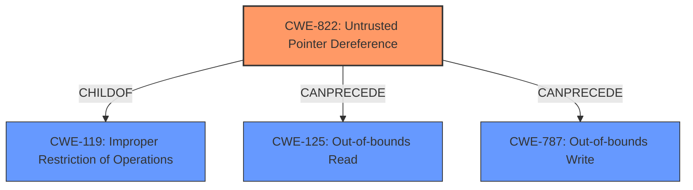

# Raw Analyzer Response for CVE-2021-46020

# Summary
| CWE ID | CWE Name | Confidence | CWE Abstraction Level | CWE Vulnerability Mapping Label | CWE-Vulnerability Mapping Notes |
|---|---|---|---|---|---|
| CWE-822 | Untrusted Pointer Dereference | 1.0 | Base | Allowed | Primary CWE |
| CWE-787 | Out-of-bounds Write | 0.5 | Base | Allowed | Secondary Candidate |
| CWE-125 | Out-of-bounds Read | 0.5 | Base | Allowed | Secondary Candidate |

## Evidence and Confidence

*   **Confidence Score:** 1.0
*   **Evidence Strength:** HIGH

## Relationship Analysis
The primary CWE is CWE-822, which is a Base level CWE. It has child relationships to CWE-119 (Improper Restriction of Operations within the Bounds of a Memory Buffer). It also has chain relationships, with CanPrecede relationships to CWE-125 (Out-of-bounds Read) and CWE-787 (Out-of-bounds Write). These relationships suggest a potential sequence of events where an **untrusted pointer dereference** could lead to out-of-bounds read or write operations.

## Vulnerability Chain
The vulnerability chain starts with an **untrusted pointer dereference** (CWE-822). This can potentially lead to an out-of-bounds read (CWE-125) or out-of-bounds write (CWE-787), ultimately causing a segmentation fault or application crash.

## Summary of Analysis
The initial analysis identified the **untrusted pointer dereference** as the primary weakness based on the vulnerability description and the CVE reference links content summary. The retriever results also ranked CWE-822 as the top candidate. The relationship analysis further supports this classification, as CWE-822 can lead to other memory-related issues like out-of-bounds read or write.

The vulnerability description states "An **untrusted pointer dereference** in mrb_vm_exec() of mruby v3.0.0 can lead to a segmentation fault or application crash."

The CVE Reference Links Content Summary states the **root cause** of the vulnerability as "An **untrusted pointer dereference** in the `mrb_vm_exec()` function within mruby v3.0.0. Specifically, the vulnerability occurs when accessing object properties after calling `mrb_get_args()`... This leads to accessing invalid memory locations."

Based on the evidence provided, CWE-822 is the most accurate and specific classification. While out-of-bounds read/write (CWE-125/CWE-787) are possible consequences, the root cause is the **untrusted pointer dereference**.

Relevant CWE Information:

# Enhanced Context (25 CWEs)

## CWE-822: Untrusted Pointer Dereference
**Abstraction:** Base
**Status:** Incomplete

### Description
The product obtains a value from an untrusted source, converts this value to a pointer, and dereferences the resulting pointer.

### Extended Description

An attacker can supply a pointer for memory locations that the product is not expecting. If the pointer is dereferenced for a write operation, the attack might allow modification of critical state variables, cause a crash, or execute code. If the dereferencing operation is for a read, then the attack might allow reading of sensitive data, cause a crash, or set a variable to an unexpected value (since the value will be read from an unexpected memory location).

### Mapping Guidance
**Usage:** Allowed
**Rationale:** This CWE entry is at the Base level of abstraction, which is a preferred level of abstraction for mapping to the root causes of vulnerabilities.

## CWE-787: Out-of-bounds Write
**Abstraction:** Base
**Status:** Draft

### Description
The product writes data past the end, or before the beginning, of the intended buffer.

### Mapping Guidance
**Usage:** Allowed
**Rationale:** This CWE entry is at the Base level of abstraction, which is a preferred level of abstraction for mapping to the root causes of vulnerabilities.

## CWE-125: Out-of-bounds Read
**Abstraction:** Base
**Status:** Draft

### Description
The product reads data past the end, or before the beginning, of the intended buffer.

### Mapping Guidance
**Usage:** Allowed
**Rationale:** This CWE entry is at the Base level of abstraction, which is a preferred level of abstraction for mapping to the root causes of vulnerabilities.

CWE-476 (NULL Pointer Dereference) was considered, but the vulnerability description specifies an **untrusted pointer**, not necessarily a NULL pointer. CWE-823 (Use of Out-of-range Pointer Offset) was also considered, but the description focuses on the dereference of an **untrusted pointer** rather than specifically an offset issue.

CWE-119 (Improper Restriction of Operations within the Bounds of a Memory Buffer) is a Class-level CWE and less specific than CWE-822.