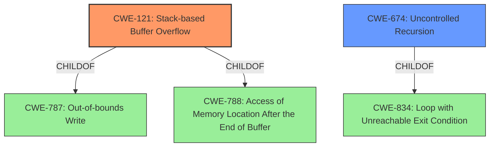

# Enhanced Analysis for CVE-2021-46050

# Summary
| CWE ID | CWE Name | Confidence | CWE Abstraction Level | CWE Vulnerability Mapping Label | CWE-Vulnerability Mapping Notes |
|---|---|---|---|---|---|
| CWE-121 | Stack-based Buffer Overflow | 0.9 | Variant | Allowed | Primary CWE. The vulnerability is a stack overflow due to excessive nesting, which leads to writing beyond the buffer allocated on the stack. |
| CWE-674 | Uncontrolled Recursion | 0.6 | Class | Allowed-with-Review | Secondary CWE. The stack overflow is triggered by excessive recursion due to the nested try-catch blocks. While "Uncontrolled Recursion" is a Class level CWE, it helps to define how the Stack-based Buffer Overflow was caused, as stack exhaustion stems from uncontrolled recursion. |

## Evidence and Confidence

*   **Confidence Score:** 0.75
*   **Evidence Strength:** HIGH

## Relationship Analysis
The primary CWE is CWE-121 (Stack-based Buffer Overflow), which is a variant of CWE-787 (Out-of-bounds Write) and CWE-788 (Access of Memory Location After the End of Buffer). The secondary CWE is CWE-674 (Uncontrolled Recursion) which is a class level CWE. CWE-674 is related to CWE-834 (Loop with Unreachable Exit Condition ('Infinite Loop')). The deep nesting of try-catch blocks leads to excessive function calls that exhaust the stack space, resulting in a stack overflow.



## Vulnerability Chain
The vulnerability chain starts with the malicious WebAssembly binary containing excessive nested try-catch blocks. This leads to uncontrolled recursion and excessive function calls. The deep call stack exhausts the stack space, resulting in a stack-based buffer overflow, and ultimately a segmentation fault leading to a denial of service.

## Summary of Analysis
The initial analysis focused on the **Stack Overflow** vulnerability, pinpointing CWE-121 as the most appropriate primary weakness, as it is a **Variant** that specifically addresses stack-based buffer overflows. The evidence from the vulnerability description, especially the "CVE Reference Links Content Summary," clearly indicates a stack overflow caused by excessive nesting of try-catch blocks. "The root cause is a stack overflow vulnerability triggered by excessive nesting of try-catch blocks in the WebAssembly binary being processed by `wasm-ctor-eval`".

The retriever results listed CWE-121 with the highest score. The description of CWE-121 perfectly matches the vulnerability: "A stack-based buffer overflow condition is a condition where the buffer being overwritten is allocated on the stack".

CWE-674, Uncontrolled Recursion, was also identified as a contributing factor, with the excessive nesting causing a very deep call stack. This is a **Class** level CWE. It is not the primary cause, but a contributing factor.
CWE-190 (Integer Overflow or Wraparound) was considered but deemed less relevant as the core issue is not an integer overflow, but the exhaustion of stack space due to excessive recursion.
CWE-120 (Buffer Copy without Checking Size of Input) was also considered but not selected because the vulnerability isn't about copying a buffer without checking its size, but rather overflowing the stack due to deeply nested function calls.
CWE-770 (Allocation of Resources Without Limits or Throttling) was considered, but the primary issue is not the allocation of resources without limits, but rather the exhaustion of the stack due to deep recursion.

The final decision is based on direct evidence of a **Stack Overflow** resulting from excessive nesting, making CWE-121 the most specific and accurate classification, further complemented by CWE-674 to provide context for the root cause mechanism.

Relevant CWE Information:
# Enhanced Context (25 CWEs)
## CWE-121: Stack-based Buffer Overflow
**Abstraction:** Variant

### Description
A stack-based buffer overflow condition is a condition where the buffer being overwritten is allocated on the stack (i.e., is a local variable or, rarely, a parameter to a function).

## CWE-674: Uncontrolled Recursion
**Abstraction:** Class

### Description
The product does not properly control the amount of recursion that takes place, consuming excessive resources, such as allocated memory or the program stack.


## CWE Relationship Analysis

Current CWEs represent these abstraction levels: .


### Vulnerability Chain Analysis

**Chain starting from CWE-190:**
- 190 (Integer Overflow or Wraparound) - ROOT


**Chain starting from CWE-834:**
- 834 (Excessive Iteration) - ROOT


### CWE Relationship Diagram

```mermaid
graph TD
    classDef primary fill:#f96,stroke:#333,stroke-width:2px
    classDef secondary fill:#69f,stroke:#333
    classDef tertiary fill:#9e9,stroke:#333
```