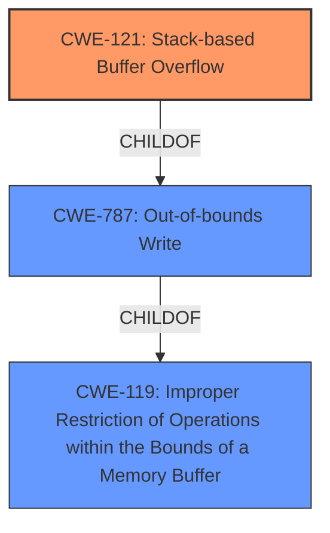

# Enhanced Analysis for CVE-2021-46158

# Summary
| CWE ID | CWE Name | Confidence | CWE Abstraction Level | CWE Vulnerability Mapping Label | CWE-Vulnerability Mapping Notes |
|---|---|---|---|---|---|
| CWE-121 | Stack-based Buffer Overflow | 1.0 | Variant | Primary | Allowed |
| CWE-787 | Out-of-bounds Write | 0.7 | Base | Secondary | Allowed |
| CWE-119 | Improper Restriction of Operations within the Bounds of a Memory Buffer | 0.5 | Class | Secondary | Discouraged |

## Evidence and Confidence

*   **Confidence Score:** 0.8
*   **Evidence Strength:** HIGH

## Relationship Analysis
The primary CWE is CWE-121, a variant of CWE-787 (Out-of-bounds Write), which in turn is a child of CWE-119 (Improper Restriction of Operations within the Bounds of a Memory Buffer). This hierarchy reflects the specific nature of the vulnerability being a stack-based buffer overflow (CWE-121), which is a type of out-of-bounds write (CWE-787) and generally falls under improper memory buffer handling (CWE-119). The selection of CWE-121 provides the most specific classification, while acknowledging its relationship to broader memory safety issues represented by CWE-787 and CWE-119.



## Vulnerability Chain
The vulnerability chain starts with the lack of proper input validation when parsing NEU files. This leads to a **stack-based buffer overflow** (CWE-121), a specific instance of an **out-of-bounds write** (CWE-787) because the length of user-supplied data is not validated before being copied into a stack-allocated buffer. The final impact is the ability to execute code in the context of the current process.

Improper Input Validation (missing link) -> Stack-based Buffer Overflow (CWE-121) -> Out-of-bounds Write (CWE-787) -> Code Execution

## Summary of Analysis
The initial analysis focused on identifying the **root cause** and the specific type of buffer overflow. The vulnerability description clearly states a "**stack based buffer overflow**" while parsing NEU files, and the CVE Reference Links Content Summary confirms the **lack of proper validation** of user-supplied data's length, leading to the overflow on the stack. The primary CWE match in the "CWE for similar CVE Descriptions" is CWE-787, but considering the description, CWE-121 is a more specific variant.

The decision to prioritize CWE-121 is based on its precise match to the vulnerability description, explicitly mentioning a stack-based overflow. While CWE-787 (Out-of-bounds Write) is also relevant and captures the general nature of the write beyond buffer boundaries, CWE-121 provides a more granular classification. CWE-119 (Improper Restriction of Operations within the Bounds of a Memory Buffer) is a broader category that encompasses various buffer-related issues, but it's less specific than CWE-121 and CWE-787.

The relationship analysis supports this decision, as CWE-121 is a child of CWE-787, indicating a specialized type of out-of-bounds write. The mapping guidance for CWE-119 discourages its use when more specific CWEs are available, further justifying the choice of CWE-121.

The provided evidence supports a high confidence level in this assessment.

Relevant CWE Information:

# Enhanced Context (25 CWEs)

## CWE-124: Buffer Underwrite ('Buffer Underflow')
**Abstraction Level**: Base
**Similarity Score**: 0.77
**Source**: dense

**Description**:
The product writes to a buffer using an index or pointer that references a memory location prior to the beginning of the buffer.

**Mapping Guidance**:
- Usage: Allowed
- Rationale: This CWE entry is at the Base level of abstraction, which is a preferred level of abstraction for mapping to the root causes of vulnerabilities.

*Not selected* because the vulnerability description and supporting evidence indicate a buffer overflow (write past the end of the buffer), not a buffer underflow (write before the beginning of the buffer).

## CWE-191: Integer Underflow (Wrap or Wraparound)
**Abstraction Level**: Base
**Similarity Score**: 0.76
**Source**: dense

**Description**:
The product subtracts one value from another, such that the result is less than the minimum allowable integer value, which produces a value that is not equal to the correct result.

**Mapping Guidance**:
- Usage: Allowed
- Rationale: This CWE entry is at the Base level of abstraction, which is a preferred level of abstraction for mapping to the root causes of vulnerabilities.

*Not selected* because the vulnerability description and supporting evidence do not indicate an integer underflow. The issue is a buffer overflow due to **missing length validation**.

## CWE-131: Incorrect Calculation of Buffer Size
**Abstraction Level**: Base
**Similarity Score**: 0.76
**Source**: dense

**Description**:
The product does not correctly calculate the size to be used when allocating a buffer, which could lead to a buffer overflow.

**Mapping Guidance**:
- Usage: Allowed
- Rationale: This CWE entry is at the Base level of abstraction, which is a preferred level of abstraction for mapping to the root causes of vulnerabilities.

*Not selected* because the evidence points to a lack of input validation rather than an incorrect calculation of the buffer size. While an incorrect calculation could lead to a buffer overflow, the primary weakness is the **missing length validation**.

## CWE-680: Integer Overflow to Buffer Overflow
**Abstraction Level**: Compound
**Similarity Score**: 0.76
**Source**: dense

**Description**:
The product performs a calculation to determine how much memory to allocate, but an integer overflow can occur that causes less memory to be allocated than expected, leading to a buffer overflow.

**Mapping Guidance**:
- Usage: Discouraged
- Rationale: This CWE entry is a named chain, which combines multiple weaknesses.

*Not selected* because the evidence doesn't indicate an integer overflow in calculating memory allocation. The vulnerability is due to the **lack of proper validation** of the input size, leading to a direct buffer overflow.

## CWE-805: Buffer Access with Incorrect Length Value
**Abstraction Level**: Base
**Similarity Score**: 0.76
**Source**: dense

**Description**:
The product uses a sequential operation to read or write a buffer, but it uses an incorrect length value that causes it to access memory that is outside of the bounds of the buffer.

**Mapping Guidance**:
- Usage: Allowed
- Rationale: This CWE entry is at the Base level of abstraction, which is a preferred level of abstraction for mapping to the root causes of vulnerabilities.

*Not selected* because while the buffer access uses an incorrect length, this is a consequence of the missing input validation. The **root cause** is the **lack of proper validation** of the length, not the incorrect length value itself.

## CWE-126: Buffer Over-read
**Abstraction Level**: Variant
**Similarity Score**: 0.75
**Source**: dense

**Description**:
The product reads from a buffer using buffer access mechanisms such as indexes or pointers that reference memory locations after the targeted buffer.

**Mapping Guidance**:
- Usage: Allowed
- Rationale: This CWE entry is at the Variant level of abstraction, which is a preferred level of abstraction for mapping to the root causes of vulnerabilities.

*Not selected* because the vulnerability description and supporting evidence clearly indicate a buffer overflow (write), not a buffer over-read.

## CWE-681: Incorrect Conversion between Numeric Types
**Abstraction Level**: Base
**Similarity Score**: 0.74
**Source**: dense

**Description**:
When converting from one data type to another, such as long to integer, data can be omitted or translated in a way that produces unexpected values. If the resulting values are used in a sensitive context, then dangerous behaviors may occur.

**Mapping Guidance**:
- Usage: Allowed
- Rationale: This CWE entry is at the Base level of abstraction, which is a preferred level of abstraction for mapping to the root causes of vulnerabilities.

*Not selected* because the vulnerability description and supporting evidence do not indicate an incorrect conversion between numeric types. The vulnerability is due to the **lack of proper validation** of the input size.

## CWE-125: Out-of-bounds Read
**Abstraction Level**: Base
**Similarity


## CWE Relationship Analysis

Current CWEs represent these abstraction levels: .


### Vulnerability Chain Analysis

**Chain starting from CWE-131:**
- 131 (Incorrect Calculation of Buffer Size) - ROOT


**Chain starting from CWE-680:**
- 680 (Integer Overflow to Buffer Overflow) - ROOT


### CWE Relationship Diagram

```mermaid
graph TD
    classDef primary fill:#f96,stroke:#333,stroke-width:2px
    classDef secondary fill:#69f,stroke:#333
    classDef tertiary fill:#9e9,stroke:#333
```