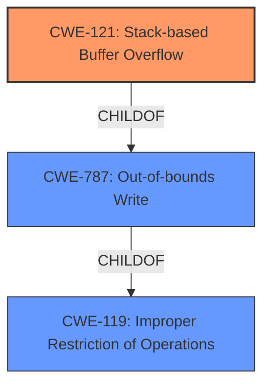

# Analysis for CVE-2021-46238

# Summary
| CWE ID | CWE Name | Confidence | CWE Abstraction Level | CWE Vulnerability Mapping Label | CWE-Vulnerability Mapping Notes |
|---|---|---|---|---|---|
| CWE-121 | Stack-based Buffer Overflow | 0.9 | Variant | Allowed | Primary CWE: The vulnerability is explicitly described as a **stack overflow** in the `gf_node_get_name` function. |
| CWE-119 | Improper Restriction of Operations within the Bounds of a Memory Buffer | 0.6 | Class | Allowed | Secondary CWE: A more general class encompassing buffer overflows, indicating the fundamental issue of improper memory boundary handling. |
| CWE-787 | Out-of-bounds Write | 0.6 | Base | Allowed | Secondary CWE: A base-level CWE that indicates writing data past the end of the intended buffer which can lead to a **stack overflow**. |

## Evidence and Confidence

*   **Confidence Score:** 0.9
*   **Evidence Strength:** HIGH

## Relationship Analysis
The primary CWE is CWE-121, Stack-based Buffer Overflow, which is a variant of CWE-787, Out-of-bounds Write, which in turn is a child of CWE-119, Improper Restriction of Operations within the Bounds of a Memory Buffer. This hierarchy reflects the specific nature of the vulnerability (stack-based) and its relationship to more general buffer handling issues. The choice of CWE-121 is supported by the explicit mention of "stack overflow" in the vulnerability description.

## Vulnerability Chain
The chain of events is as follows:
1.  A crafted input file (`POC2`) is provided to `MP4Box`.
2.  The `MP4Box` utility processes the file with specific command-line arguments.
3.  This leads to an invalid `GF_Node` pointer (`p`) in the `gf_node_get_name` function.
4.  The function attempts to access `p->sgprivate->flags` without proper validation, causing a **null pointer dereference**.
5.  The **null pointer dereference** leads to a **stack overflow** and segmentation fault.
6.  The program crashes, resulting in a Denial of Service (DoS).

## Summary of Analysis
The initial analysis identified the vulnerability as a **stack overflow**, which is supported by the vulnerability description. The root cause is the **null pointer dereference**, which triggers the stack overflow.

The primary CWE is CWE-121, Stack-based Buffer Overflow, because the vulnerability is explicitly described as a stack overflow. The supporting evidence is the phrase "**stack overflow** via the function gf_node_get_name () at scenegraph/base_scenegraph.c" from the Vulnerability Description.

CWE-787 Out-of-bounds Write was considered as a candidate because a stack overflow is caused by writing beyond the bounds of allocated memory. It is a base CWE of CWE-121.

CWE-119 Improper Restriction of Operations within the Bounds of a Memory Buffer was considered because it is a class CWE of CWE-787.

CWE-190 Integer Overflow or Wraparound was considered but rejected because the vulnerability is directly related to writing beyond memory boundaries rather than integer manipulation.

CWE-674 Uncontrolled Recursion was considered but rejected because the vulnerability is not caused by excessive recursion.

CWE-125 Out-of-bounds Read was considered but rejected because the primary action is writing to memory, not reading.

The selected CWEs (CWE-121, CWE-119, and CWE-787) are at the optimal level of specificity, accurately reflecting the root cause and nature of the vulnerability.
Relevant CWE Information:

# Enhanced Context (25 CWEs)
The following CWEs were identified as potentially relevant to this vulnerability:

## CWE-131: Incorrect Calculation of Buffer Size
**Abstraction Level**: Base
**Similarity Score**: 0.78
**Source**: dense

**Description**:
The product does not correctly calculate the size to be used when allocating a buffer, which could lead to a buffer overflow.

**Mapping Guidance**:
- Usage: Allowed
- Rationale: This CWE entry is at the Base level of abstraction, which is a preferred level of abstraction for mapping to the root causes of vulnerabilities.

## CWE-191: Integer Underflow (Wrap or Wraparound)
**Abstraction Level**: Base
**Similarity Score**: 0.78
**Source**: dense

**Description**:
The product subtracts one value from another, such that the result is less than the minimum allowable integer value, which produces a value that is not equal to the correct result.

**Mapping Guidance**:
- Usage: Allowed
- Rationale: This CWE entry is at the Base level of abstraction, which is a preferred level of abstraction for mapping to the root causes of vulnerabilities.

## CWE-125: Out-of-bounds Read
**Abstraction Level**: Base
**Similarity Score**: 0.77
**Source**: dense

**Description**:
The product reads data past the end, or before the beginning, of the intended buffer.

**Mapping Guidance**:
- Usage: Allowed
- Rationale: This CWE entry is at the Base level of abstraction, which is a preferred level of abstraction for mapping to the root causes of vulnerabilities.

## CWE-789: Memory Allocation with Excessive Size Value
**Abstraction Level**: Variant
**Similarity Score**: 0.77
**Source**: dense

**Description**:
The product allocates memory based on an untrusted, large size value, but it does not ensure that the size is within expected limits, allowing arbitrary amounts of memory to be allocated.

**Mapping Guidance**:
- Usage: Allowed
- Rationale: This CWE entry is at the Variant level of abstraction, which is a preferred level of abstraction for mapping to the root causes of vulnerabilities.

## CWE-126: Buffer Over-read
**Abstraction Level**: Variant
**Similarity Score**: 0.77
**Source**: dense

**Description**:
The product reads from a buffer using buffer access mechanisms such as indexes or pointers that reference memory locations after the targeted buffer.

**Mapping Guidance**:
- Usage: Allowed
- Rationale: This CWE entry is at the Variant level of abstraction, which is a preferred level of abstraction for mapping to the root causes of vulnerabilities.

## CWE-404: Improper Resource Shutdown or Release
**Abstraction Level**: Class
**Similarity Score**: 0.77
**Source**: dense

**Description**:
The product does not release or incorrectly releases a resource before it is made available for re-use.

**Mapping Guidance**:
- Usage: Allowed-with-Review
- Rationale: This CWE entry is a Class and might have Base-level children that would be more appropriate

## CWE-1325: Improperly Controlled Sequential Memory Allocation
**Abstraction Level**: Base
**Similarity Score**: 0.76
**Source**: dense

**Description**:
The product manages a group of objects or resources and performs a separate memory allocation for each object, but it does not properly limit the total amount of memory that is consumed by all of the combined objects.

**Mapping Guidance**:
- Usage: Allowed
- Rationale: This CWE entry is at the Base level of abstraction, which is a preferred level of abstraction for mapping to the root causes of vulnerabilities.

## CWE-129: Improper Validation of Array Index
**Abstraction Level**: Variant
**Similarity Score**: 0.76
**Source**: dense

**Description**:
The product uses untrusted input when calculating or using an array index, but the product does not validate or incorrectly validates the index to ensure the index references a valid position within the array.

**Mapping Guidance**:
- Usage: Allowed
- Rationale: This CWE entry is at the Variant level of abstraction, which is a preferred level of abstraction for mapping to the root causes of vulnerabilities.

## CWE-190: Integer Overflow or Wraparound
**Abstraction Level**: Base
**Similarity Score**: 0.76
**Source**: dense

**Description**:
The product performs a calculation that can
         produce an integer overflow or wraparound when the logic
         assumes that the resulting value will always be larger than
         the original value. This occurs when an integer value is
         incremented to a value that is too large to store in the
         associated representation. When this occurs, the value may
         become a very small or negative number.

**Mapping Guidance**:
- Usage: Allowed
- Rationale: This CWE entry is at the