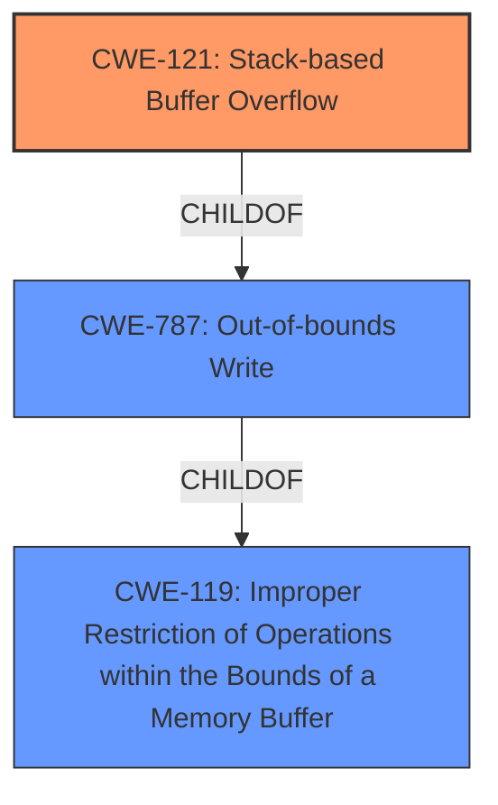

# Raw Analyzer Response for CVE-2021-46263

# Summary
| CWE ID  | CWE Name                                                              | Confidence | CWE Abstraction Level | CWE Vulnerability Mapping Label | CWE-Vulnerability Mapping Notes |
| :-------- | :-------------------------------------------------------------------- | :---------- | :---------------------- | :-------------------------------- | :-------------------------------- |
| CWE-121 | Stack-based Buffer Overflow                                           | 0.9         | Variant               | Primary                           | Allowed                           |
| CWE-787 | Out-of-bounds Write                                                   | 0.8         | Base                  | Secondary                         | Allowed                           |
| CWE-119 | Improper Restriction of Operations within the Bounds of a Memory Buffer | 0.6         | Class                  | Secondary                         | Discouraged                       |

## Evidence and Confidence

*   **Confidence Score:** 0.9
*   **Evidence Strength:** HIGH

## Relationship Analysis

The primary weakness is a **stack buffer overflow** (CWE-121). This is a specific type of **out-of-bounds write** (CWE-787), which, in turn, is a specific case of **improper restriction of operations within the bounds of a memory buffer** (CWE-119). CWE-121 is the most specific and accurate representation of the vulnerability described.

## Vulnerability Chain

The vulnerability chain involves the following steps:

1.  **Improper Input Validation:** The program does not check the length of the `wifiTimeClose` input.
2.  **Uncontrolled Copy:** The program copies the unchecked input to a stack-allocated buffer.
3.  **Stack-based Buffer Overflow (CWE-121):** The unchecked copy results in a buffer overflow on the stack.
4.  **Denial of Service (DoS):** The buffer overflow causes the device to crash.

## Summary of Analysis

The initial analysis identified CWE-787 as the primary candidate based on the **Top CWEs** list, however the **Vulnerability Description Key Phrases** clearly indicate a **stack buffer overflow**. The **CVE Reference Links Content Summary** describes how the `wifiTimeClose` parameter is copied to a stack-allocated buffer without proper bounds checking, leading to the overflow. The **Retriever Results** also includes CWE-121.

CWE-121 is a variant of CWE-787, offering a more precise classification. CWE-119 is a more general classification and is discouraged when a more specific CWE is available.

The selection of CWE-121 is at the optimal level of specificity because the vulnerability is explicitly a **stack buffer overflow**.

Relevant CWE Information:

# Enhanced Context (25 CWEs)

## CWE-191: Integer Underflow (Wrap or Wraparound)
**Abstraction Level**: Base
**Similarity Score**: 0.77
**Source**: dense

This CWE was not selected because the vulnerability is not related to integer underflow. The root cause is a buffer overflow due to lack of input validation.

## CWE-131: Incorrect Calculation of Buffer Size
**Abstraction Level**: Base
**Similarity Score**: 0.77
**Source**: dense

This CWE was not selected because the root cause is not an incorrect calculation of buffer size, but rather a missing check on the input size before copying it to a fixed-size buffer.

## CWE-130: Improper Handling of Length Parameter Inconsistency
**Abstraction Level**: Base
**Similarity Score**: 0.77
**Source**: dense

This CWE was not selected because while there is a length issue involved, the core problem is not the mishandling of the length parameter itself, but the complete absence of a check on the input length before writing to the buffer.

## CWE-789: Memory Allocation with Excessive Size Value
**Abstraction Level**: Variant
**Similarity Score**: 0.76
**Source**: dense

This CWE was not selected because the vulnerability does not involve allocating memory with an excessive size value. The buffer is already allocated on the stack, and the overflow occurs because the input data exceeds the buffer's capacity.

## CWE-404: Improper Resource Shutdown or Release
**Abstraction Level**: Class
**Similarity Score**: 0.75
**Source**: dense

This CWE was not selected because the vulnerability is not related to improper resource shutdown or release. The issue is a buffer overflow, which is a different type of weakness.

## CWE-805: Buffer Access with Incorrect Length Value
**Abstraction Level**: Base
**Similarity Score**: 0.75
**Source**: dense

This CWE was not selected because while a length value is involved, the primary issue is the lack of any length validation before writing to the buffer, leading to an overflow.

## CWE-125: Out-of-bounds Read
**Abstraction Level**: Base
**Similarity Score**: 0.75
**Source**: dense

This CWE was not selected because the vulnerability is an out-of-bounds write (buffer overflow), not an out-of-bounds read.

## CWE-1325: Improperly Controlled Sequential Memory Allocation
**Abstraction Level**: Base
**Similarity Score**: 0.75
**Source**: dense

This CWE was not selected because the vulnerability does not involve sequential memory allocation. The buffer is allocated on the stack, and the overflow occurs due to a lack of input validation.

## CWE-193: Off-by-one Error
**Abstraction Level**: Base
**Similarity Score**: 0.75
**Source**: dense

This CWE was not selected because the vulnerability is not specifically related to an off-by-one error. The overflow is due to a lack of input validation, allowing an arbitrary amount of data to be written to the buffer.

## CWE-226: Sensitive Information in Resource Not Removed Before Reuse
**Abstraction Level**: Base
**Similarity Score**: 0.75
**Source**: dense

This CWE was not selected because the vulnerability is not related to sensitive information being left in a resource before reuse. The issue is a buffer overflow due to a lack of input validation.

## CWE-190: Integer Overflow or Wraparound
**Abstraction Level**: Base
**Similarity Score**: 7593.20
**Source**: sparse

This CWE was not selected because the vulnerability is not directly related to an integer overflow or wraparound. While integer overflows could potentially be involved in calculating buffer sizes, the primary issue here is the lack of input validation before writing to the buffer.

## CWE-1284: Improper Validation of Specified Quantity in Input
**Abstraction Level**: Base
**Similarity Score**: 7057.06
**Source**: sparse

This CWE relates to the improper validation of quantities in input. While this is present in the vulnerability, the CWE-121 more directly describes the vulnerability which is a **stack buffer overflow**.

## CWE-119: Improper Restriction of Operations within the Bounds of a Memory Buffer
**Abstraction Level**: Class
**Similarity Score**: 6835.85
**Source**: sparse

CWE-119 is too general. While the vulnerability does involve operations outside the bounds of a memory buffer, CWE-121 (Stack-based Buffer Overflow) is a more specific and appropriate classification. The mapping guidance for CWE-119 discourages its use when more specific CWEs are available.

## CWE-770: Allocation of Resources Without Limits or Throttling
**Abstraction Level**: Base
**Similarity Score**: 6774.23
**Source**: sparse

This CWE was not selected because the vulnerability is not directly related to resource allocation without limits. The buffer is allocated on the stack, and the overflow occurs due to a lack of input validation.

## CWE-128: Wrap-around Error
**Abstraction Level**: base
**Similarity Score**: 5.03
**Source**: graph

This CWE was not selected because the vulnerability is not directly related to a wrap-around error. While wrap-around errors could potentially be involved in calculating buffer sizes, the primary issue here is the lack of input validation before writing to the buffer.

## CWE-123: Write-what-where Condition
**Abstraction Level**: base
**Similarity Score**: 4.33
**Source**: graph

This CWE was not selected because the primary issue is the **stack buffer overflow**. While a write-what-where condition could potentially result from the overflow, CWE-121 more directly describes the vulnerability.

## CWE-120: Buffer Copy without Checking Size of Input ('Classic Buffer Overflow')
**Abstraction Level**: base
**