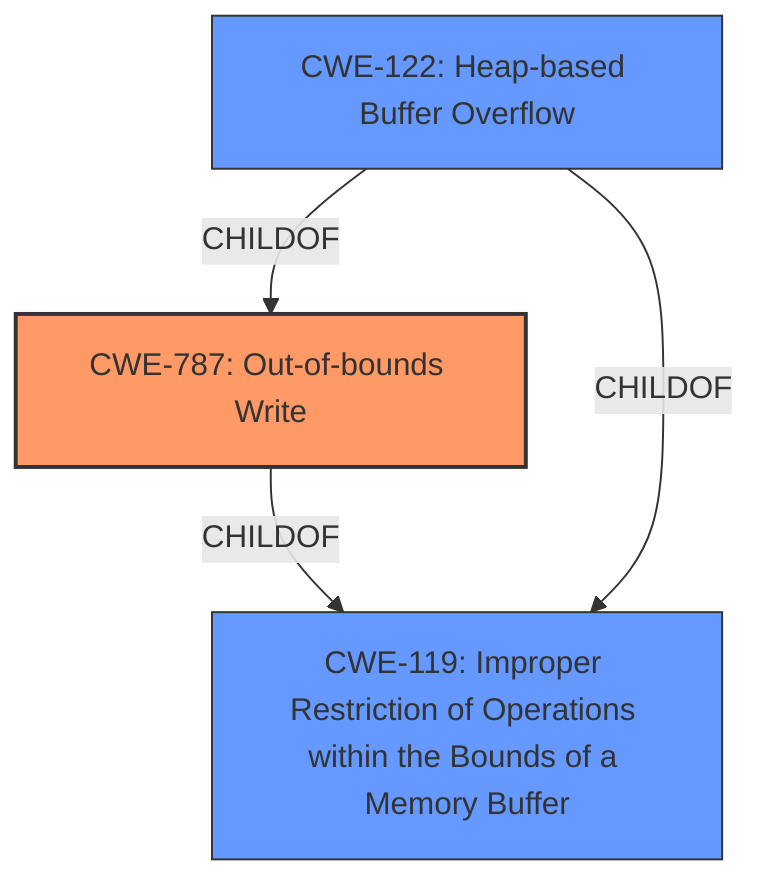

# Enhanced Analysis for CVE-2021-46478

# Summary
| CWE ID | CWE Name | Confidence | CWE Abstraction Level | CWE Vulnerability Mapping Label | CWE-Vulnerability Mapping Notes |
|---|---|---|---|---|---|
| CWE-787 | Out-of-bounds Write | 0.9 | Base | Primary | Allowed |
| CWE-122 | Heap-based Buffer Overflow | 0.7 | Variant | Secondary | Allowed |
| CWE-119 | Improper Restriction of Operations within the Bounds of a Memory Buffer | 0.5 | Class | Secondary | Discouraged |

## Evidence and Confidence

*   **Confidence Score:** 0.8
*   **Evidence Strength:** HIGH

## Relationship Analysis
The primary CWE is CWE-787, which is a child of CWE-119. CWE-122, Heap-based Buffer Overflow, is a variant of CWE-787 and a child of CWE-119 as well. While the description explicitly mentions a "heap buffer overflow", the root cause is the **out-of-bounds write** that leads to it. Therefore, CWE-787 is a more precise base level classification, while CWE-122 is a more specific variant of buffer overflow. CWE-119 is a more general class, and its usage is discouraged, as the other CWEs are more specific to the root cause.



## Vulnerability Chain
The vulnerability chain starts with the **heap buffer overflow** in `jsiClearStack`, which leads to memory corruption and ultimately a Denial of Service (DoS). The crafted JavaScript code triggers the overflow, indicating a potential lack of input validation or boundary checks.
  - **Root Cause:** **Heap buffer overflow** (CWE-787) due to **improper** memory management.
  - **Weakness:** Memory corruption.
  - **Impact:** Denial of Service (DoS).

## Summary of Analysis
The initial analysis focused on the **heap buffer overflow** reported in the vulnerability description. The primary CWE match from similar CVE descriptions was CWE-416 (Use After Free). However, the CVE Reference Links Content Summary explicitly mentions a **heap-buffer-overflow** in the `jsiClearStack` function, indicating an out-of-bounds write.

The evidence from the "CVE Reference Links Content Summary" states: "A **heap-buffer-overflow** vulnerability exists in the `jsiClearStack` function within the `src/jsiEval.c` file of the jsish project." It also notes: "The vulnerability is a **heap-buffer-overflow**, which occurs when the program attempts to write data beyond the allocated memory buffer on the heap."

Considering the provided evidence and the CWE specifications, CWE-787 (Out-of-bounds Write) is the most appropriate primary CWE. It accurately reflects the root cause of the vulnerability, which is writing data beyond the allocated buffer. CWE-122 (Heap-based Buffer Overflow) is included as a secondary CWE, as it describes the specific type of buffer overflow. CWE-119 (Improper Restriction of Operations within the Bounds of a Memory Buffer) is also considered, but it is a more general class and less specific than CWE-787 and is discouraged.

The selected CWEs are at the optimal level of specificity, with CWE-787 being the base level and CWE-122 being a variant.

Relevant CWE Information:

# Enhanced Context (25 CWEs)
The following CWEs were identified as potentially relevant to this vulnerability:

## CWE-131: Incorrect Calculation of Buffer Size
**Abstraction Level**: Base
**Similarity Score**: 0.77

Not selected. While an incorrect calculation could lead to a buffer overflow, there's no explicit mention of that in the vulnerability description.

## CWE-191: Integer Underflow (Wrap or Wraparound)
**Abstraction Level**: Base
**Similarity Score**: 0.77

Not selected. Integer underflow is not indicated in the description.

## CWE-805: Buffer Access with Incorrect Length Value
**Abstraction Level**: Base
**Similarity Score**: 0.76

Not selected. The report doesn't specify that the length value itself is the issue.

## CWE-124: Buffer Underwrite ('Buffer Underflow')
**Abstraction Level**: Base
**Similarity Score**: 0.76

Not selected. Underwrite is not indicated in the description.

## CWE-125: Out-of-bounds Read
**Abstraction Level**: Base
**Similarity Score**: 0.76

Not selected. The description focuses on a **write** not a read.

## CWE-193: Off-by-one Error
**Abstraction Level**: Base
**Similarity Score**: 0.75

Not selected. There is no evidence of an off-by-one error in the provided description.

## CWE-126: Buffer Over-read
**Abstraction Level**: Variant
**Similarity Score**: 0.75

Not selected. The description focuses on a **write** not a read.

## CWE-681: Incorrect Conversion between Numeric Types
**Abstraction Level**: Base
**Similarity Score**: 0.75

Not selected. No evidence of numeric type conversion issues.

## CWE-197: Numeric Truncation Error
**Abstraction Level**: Base
**Similarity Score**: 0.75

Not selected. No evidence of truncation errors.

## CWE-789: Memory Allocation with Excessive Size Value
**Abstraction Level**: Variant
**Similarity Score**: 0.75

Not selected. While the heap is involved, the **overflow** is from writing past the buffer, not allocating an excessive size.

## CWE-190: Integer Overflow or Wraparound
**Abstraction Level**: Base
**Similarity Score**: 6140.60

Not selected. While integer overflows can lead to buffer overflows, there is no explicit evidence of an integer overflow in this description.

## CWE-125: Out-of-bounds Read
**Abstraction Level**: Base
**Similarity Score**: 5788.18

Not selected. The description focuses on a **write** not a read.

## CWE-193: Off-by-one Error
**Abstraction Level**: Base
**Similarity Score**: 5662.94

Not selected. There is no evidence of an off-by-one error in the provided description.

## CWE-1284: Improper Validation of Specified Quantity in Input
**Abstraction Level**: Base
**Similarity Score**: 5555.30

Not selected. There's nothing directly indicating a failure to validate input quantity, even though that might be part of the exploit chain.

## CWE-119: Improper Restriction of Operations within the Bounds of a Memory Buffer
**Abstraction Level**: Class
**Similarity Score**: 5477.07

Selected as a secondary CWE, but discouraged. This is a general class of error, but the other CWEs provide more specifics.

## CWE-170: Improper Null Termination
**Abstraction Level**: base
**Similarity Score**: 5.03

Not selected. No evidence.

## CWE-128: Wrap-around Error
**Abstraction Level**: base
**Similarity Score**: 5.03

Not selected. No evidence.

## CWE-123: Write-what-where Condition
**Abstraction Level**: base
**Similarity Score**: 4.82

Not selected. The description does not mention arbitrary write.

## CWE-1284: Improper Validation of Specified Quantity in Input
**Abstraction Level**: base
**Similarity Score**: 4.33

Not selected. There's nothing directly indicating a failure to validate input quantity, even though that might be part of the exploit chain.

## CWE-617: Reachable Assertion
**Abstraction Level**: base
**Similarity Score**: 4.33

Not selected. No evidence.

## CWE-416: Use After Free
**Abstraction Level**: variant
**Similarity Score**: 4.20

Not selected. Despite being the primary CWE from similar CVE descriptions, the root cause described is not a use-after-free condition.

## CWE-195: Signed to Unsigned Conversion Error
**Abstraction Level**: variant
**Similarity Score**: 3.88

Not selected. No evidence.

## CWE-463: Deletion of Data Structure Sentinel
**Abstraction Level**: base


## CWE Relationship Analysis

Current CWEs represent these abstraction levels: .


### Vulnerability Chain Analysis

**Chain starting from CWE-119:**
- 119 (Improper Restriction of Operations within the Bounds of a Memory Buffer) - ROOT


**Chain starting from CWE-123:**
- 123 (Write-what-where Condition) - ROOT


### CWE Relationship Diagram

```mermaid
graph TD
    classDef primary fill:#f96,stroke:#333,stroke-width:2px
    classDef secondary fill:#69f,stroke:#333
    classDef tertiary fill:#9e9,stroke:#333
```