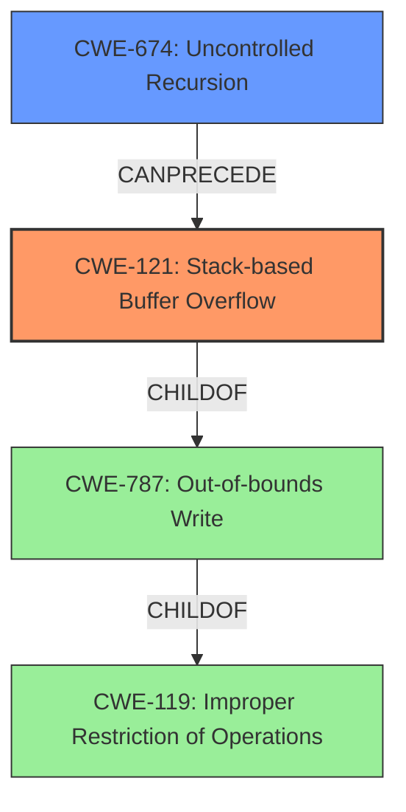

# Enhanced Analysis for CVE-2021-46505

# Summary
| CWE ID  | CWE Name                       | Confidence | CWE Abstraction Level | CWE Vulnerability Mapping Label | CWE-Vulnerability Mapping Notes |
|---------|--------------------------------|------------|-----------------------|---------------------------------|---------------------------------|
| CWE-121 | Stack-based Buffer Overflow | 1          | Variant               | Primary CWE                     | Allowed                         |
| CWE-674 | Uncontrolled Recursion        | 0.8          | Class                 | Secondary Candidate             | Allowed-with-Review           |

## Evidence and Confidence

*   **Confidence Score:** 0.9
*   **Evidence Strength:** HIGH

## Relationship Analysis
The primary weakness is a stack-based buffer overflow (CWE-121), which is a variant of the more general buffer overflow (CWE-787) and improper restriction of operations within memory buffer (CWE-119). The vulnerability arises due to uncontrolled recursion (CWE-674), which leads to excessive memory consumption on the stack, eventually causing the overflow.



## Vulnerability Chain
The vulnerability chain starts with **uncontrolled recursion** (CWE-674), which leads to the consumption of stack memory. As the recursion continues without proper limits, it results in a **stack-based buffer overflow** (CWE-121), causing the jsish interpreter to crash and leading to a denial of service.

## Summary of Analysis
The initial analysis identified a **stack overflow**. The evidence clearly points to a **stack overflow** due to excessive recursion. The "CVE Reference Links Content Summary" confirms that the root cause is excessive recursion in `Jsi_NameLookup` and `jsi_ValueSubscript` functions, triggered by repeatedly calling `Array.prototype.push.call(a, 42, 43)` within the `JSEtest` function called in a loop. This leads to a crash of the jsish interpreter, causing a denial of service.

The graph relationships show that CWE-121 (Stack-based Buffer Overflow) is a child of CWE-787 (Out-of-bounds Write) and CWE-119 (Improper Restriction of Operations within Memory Buffer). CWE-674 (Uncontrolled Recursion) can precede CWE-121.

Given the specific evidence of a stack overflow caused by uncontrolled recursion, CWE-121 is the most appropriate primary CWE. CWE-674 is a contributing factor, and therefore is added as a secondary candidate. These selections are at the optimal level of specificity, with CWE-121 being a Variant and CWE-674 being a Class, providing a balance between detail and abstraction.

Relevant CWE Information:

# Enhanced Context (25 CWEs)

## CWE-124: Buffer Underwrite ('Buffer Underflow')
**Abstraction Level**: Base
**Similarity Score**: 0.76
**Source**: dense
- Not Selected: The vulnerability is a stack overflow, not an underflow.

## CWE-191: Integer Underflow (Wrap or Wraparound)
**Abstraction Level**: Base
**Similarity Score**: 0.76
**Source**: dense
- Not Selected: This vulnerability does not involve integer underflow.

## CWE-131: Incorrect Calculation of Buffer Size
**Abstraction Level**: Base
**Similarity Score**: 0.75
**Source**: dense
- Not Selected: The issue is not related to incorrect buffer size calculation but rather to uncontrolled recursion leading to stack overflow.

## CWE-680: Integer Overflow to Buffer Overflow
**Abstraction Level**: Compound
**Similarity Score**: 0.75
**Source**: dense
- Not Selected: This vulnerability does not involve integer overflow.

## CWE-805: Buffer Access with Incorrect Length Value
**Abstraction Level**: Base
**Similarity Score**: 0.75
**Source**: dense
- Not Selected: The vulnerability isn't related to incorrect length value, but rather excessive recursion causing stack overflow.

## CWE-126: Buffer Over-read
**Abstraction Level**: Variant
**Similarity Score**: 0.74
**Source**: dense
- Not Selected: The vulnerability is a stack overflow, not a buffer over-read.

## CWE-1325: Improperly Controlled Sequential Memory Allocation
**Abstraction Level**: Base
**Similarity Score**: 0.74
**Source**: dense
- Not Selected: The vulnerability isn't related to sequential memory allocation but rather excessive recursion causing stack overflow.

## CWE-193: Off-by-one Error
**Abstraction Level**: Base
**Similarity Score**: 0.74
**Source**: dense
- Not Selected: This vulnerability does not involve off-by-one errors.

## CWE-190: Integer Overflow or Wraparound
**Abstraction Level**: Base
**Similarity Score**: 0.73
**Source**: dense
- Not Selected: The vulnerability is a stack overflow due to uncontrolled recursion, not related to integer overflow.

## CWE-197: Numeric Truncation Error
**Abstraction Level**: Base
**Similarity Score**: 0.73
**Source**: dense
- Not Selected: This vulnerability does not involve numeric truncation errors.

## CWE-190: Integer Overflow or Wraparound
**Abstraction Level**: Base
**Similarity Score**: 6136.48
**Source**: sparse
- Not Selected: This vulnerability does not involve integer overflow.

## CWE-193: Off-by-one Error
**Abstraction Level**: Base
**Similarity Score**: 5734.63
**Source**: sparse
- Not Selected: This vulnerability does not involve off-by-one errors.

## CWE-125: Out-of-bounds Read
**Abstraction Level**: Base
**Similarity Score**: 5708.35
**Source**: sparse
- Not Selected: The vulnerability is a stack overflow, not an out-of-bounds read.

## CWE-1284: Improper Validation of Specified Quantity in Input
**Abstraction Level**: Base
**Similarity Score**: 5507.86
**Source**: sparse
- Not Selected: The vulnerability isn't related to improper validation of quantity, but rather excessive recursion causing stack overflow.

## CWE-191: Integer Underflow (Wrap or Wraparound)
**Abstraction Level**: Base
**Similarity Score**: 5505.14
**Source**: sparse
- Not Selected: This vulnerability does not involve integer underflow.

## CWE-128: Wrap-around Error
**Abstraction Level**: base
**Similarity Score**: 5.03
**Source**: graph
- Not Selected: This vulnerability does not involve wrap-around errors.

## CWE-170: Improper Null Termination
**Abstraction Level**: base
**Similarity Score**: 5.03
**Source**: graph
- Not Selected: This vulnerability does not involve improper null termination.

## CWE-120: Buffer Copy without Checking Size of Input ('Classic Buffer Overflow')
**Abstraction Level**: base
**Similarity Score**: 4.82
**Source**: graph
- Not Selected: The root cause is uncontrolled recursion, not a buffer copy without checking size. While the result is a stack overflow, CWE-121 is more specific.

## CWE-123: Write-what-where Condition
**Abstraction Level**: base
**Similarity Score**: 4.33
**Source**: graph
- Not Selected: The vulnerability isn't directly related to write-what-where condition.

## CWE-770: Allocation of Resources Without Limits or Throttling
**Abstraction Level**: base
**Similarity Score**: 4.33
**Source**: graph
- Not Selected: While uncontrolled recursion does allocate resources, the primary issue is the resulting stack overflow (CWE-121), making CWE-674 more appropriate, but as a contributing factor.

## CWE-1284: Improper Validation of Specified Quantity in Input
**Abstraction Level**: base
**Similarity Score**: 4.33
**Source**: graph
- Not Selected: The vulnerability isn't related to improper validation of quantity.

## CWE-617: Reachable Assertion
**Abstraction Level**: base
**Similarity Score**: 4.33
**Source**: graph
- Not Selected: The vulnerability is not directly related to


## CWE Relationship Analysis

Current CWEs represent these abstraction levels: .


### Vulnerability Chain Analysis

**Chain starting from CWE-121:**
- 121 (Stack-based Buffer Overflow) - ROOT


**Chain starting from CWE-119:**
- 119 (Improper Restriction of Operations within the Bounds of a Memory Buffer) - ROOT


### CWE Relationship Diagram

```mermaid
graph TD
    classDef primary fill:#f96,stroke:#333,stroke-width:2px
    classDef secondary fill:#69f,stroke:#333
    classDef tertiary fill:#9e9,stroke:#333
```