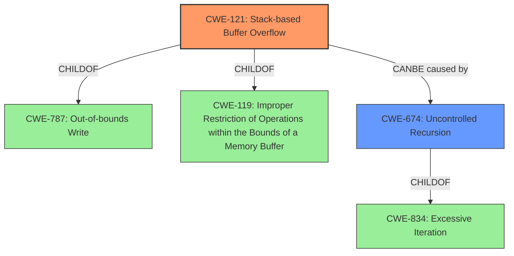

# Raw Analyzer Response for CVE-2021-46509

# Summary
| CWE ID | CWE Name | Confidence | CWE Abstraction Level | CWE Vulnerability Mapping Label | CWE-Vulnerability Mapping Notes |
|---|---|---|---|---|---|
| CWE-121 | Stack-based Buffer Overflow | 1.0 | Variant | Allowed | Primary CWE. Matches the described **stack overflow** in the `snquote` function. |
| CWE-674 | Uncontrolled Recursion | 0.6 | Class | Allowed-with-Review | Secondary CWE. Could be the root cause if the stack overflow is caused by uncontrolled recursion. |

## Evidence and Confidence

*   **Confidence Score:** 0.8
*   **Evidence Strength:** HIGH

## Relationship Analysis
The primary CWE is CWE-121, Stack-based Buffer Overflow, a variant of CWE-787 (Out-of-bounds Write) and CWE-119 (Improper Restriction of Operations within the Bounds of a Memory Buffer). CWE-674 (Uncontrolled Recursion) is a class-level CWE and a child of CWE-834 (Excessive Iteration). If the stack overflow is caused by uncontrolled recursion, then CWE-674 would be the root cause, leading to CWE-121.

## Vulnerability Chain
The vulnerability chain is: potentially CWE-674 (Uncontrolled Recursion) -> CWE-121 (Stack-based Buffer Overflow). If the **stack overflow** is due to uncontrolled recursion, then CWE-674 precedes CWE-121. Otherwise, the root cause may be something else, such as an off-by-one error or incorrect buffer size calculation within the `snquote` function.

## Summary of Analysis
The primary weakness is a **stack overflow** in the `snquote` function of Cesanta MJS v2.20.0. The vulnerability description explicitly mentions "**stack overflow** via snquote at mjs/src/mjs_json.c". The CVE Reference Links Content Summary states that "A **stack overflow** occurs due to an issue in the `snquote` function when processing a crafted JSON string, specifically within the `mjs_json.c` file at line 102." The Retriever Results list CWE-121 (Stack-based Buffer Overflow) as the top candidate with a score of 1.0.

CWE-121 is a Variant-level CWE, which is a preferred level of abstraction for mapping. The description of CWE-121, "A stack-based buffer overflow condition is a condition where the buffer being overwritten is allocated on the stack (i.e., is a local variable or, rarely, a parameter to a function)," accurately matches the vulnerability description.

CWE-674 (Uncontrolled Recursion) is considered as a secondary CWE because the stack overflow may be caused by uncontrolled recursion in the `snquote` function. However, without more information, it is difficult to confirm. CWE-674 is a Class-level CWE, and the Mapping Guidance suggests examining children of this entry for a better fit.

The other CWEs listed in the Retriever Results (CWE-190, CWE-122, CWE-193, CWE-126, CWE-128, CWE-401, CWE-125, CWE-191) are not as directly relevant as CWE-121. While integer overflows (CWE-190) or off-by-one errors (CWE-193) could potentially contribute to a buffer overflow, the primary issue described is a **stack overflow**, making CWE-121 the most appropriate choice.

The final decision is based on the provided evidence and the relationships. Selecting CWE-121 is at the optimal level of specificity.