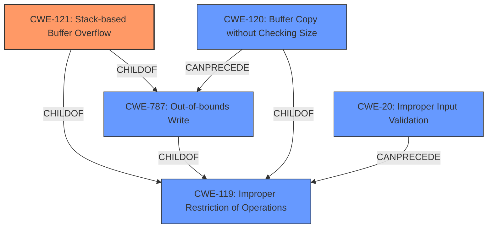

# Analysis for CVE-2021-46699

# Summary
| CWE ID | CWE Name | Confidence | CWE Abstraction Level | CWE Vulnerability Mapping Label | CWE-Vulnerability Mapping Notes |
|---|---|---|---|---|---|
| CWE-121 | Stack-based Buffer Overflow | 1.0 | Variant | Primary | Allowed |
| CWE-119 | Improper Restriction of Operations within the Bounds of a Memory Buffer | 0.7 | Class | Secondary | Discouraged |
| CWE-120 | Buffer Copy without Checking Size of Input ('Classic Buffer Overflow') | 0.6 | Base | Secondary | Allowed-with-Review |
| CWE-787 | Out-of-bounds Write | 0.6 | Base | Secondary | Allowed |
| CWE-20 | Improper Input Validation | 0.5 | Class | Secondary | Discouraged |

## Evidence and Confidence

*   **Confidence Score:** 0.8
*   **Evidence Strength:** HIGH

## Relationship Analysis
The primary CWE, CWE-121 (Stack-based Buffer Overflow), is a variant of CWE-787 (Out-of-bounds Write) and CWE-119 (Improper Restriction of Operations within the Bounds of a Memory Buffer). CWE-119 is a more general class of weakness, while CWE-121 is specific to stack-based overflows. CWE-120 (Buffer Copy without Checking Size of Input) can lead to CWE-787. CWE-20 (Improper Input Validation) can precede buffer overflows.

## Vulnerability Chain
The chain of events is as follows:
1.  **Root Cause:** **Lack of proper validation** of the length of user-supplied data (potentially CWE-20).
2.  **Weakness:** Copying data to a stack-based buffer without checking its size (CWE-120).
3.  **Vulnerability:** **Stack-based buffer overflow** (CWE-121, CWE-787).
4.  **Impact:** Remote code execution (as stated in the vulnerability description).

## Summary of Analysis
The analysis is based on the vulnerability description and the "CVE Reference Links Content Summary." The vulnerability is a **stack based buffer overflow** (CWE-121) that occurs while parsing specially crafted BDF files. The root cause is a lack of proper validation of the length of user-supplied data before copying it to a stack-based buffer. This can allow an attacker to execute code in the context of the current process.

The primary CWE is CWE-121 (Stack-based Buffer Overflow), as it is the most specific and accurate representation of the vulnerability.

The following CWEs were considered but not used as primary:

*   CWE-119 (Improper Restriction of Operations within the Bounds of a Memory Buffer): While this is a parent of CWE-121, it is too general. The vulnerability is specifically a stack-based buffer overflow, so CWE-121 is more appropriate. The mapping guidance discourages using CWE-119 when more specific CWEs are available.
*   CWE-120 (Buffer Copy without Checking Size of Input): This is a potential contributing factor, as the vulnerability involves copying data without checking the size. However, the description clearly states a **stack based buffer overflow**, making CWE-121 the better choice.
*   CWE-787 (Out-of-bounds Write): This is a parent of CWE-121. While the vulnerability does involve writing out of bounds, CWE-121 specifies that it is on the stack, thus it's more specific.
*   CWE-20 (Improper Input Validation): This could be a contributing factor if the size of the input isn't properly validated. However, the vulnerability description focuses on the buffer overflow itself, not the input validation.
*   CWE-190 (Integer Overflow or Wraparound), CWE-1284 (Improper Validation of Specified Quantity in Input): These were considered due to their retriever scores, but there isn't enough evidence to support these. While integer overflow/wraparound could potentially lead to the overflow, it isn't directly stated in the provided information. Improper validation of specified quantity in input, could be considered, but it's less descriptive of the specific overflow.

The selection of CWE-121 is at the optimal level of specificity because it accurately describes the vulnerability as a stack-based buffer overflow, which is the most detailed information available.

Relevant CWE Information:

# Enhanced Context (25 CWEs)
The following CWEs were identified as potentially relevant to this vulnerability:

## CWE-124: Buffer Underwrite ('Buffer Underflow')
**Abstraction Level**: Base
**Similarity Score**: 0.77
**Source**: dense

**Description**:
The product writes to a buffer using an index or pointer that references a memory location prior to the beginning of the buffer.

**Mapping Guidance**:
- Usage: Allowed
- Rationale: This CWE entry is at the Base level of abstraction, which is a preferred level of abstraction for mapping to the root causes of vulnerabilities.

## CWE-131: Incorrect Calculation of Buffer Size
**Abstraction Level**: Base
**Similarity Score**: 0.76
**Source**: dense

**Description**:
The product does not correctly calculate the size to be used when allocating a buffer, which could lead to a buffer overflow.

**Mapping Guidance**:
- Usage: Allowed
- Rationale: This CWE entry is at the Base level of abstraction, which is a preferred level of abstraction for mapping to the root causes of vulnerabilities.

## CWE-805: Buffer Access with Incorrect Length Value
**Abstraction Level**: Base
**Similarity Score**: 0.76
**Source**: dense

**Description**:
The product uses a sequential operation to read or write a buffer, but it uses an incorrect length value that causes it to access memory that is outside of the bounds of the buffer.

**Mapping Guidance**:
- Usage: Allowed
- Rationale: This CWE entry is at the Base level of abstraction, which is a preferred level of abstraction for mapping to the root causes of vulnerabilities.

## CWE-191: Integer Underflow (Wrap or Wraparound)
**Abstraction Level**: Base
**Similarity Score**: 0.76
**Source**: dense

**Description**:
The product subtracts one value from another, such that the result is less than the minimum allowable integer value, which produces a value that is not equal to the correct result.

**Mapping Guidance**:
- Usage: Allowed
- Rationale: This CWE entry is at the Base level of abstraction, which is a preferred level of abstraction for mapping to the root causes of vulnerabilities.

## CWE-126: Buffer Over-read
**Abstraction Level**: Variant
**Similarity Score**: 0.76
**Source**: dense

**Description**:
The product reads from a buffer using buffer access mechanisms such as indexes or pointers that reference memory locations after the targeted buffer.

**Mapping Guidance**:
- Usage: Allowed
- Rationale: This CWE entry is at the Variant level of abstraction, which is a preferred level of abstraction for mapping to the root causes of vulnerabilities.

## CWE-125: Out-of-bounds Read
**Abstraction Level**: Base
**Similarity Score**: 0.75
**Source**: dense

**Description**:
The product reads data past the end, or before the beginning, of the intended buffer.

**Mapping Guidance**:
- Usage: Allowed
- Rationale: This CWE entry is at the Base level of abstraction, which is a preferred level of abstraction for mapping to the root causes of vulnerabilities.

## CWE-127: Buffer Under-read
**Abstraction Level**: Variant
**Similarity Score**: 0.75
**Source**: dense

**Description**:
The product reads from a buffer using buffer access mechanisms such as indexes or pointers that reference memory locations prior to the targeted buffer.

**Mapping Guidance**:
- Usage: Allowed
- Rationale: This CWE entry is at the Variant level of abstraction, which