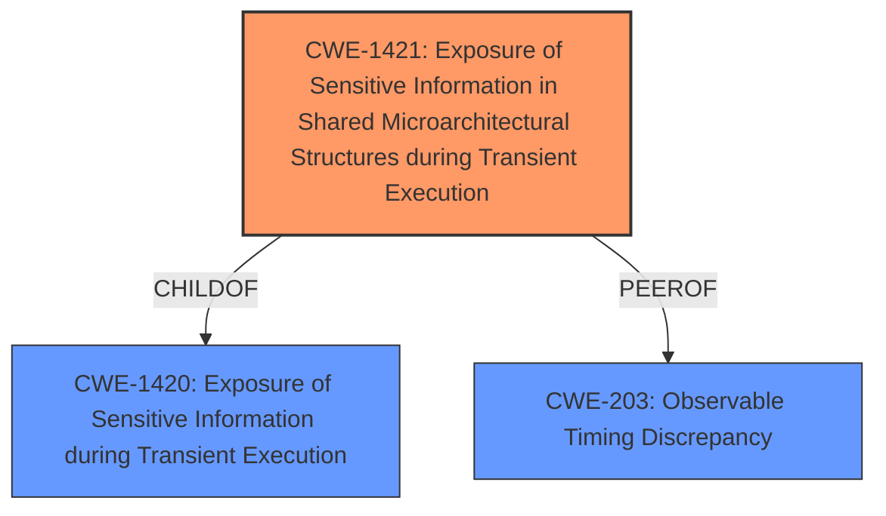

# Raw Analyzer Response for CVE-2021-46744

# Summary
| CWE ID    | CWE Name                                                                                                     | Confidence | CWE Abstraction Level | CWE Vulnerability Mapping Label | CWE-Vulnerability Mapping Notes |
| :-------- | :----------------------------------------------------------------------------------------------------------- | :--------- | :---------------------- | :------------------------------ | :------------------------------ |
| CWE-1421 | Exposure of Sensitive Information in Shared Microarchitectural Structures during Transient Execution | 0.85      | Base                     | Allowed                     | Primary CWE                   |
| CWE-203 | Observable Discrepancy                                                                                       | 0.75      | Base                     | Allowed                     | Secondary Candidate                 |
| CWE-1420 | Exposure of Sensitive Information during Transient Execution                                                 | 0.60      | Base                     | Allowed-with-Review                     | Secondary Candidate                 |

## Evidence and Confidence

*   **Confidence Score:** 0.80
*   **Evidence Strength:** HIGH

## Relationship Analysis
The primary CWE is CWE-1421, which is a child of CWE-1420. CWE-203 is a peer that shares characteristics of the vulnerability. The relationships influenced the decision by providing a hierarchy to choose the most specific CWE.

## Vulnerability Chain
The vulnerability chain involves a **ciphertext side channel** leading to **data leakage**. The attacker monitors ciphertext values over time from a malicious hypervisor to infer data values used in an SEV guest.

## Summary of Analysis
The analysis indicates that the vulnerability is primarily due to the exposure of sensitive information through a ciphertext side channel in AMD CPUs, specifically when using Secure Encrypted Virtualization (SEV). The attacker, with access to a malicious hypervisor, can monitor ciphertext values over time to infer data values used in a SEV guest. This aligns well with **CWE-1421: Exposure of Sensitive Information in Shared Microarchitectural Structures during Transient Execution**, as it involves accessing architecturally restricted data (data within the SEV guest) via a shared microarchitectural structure (CPU caches) during transient execution. The vulnerability also aligns with **CWE-203: Observable Discrepancy** since the monitoring of ciphertext values over time reflects a timing discrepancy that reveals information about the state of the system. Finally, **CWE-1420: Exposure of Sensitive Information during Transient Execution** is a more general case of the same issue.

The primary CWE is **CWE-1421: Exposure of Sensitive Information in Shared Microarchitectural Structures during Transient Execution** because it directly addresses the scenario where a processor event allows transient operations to access architecturally restricted data in a shared microarchitectural structure, potentially exposing the data over a covert channel. The description of **CWE-1421** aligns well with the details provided in the vulnerability description.

The evidence for **CWE-1421** is strong: "An attacker with access to a malicious hypervisor may be able to infer data values used in a SEV guest on AMD CPUs by monitoring ciphertext values over time." This statement clearly indicates exposure of sensitive information (data values) due to the monitoring of ciphertext, which can be considered a shared microarchitectural structure.

**CWE-203: Observable Discrepancy** is a secondary candidate since monitoring ciphertext values over time implies observing discrepancies in timing or behavior.

**CWE-1420: Exposure of Sensitive Information during Transient Execution** is also considered since it describes a more general case, but **CWE-1421** is more specific and therefore preferred.

The confidence in this assessment is high (0.80) due to the clear alignment of the vulnerability description with the characteristics of **CWE-1421**.