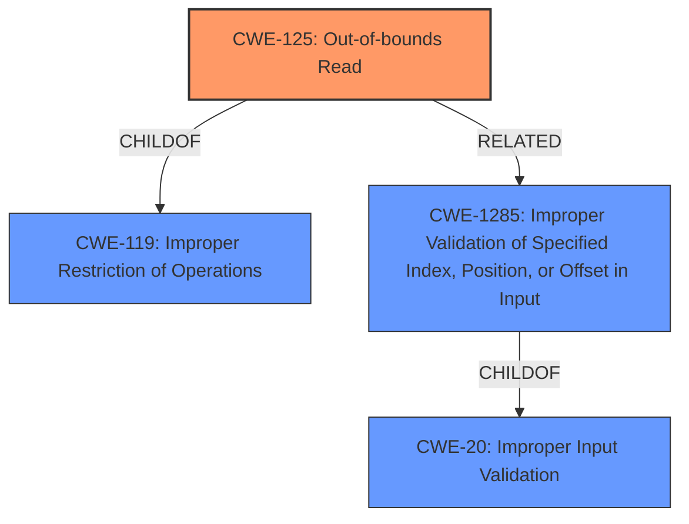

# Analysis Report for CVE-2021-46768

# Vulnerability Analysis Report: CVE-2021-46768

## Description


## Analysis (with Relationship Data)

# Summary
| CWE ID | CWE Name | Confidence | CWE Abstraction Level | CWE Vulnerability Mapping Label | CWE-Vulnerability Mapping Notes |
|---|---|---|---|---|---|
| CWE-125 | Out-of-bounds Read | 0.9 | Base | Allowed | Primary CWE |
| CWE-20 | Improper Input Validation | 0.7 | Class | Discouraged | Secondary Candidate |

## Evidence and Confidence

*   **Confidence Score:** 0.9
*   **Evidence Strength:** HIGH

## Relationship Analysis
The primary relationship that influenced my decision was the ChildOf relationship between CWE-125 and CWE-119 (Improper Restriction of Operations within the Bounds of a Memory Buffer), and between CWE-125, CWE-1285 and CWE-20 (Improper Input Validation).
CWE-125 is a more specific Base CWE than CWE-119, which is a Class CWE. This specificity makes CWE-125 a better fit for describing the vulnerability.
CWE-20 is a Class CWE and is too general, with the recommendation to use a child CWE instead.



## Vulnerability Chain
The vulnerability chain starts with **insufficient input validation**, leading to an **out-of-bounds memory read**, which can result in a denial of service.

## Summary of Analysis
The vulnerability description clearly states that **insufficient input validation** in SEV firmware allows an attacker to perform **out-of-bounds memory reads**, leading to a denial of service.

The primary CWE is CWE-125, as it directly describes the **out-of-bounds read** vulnerability. The evidence supporting this is:
*   Vulnerability Description: "...may allow an attacker to perform **out-of-bounds memory reads** within the ASP boot loader..."
*   CVE Reference Links Content Summary: "...**Out-of-bounds memory reads** within the ASP boot loader due to **improper input validation**."

CWE-20 (Improper Input Validation) was considered because the root cause is **insufficient input validation**. However, CWE-20 is a Class-level CWE and is discouraged for direct mapping when more specific Base-level CWEs are available.
The retriever results listed CWE-1285 (Improper Validation of Specified Index, Position, or Offset in Input) which is a more specific child of CWE-20, but based on the description, the **insufficient input validation** is not specific to just indexes, positions, or offsets. Thus, CWE-20 is a secondary candidate, but not the primary CWE.

CWE-787 (Out-of-bounds Write) was considered but not chosen as the vulnerability is specifically an **out-of-bounds read**, not a write.

The final decision is based on the evidence of the **out-of-bounds memory read**, the relationship analysis favoring specific Base-level CWEs, and the mapping guidance discouraging the use of the general CWE-20. CWE-125 is at the optimal level of specificity, accurately describing the vulnerability.

Relevant CWE Information:

# Enhanced Context (25 CWEs)

## CWE-1289: Improper Validation of Unsafe Equivalence in Input
**Abstraction Level**: Base
**Similarity Score**: 0.77
**Source**: dense

**Description**:
The product receives an input value that is used as a resource identifier or other type of reference, but it does not validate or incorrectly validates that the input is equivalent to a potentially-unsafe value.
**Rationale for Not Selecting**: The vulnerability description does not indicate an issue of unsafe equivalence. It is about general **insufficient input validation** leading to **out-of-bounds reads**, not about equivalence checks.

## CWE-805: Buffer Access with Incorrect Length Value
**Abstraction Level**: Base
**Similarity Score**: 0.76
**Source**: dense

**Description**:
The product uses a sequential operation to read or write a buffer, but it uses an incorrect length value that causes it to access memory that is outside of the bounds of the buffer.
**Rationale for Not Selecting**: While incorrect length could be a factor, the description focuses on the **insufficient validation** aspect and the resulting **out-of-bounds read**, not specifically on an incorrect length value during buffer access.

## CWE-131: Incorrect Calculation of Buffer Size
**Abstraction Level**: Base
**Similarity Score**: 0.76
**Source**: dense

**Description**:
The product does not correctly calculate the size to be used when allocating a buffer, which could lead to a buffer overflow.
**Rationale for Not Selecting**: The description doesn't mention incorrect buffer size calculation. It is related to **insufficient input validation** leading to **out-of-bounds reads**, not the buffer allocation itself.

## CWE-125: Out-of-bounds Read
**Abstraction Level**: Base
**Similarity Score**: 0.76
**Source**: dense

**Description**:
The product reads data past the end, or before the beginning, of the intended buffer.
**Rationale for Selecting**: This aligns directly with the vulnerability description mentioning **out-of-bounds memory reads**.

## CWE-823: Use of Out-of-range Pointer Offset
**Abstraction Level**: Base
**Similarity Score**: 0.75
**Source**: dense

**Description**:
The product performs pointer arithmetic on a valid pointer, but it uses an offset that can point outside of the intended range of valid memory locations for the resulting pointer.
**Rationale for Not Selecting**: The description does not explicitly mention pointer arithmetic or out-of-range offsets. It is about **insufficient input validation** and resulting **out-of-bounds reads**.

## CWE-191: Integer Underflow (Wrap or Wraparound)
**Abstraction Level**: Base
**Similarity Score**: 0.75
**Source**: dense

**Description**:
The product subtracts one value from another, such that the result is less than the minimum allowable integer value, which produces a value that is not equal to the correct result.
**Rationale for Not Selecting**: Integer underflow is not mentioned in the vulnerability description.

## CWE-667: Improper Locking
**Abstraction Level**: Class
**Similarity Score**: 0.75
**Source**: dense

**Description**:
The product does not properly acquire or release a lock on a resource, leading to unexpected resource state changes and behaviors.
**Rationale for Not Selecting**: Improper locking is not related to the described vulnerability.

## CWE-404: Improper Resource Shutdown or Release
**Abstraction Level**: Class
**Similarity Score**: 0.75
**Source**: dense

**Description**:
The product does not release or incorrectly releases a resource before it is made available for re-use.
**Rationale for Not Selecting**: Improper resource shutdown is not related to the described vulnerability.

## CWE-130: Improper Handling of Length Parameter Inconsistency
**Abstraction Level**: Base
**Similarity Score**: 0.75
**Source**: dense

**Description**:
The product parses a formatted message or structure, but it does not handle or incorrectly handles a length field that is inconsistent with the actual length of the associated data.
**Rationale for Not Selecting**: Length parameter inconsistency is not mentioned in the vulnerability description.

## CWE-193: Off-by-one Error
**Abstraction Level**: Base
**Similarity Score**: 0.75
**Source**: dense

**Description**:
A product calculates or uses an incorrect maximum or minimum value that is 1 more, or 1 less, than the correct value.
**Rationale for Not Selecting**: Off-by-one errors are not explicitly mentioned in the vulnerability description. It is about **insufficient input validation** and resulting **out-of-bounds reads**, not an off-by-one calculation error.

## CWE-125: Out-of-bounds Read
**Abstraction Level**: Base
**Similarity Score**: 6494.44
**Source**: sparse

**Description**:
The product reads data past the end, or before the beginning, of the intended buffer.
**Rationale for Selecting**: This aligns directly with the vulnerability description mentioning **out-of-bounds memory reads**.

## CWE-1284: Improper Validation of Specified Quantity in Input
**Abstraction Level**: Base
**Similarity Score**: 6411.39
**Source**: sparse


## CWE Relationship Analysis

Current CWEs represent these abstraction levels: .


### Vulnerability Chain Analysis

**Chain starting from CWE-131:**
- 131 (Incorrect Calculation of Buffer Size) - ROOT


**Chain starting from CWE-130:**
- 130 (Improper Handling of Length Parameter Inconsistency) - ROOT


### CWE Relationship Diagram

```mermaid
graph TD
    classDef primary fill:#f96,stroke:#333,stroke-width:2px
    classDef secondary fill:#69f,stroke:#333
    classDef tertiary fill:#9e9,stroke:#333
```


*Report generated on 2025-03-31 05:01:06*
