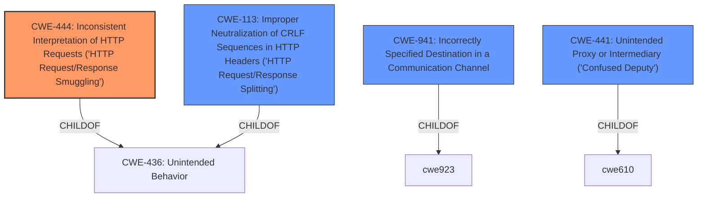

# Raw Analyzer Response for CVE-2021-46825

# Summary
| CWE ID | CWE Name | Confidence | CWE Abstraction Level | CWE Vulnerability Mapping Label | CWE-Vulnerability Mapping Notes |
|---|---|---|---|---|---|
| CWE-444 | Inconsistent Interpretation of HTTP Requests ('HTTP Request/Response Smuggling') | 0.9 | Base | Allowed | Primary CWE |

## Evidence and Confidence

*   **Confidence Score:** 0.9
*   **Evidence Strength:** HIGH

## Relationship Analysis
The primary relationship that influenced the decision was the direct match of the vulnerability description with the definition of CWE-444. CWE-444 is a Base level CWE, making it preferred. Other CWEs such as CWE-113, CWE-941, and CWE-441 were considered but deemed less specific to the root cause.

## Vulnerability Chain
The vulnerability chain begins with the **HTTP desync** due to the proxy's **inability to properly process crafted HTTP requests**. This leads to the **misinterpretation of request boundaries**, and ultimately to the **forwarding of responses to unintended recipients**.

## Summary of Analysis
The initial analysis strongly suggested CWE-444, which aligns directly with the **HTTP desync** vulnerability described. The vulnerability description states that "When a remote unauthenticated attacker and other web clients communicate through the proxy with the same web server, the attacker can send crafted HTTP requests and cause the proxy to forward web server responses to unintended clients." The "CVE Reference Links Content Summary" indicates the **root cause** is "HTTP desync vulnerability" and "The proxy mishandles crafted HTTP requests leading to a desynchronization in communication between the proxy, web server, and clients." CWE-444 describes this scenario: "The product acts as an intermediary HTTP agent but it does not interpret malformed HTTP requests or responses in ways that are consistent with how the messages will be processed by those entities that are at the ultimate destination." The retriever results also strongly suggest CWE-444.

CWE-113, Improper Neutralization of CRLF Sequences in HTTP Headers ('HTTP Request/Response Splitting'), was considered, but the vulnerability description doesn't explicitly mention CRLF injection. CWE-941, Incorrectly Specified Destination in a Communication Channel, was considered because the proxy forwards responses to unintended clients, but the **root cause** is not an incorrectly specified destination, but the **HTTP desync**. CWE-441, Unintended Proxy or Intermediary ('Confused Deputy'), was considered but it is a Class level CWE and less specific than CWE-444.

Therefore, based on the evidence, CWE-444 is the most appropriate and specific mapping.