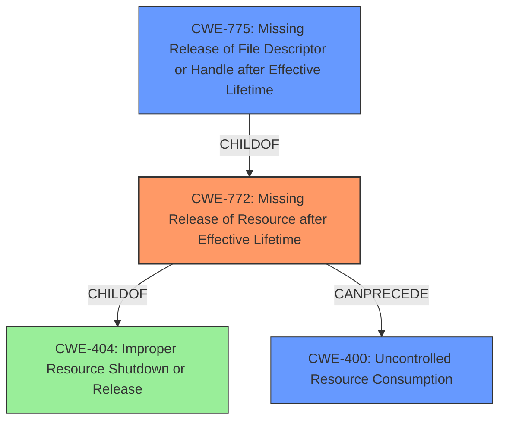

# Analysis Report for CVE-2021-46828

# Vulnerability Analysis Report: CVE-2021-46828

## Description


## Analysis (with Relationship Data)

# Summary
| CWE ID | CWE Name | Confidence | CWE Abstraction Level | CWE Vulnerability Mapping Label | CWE-Vulnerability Mapping Notes |
|---|---|---|---|---|---|
| CWE-772 | Missing Release of Resource after Effective Lifetime | 0.9 | Base | Allowed | Primary CWE |
| CWE-775 | Missing Release of File Descriptor or Handle after Effective Lifetime | 0.8 | Variant | Allowed | Secondary Candidate |
| CWE-400 | Uncontrolled Resource Consumption | 0.7 | Class | Discouraged | Secondary Candidate |

## Evidence and Confidence

*   **Confidence Score:** 0.9
*   **Evidence Strength:** HIGH

## Relationship Analysis
The primary CWE is CWE-772 (Missing Release of Resource after Effective Lifetime), which is a base-level CWE. A more specific variant, CWE-775 (Missing Release of File Descriptor or Handle after Effective Lifetime), was considered as a secondary candidate, since the resource in question is a file descriptor. CWE-400 (Uncontrolled Resource Consumption) is a higher-level class CWE that describes the impact of the resource leak.



## Vulnerability Chain
The vulnerability chain starts with **mishandled idle TCP connections**, which leads to **missing poll timeout handling** and **missing EMFILE error handling**. This results in the **exhaustion of file descriptors** and an **svc_run infinite loop**, ultimately causing a denial of service.

## Summary of Analysis
The initial analysis focused on the **mishandling of idle TCP connections** and the resulting **resource exhaustion**. The evidence from the CVE reference links confirms that the **root cause** is the **missing handling of poll timeouts** and `EMFILE` errors. This leads to a situation where the system's open file descriptor limit is reached, causing a denial of service.

CWE-772 (Missing Release of Resource after Effective Lifetime) is the most appropriate primary CWE because it directly addresses the **failure to release resources** (idle TCP connections) after their effective lifetime. The vulnerability description explicitly states that "remote attackers could exhaust the file descriptors of a process... because **idle TCP connections are mishandled**." The **mishandling** leads to these connections not being properly released, aligning perfectly with CWE-772.

CWE-775 (Missing Release of File Descriptor or Handle after Effective Lifetime) is a more specific variant of CWE-772, as it focuses on file descriptors. Given that the vulnerability ultimately leads to the exhaustion of file descriptors, CWE-775 could also be considered. However, the broader issue is the mishandling of TCP connections which leads to the failure to release them, making CWE-772 the more direct mapping.

CWE-400 (Uncontrolled Resource Consumption) describes the impact of the vulnerability (denial of service) rather than the **root cause**. While resource exhaustion is a consequence, the underlying issue is the **failure to release resources** after they are no longer needed.

The selection of CWE-772 as the primary CWE is based on the following evidence:

*   The vulnerability description's focus on **mishandled idle TCP connections**.
*   The CVE reference links' emphasis on **missing poll timeout handling** and `EMFILE` errors, preventing proper resource release.
*   The direct alignment of CWE-772's description with the **failure to release resources** after their effective lifetime.

The other CWEs were considered but not used as primary mappings because they either represented the impact (CWE-400) or were more specific instances of the primary weakness (CWE-775).

Relevant CWE Information:

# Enhanced Context (25 CWEs)
The following CWEs were identified as potentially relevant to this vulnerability:

## CWE-330: Use of Insufficiently Random Values
**Abstraction Level**: Class
**Similarity Score**: 0.79
**Source**: dense

**Description**:
The product uses insufficiently random numbers or values in a security context that depends on unpredictable numbers.

**Mapping Guidance**:
- Usage: Discouraged
- Rationale: This CWE entry is a level-1 Class (i.e., a child of a Pillar). It might have lower-level children that would be more appropriate

## CWE-404: Improper Resource Shutdown or Release
**Abstraction Level**: Class
**Similarity Score**: 0.78
**Source**: dense

**Description**:
The product does not release or incorrectly releases a resource before it is made available for re-use.

**Mapping Guidance**:
- Usage: Allowed-with-Review
- Rationale: This CWE entry is a Class and might have Base-level children that would be more appropriate

## CWE-226: Sensitive Information in Resource Not Removed Before Reuse
**Abstraction Level**: Base
**Similarity Score**: 0.78
**Source**: dense

**Description**:
The product releases a resource such as memory or a file so that it can be made available for reuse, but it does not clear or "zeroize" the information contained in the resource before the product performs a critical state transition or makes the resource available for reuse by other entities.

**Mapping Guidance**:
- Usage: Allowed
- Rationale: This CWE entry is at the Base level of abstraction, which is a preferred level of abstraction for mapping to the root causes of vulnerabilities.

## CWE-667: Improper Locking
**Abstraction Level**: Class
**Similarity Score**: 0.76
**Source**: dense

**Description**:
The product does not properly acquire or release a lock on a resource, leading to unexpected resource state changes and behaviors.

**Mapping Guidance**:
- Usage: Allowed-with-Review
- Rationale: This CWE entry is a Class and might have Base-level children that would be more appropriate

## CWE-668: Exposure of Resource to Wrong Sphere
**Abstraction Level**: Class
**Similarity Score**: 0.76
**Source**: dense

**Description**:
The product exposes a resource to the wrong control sphere, providing unintended actors with inappropriate access to the resource.

**Mapping Guidance**:
- Usage: Discouraged
- Rationale: CWE-668 is high-level and is often misused as a catch-all when lower-level CWE IDs might be applicable. It is sometimes used for low-information vulnerability reports [REF-1287]. It is a level-1 Class (i.e., a child of a Pillar). It is not useful for trend analysis.

## CWE-754: Improper Check for Unusual or Exceptional Conditions
**Abstraction Level**: Class
**Similarity Score**: 0.76
**Source**: dense

**Description**:
The product does not check or incorrectly checks for unusual or exceptional conditions that are not expected to occur frequently during day to day operation of the product.

**Mapping Guidance**:
- Usage: Allowed-with-Review
- Rationale: This CWE entry is a Class and might have Base-level children that would be more appropriate

## CWE-664: Improper Control of a Resource Through its Lifetime
**Abstraction Level**: Pillar
**Similarity Score**: 0.76
**Source**: dense

**Description**:
The product does not maintain or incorrectly maintains control over a resource throughout its lifetime of creation, use, and release.

**Mapping Guidance**:
- Usage: Discouraged
- Rationale: This CWE entry is high-level when lower-level children are available.

## CWE-405: Asymmetric Resource Consumption (Amplification)
**Abstraction Level**: Class
**Similarity Score**: 0.76
**Source**: dense

**Description**:
The product does not properly control situations in which an adversary can cause the product to consume or produce excessive resources without requiring the adversary to invest equivalent work or otherwise prove authorization, i.e., the adversary's influence is "asymmetric."

**Mapping Guidance**:
- Usage: Allowed-with-Review
- Rationale: This CWE entry is a Class and might have Base-level children that would be more appropriate

## CWE-331: Insufficient Entropy
**Abstraction Level**: Base
**Similarity Score**: 0.76
**Source**: dense

**Description**:
The product uses an algorithm or scheme that produces insufficient entropy, leaving patterns or clusters of values that are more likely to occur than others.

**Mapping Guidance**:
- Usage: Allowed
- Rationale: This CWE entry is


## CWE Relationship Analysis

Current CWEs represent these abstraction levels: .


### Vulnerability Chain Analysis

**Chain starting from CWE-331:**
- 331 (Insufficient Entropy) - ROOT


**Chain starting from CWE-400:**
- 400 (Uncontrolled Resource Consumption) - ROOT


### CWE Relationship Diagram

```mermaid
graph TD
    classDef primary fill:#f96,stroke:#333,stroke-width:2px
    classDef secondary fill:#69f,stroke:#333
    classDef tertiary fill:#9e9,stroke:#333
```


*Report generated on 2025-03-30 21:56:50*
