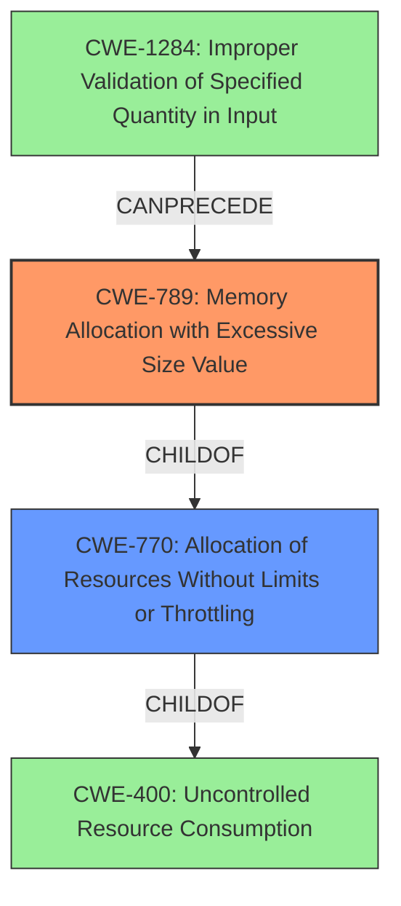

# Raw Analyzer Response for CVE-2021-46877

# Summary
| CWE ID | CWE Name | Confidence | CWE Abstraction Level | CWE Vulnerability Mapping Label | CWE-Vulnerability Mapping Notes |
|---|---|---|---|---|---|
| CWE-789 | Memory Allocation with Excessive Size Value | 0.9 | Variant | Allowed | Primary CWE |
| CWE-770 | Allocation of Resources Without Limits or Throttling | 0.7 | Base | Allowed | Secondary Candidate |
| CWE-400 | Uncontrolled Resource Consumption | 0.5 | Class | Discouraged | Secondary Candidate |

## Evidence and Confidence

*   **Confidence Score:** 0.8
*   **Evidence Strength:** HIGH

## Relationship Analysis
The primary CWE is CWE-789, which is a variant of CWE-770. CWE-770 is a child of CWE-400. This hierarchical relationship suggests a path from a general resource consumption issue (CWE-400) to a more specific problem of allocating memory with an excessive size (CWE-789). The vulnerability chain includes the lack of validation of input that specifies the size, which leads to memory allocation with an excessive size, which in turn leads to denial of service.

## Vulnerability Chain
The vulnerability chain starts with the improper handling of deserialized `JsonNode` objects through JDK serialization. The attacker can craft a malicious payload that leads to:
1.  **Improper Validation of Specified Quantity in Input (CWE-1284)**: The input stream contains a size or quantity that is not properly validated.
2.  **Memory Allocation with Excessive Size Value (CWE-789)**: The system attempts to allocate a large amount of memory based on the attacker-controlled size, without proper checks.
3.  **Uncontrolled Resource Consumption (CWE-400)**: The excessive memory allocation leads to resource exhaustion.
4.  **Denial of Service (Impact)**: The exhaustion of memory resources results in a denial-of-service condition.

## Summary of Analysis
The initial analysis strongly suggests CWE-789 as the primary weakness, supported by the vulnerability description and the retriever results. The description explicitly mentions "2 GB transient heap usage per read," indicating a memory allocation issue. The **root cause** involves **improper handling of deserialized JsonNode objects** through JDK serialization, allowing a crafted payload to cause excessive heap memory usage.

The final decision is based on:
1.  **Evidence:** The "CVE Reference Links Content Summary" explicitly states that the vulnerability allows for "excessive heap memory usage during deserialization," leading to a denial of service.
2.  **Relationship Analysis:** The hierarchical relationship between CWE-400, CWE-770, and CWE-789 helps to narrow down the specific weakness. CWE-789 is a variant of CWE-770, which is a child of CWE-400.
3.  **Mapping Guidance:** CWE-789 is a Variant, which is a preferred level of abstraction. The mapping guidance for CWE-789 allows its usage.

The selected CWEs are at the optimal level of specificity because:
*   CWE-789 directly reflects the **root cause** of the vulnerability, which is the memory allocation with an excessive size value.
*   CWE-770 provides a broader context of allocating resources without limits or throttling.
*   CWE-400 represents the high-level consequence of the vulnerability, which is uncontrolled resource consumption.

Relevant CWE Information:

# Enhanced Context (25 CWEs)
The following CWEs were identified as potentially relevant to this vulnerability:

## CWE-789: Memory Allocation with Excessive Size Value
**Abstraction Level**: Variant
**Similarity Score**: 0.79
**Source**: dense

**Description**:
The product allocates memory based on an untrusted, large size value, but it does not ensure that the size is within expected limits, allowing arbitrary amounts of memory to be allocated.

**Mapping Guidance**:
- Usage: Allowed
- Rationale: This CWE entry is at the Variant level of abstraction, which is a preferred level of abstraction for mapping to the root causes of vulnerabilities.

## CWE-1325: Improperly Controlled Sequential Memory Allocation
**Abstraction Level**: Base
**Similarity Score**: 0.77
**Source**: dense

**Description**:
The product manages a group of objects or resources and performs a separate memory allocation for each object, but it does not properly limit the total amount of memory that is consumed by all of the combined objects.

**Mapping Guidance**:
- Usage: Allowed
- Rationale: This CWE entry is at the Base level of abstraction, which is a preferred level of abstraction for mapping to the root causes of vulnerabilities.

## CWE-131: Incorrect Calculation of Buffer Size
**Abstraction Level**: Base
**Similarity Score**: 0.77
**Source**: dense

**Description**:
The product does not correctly calculate the size to be used when allocating a buffer, which could lead to a buffer overflow.

**Mapping Guidance**:
- Usage: Allowed
- Rationale: This CWE entry is at the Base level of abstraction, which is a preferred level of abstraction for mapping to the root causes of vulnerabilities.

## CWE-191: Integer Underflow (Wrap or Wraparound)
**Abstraction Level**: Base
**Similarity Score**: 0.77
**Source**: dense

**Description**:
The product subtracts one value from another, such that the result is less than the minimum allowable integer value, which produces a value that is not equal to the correct result.

**Mapping Guidance**:
- Usage: Allowed
- Rationale: This CWE entry is at the Base level of abstraction, which is a preferred level of abstraction for mapping to the root causes of vulnerabilities.

## CWE-674: Uncontrolled Recursion
**Abstraction Level**: Class
**Similarity Score**: 0.76
**Source**: dense

**Description**:
The product does not properly control the amount of recursion that takes place,  consuming excessive resources, such as allocated memory or the program stack.

**Mapping Guidance**:
- Usage: Allowed-with-Review
- Rationale: This CWE entry is a Class and might have Base-level children that would be more appropriate

## CWE-404: Improper Resource Shutdown or Release
**Abstraction Level**: Class
**Similarity Score**: 0.76
**Source**: dense

**Description**:
The product does not release or incorrectly releases a resource before it is made available for re-use.

**Mapping Guidance**:
- Usage: Allowed-with-Review
- Rationale: This CWE entry is a Class and might have Base-level children that would be more appropriate

## CWE-126: Buffer Over-read
**Abstraction Level**: Variant
**Similarity Score**: 0.76
**Source**: dense

**Description**:
The product reads from a buffer using buffer access mechanisms such as indexes or pointers that reference memory locations after the targeted buffer.

**Mapping Guidance**:
- Usage: Allowed
- Rationale: This CWE entry is at the Variant level of abstraction, which is a preferred level of abstraction for mapping to the root causes of vulnerabilities.

## CWE-226: Sensitive Information in Resource Not Removed Before Reuse
**Abstraction Level**: Base
**Similarity Score**: 0.76
**Source**: dense

**Description**:
The product releases a resource such as memory or a file so that it can be made available for reuse, but it does not clear or "zeroize" the information contained in the resource before the product performs a critical state transition or makes the resource available for reuse by other entities.

**Mapping Guidance**:
- Usage: Allowed
- Rationale: This CWE entry is at the Base level of abstraction, which is a preferred level of abstraction for mapping to the root causes of vulnerabilities.

## CWE-190: Integer Overflow or Wraparound
**Abstraction Level**: Base
**Similarity Score**: 0.76
**Source**: dense

**Description**:
The product performs a calculation that can
         produce an integer overflow or wraparound when the logic
         assumes that the resulting value will always be larger than
         the original value. This occurs when an integer value is
         incremented to