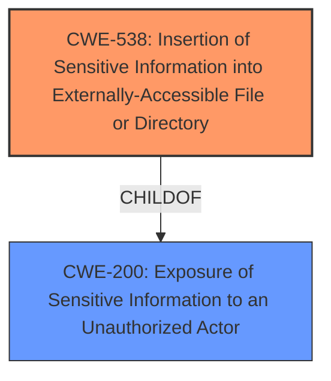

# Raw Analyzer Response for CVE-2022-0013

# Summary
| CWE ID | CWE Name | Confidence | CWE Abstraction Level | CWE Vulnerability Mapping Label | CWE-Vulnerability Mapping Notes |
|---|---|---|---|---|---|
| CWE-538 | Insertion of Sensitive Information into Externally-Accessible File or Directory | 1.0 | Base | Allowed | Primary CWE |
| CWE-200 | Exposure of Sensitive Information to an Unauthorized Actor | 0.5 | Class | Discouraged | Secondary Candidate |

## Evidence and Confidence

*   **Confidence Score:** 0.8
*   **Evidence Strength:** HIGH

## Relationship Analysis
The primary relationship considered was the ChildOf relationship between CWE-538 and CWE-200. CWE-538 is a more specific case of CWE-200, representing the insertion of sensitive information into externally accessible files, while CWE-200 is a general exposure of sensitive information. Given that the vulnerability explicitly mentions reading arbitrary files, CWE-538 was preferred as the more precise classification.

## Vulnerability Chain
The vulnerability chain involves a local attacker triggering the generation of a support file, which inadvertently includes sensitive information. This **file information exposure** allows the attacker to read the contents of arbitrary files with elevated privileges.

## Summary of Analysis
The initial assessment strongly points to CWE-538 as the primary weakness, given the explicit mention of **file information exposure** and the ability to read arbitrary files. The "CVE Reference Links Content Summary" section states that the "**Weaknesses/vulnerabilities present**: File and Directory Information Exposure (CWE-538)". The Retriever results also listed CWE-538 as the top combined result.

CWE-200 was considered but ultimately deemed too general. While the vulnerability does result in the exposure of sensitive information, the root cause is specifically related to the inclusion of this information in an externally accessible file.

Therefore, CWE-538 is the most appropriate choice as it directly reflects the **root cause** and mechanism of the vulnerability.

Relevant CWE Information:

# Enhanced Context (25 CWEs)
The following CWEs were identified as potentially relevant to this vulnerability:

## CWE-538: Insertion of Sensitive Information into Externally-Accessible File or Directory
**Abstraction Level**: Base
**Similarity Score**: 0.80
**Source**: dense

**Description**:
The product places sensitive information into files or directories that are accessible to actors who are allowed to have access to the files, but not to the sensitive information.

**Mapping Guidance**:
- Usage: Allowed
- Rationale: This CWE entry is at the Base level of abstraction, which is a preferred level of abstraction for mapping to the root causes of vulnerabilities.

## CWE-200: Exposure of Sensitive Information to an Unauthorized Actor
**Abstraction Level**: Class
**Similarity Score**: 0.73
**Source**: dense

**Description**:
The product exposes sensitive information to an actor that is not explicitly authorized to have access to that information.

**Mapping Guidance**:
- Usage: Discouraged
- Rationale: CWE-200 is commonly misused to represent the loss of confidentiality in a vulnerability, but confidentiality loss is a technical impact - not a root cause error. As of CWE 4.9, over 400 CWE entries can lead to a loss of confidentiality. Other options are often available. [REF-1287].
### CWE Considerations

*   **CWE-538 (Insertion of Sensitive Information into Externally-Accessible File or Directory):** This CWE accurately reflects the vulnerability where sensitive information is placed into files accessible to unauthorized actors. The vulnerability description highlights the ability to read arbitrary files, which aligns with the accessibility aspect of CWE-538. The "CVE Reference Links Content Summary" also suggests that the **weaknesses/vulnerabilities present** is "File and Directory Information Exposure (CWE-538)".
    *   **Security Implications:** An attacker can gain unauthorized access to sensitive information, potentially leading to further exploitation or compromise of the system.
    *   **Relationship:** ChildOf CWE-200 (Exposure of Sensitive Information to an Unauthorized Actor).
    *   **Mapping Guidance:** Allowed - This CWE entry is at the Base level of abstraction.
*   **CWE-200 (Exposure of Sensitive Information to an Unauthorized Actor):** This CWE is more general and describes the exposure of sensitive information to unauthorized actors. While the vulnerability does result in such exposure, the root cause is the inclusion of sensitive information in a file.
    *   **Security Implications:** Sensitive information can be accessed by unauthorized parties, leading to potential data breaches, identity theft, or other malicious activities.
    *   **Relationship:** ParentOf CWE-538.
    *   **Mapping Guidance:** Discouraged - CWE-200 is commonly misused to represent the loss of confidentiality in a vulnerability, but confidentiality loss is a technical impact - not a root cause error.