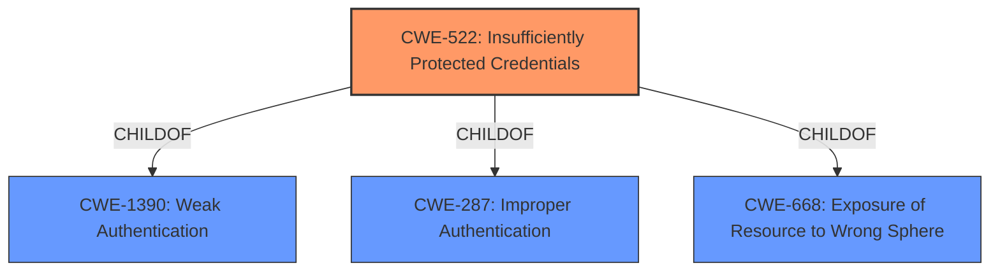

# Analysis Report for CVE-2022-0019

# Vulnerability Analysis Report: CVE-2022-0019

## Description


## Analysis (with Relationship Data)

# Summary
| CWE ID | CWE Name | Confidence | CWE Abstraction Level | CWE Vulnerability Mapping Label | CWE-Vulnerability Mapping Notes |
|---|---|---|---|---|---|
| CWE-522 | Insufficiently Protected Credentials | 1.0 | Class | Allowed-with-Review | Primary CWE |

## Evidence and Confidence

*   **Confidence Score:** 1.0
*   **Evidence Strength:** HIGH

## Relationship Analysis
The primary CWE is CWE-522, "Insufficiently Protected Credentials," which is a Class-level CWE. It is a child of CWE-1390 (Weak Authentication) and CWE-287 (Improper Authentication). While more specific Base or Variant level CWEs might exist, the provided information focuses on the broad category of credentials not being adequately protected. The relationship analysis highlights the need to consider more specific children of CWE-522 if more details were available.



## Vulnerability Chain
The vulnerability chain starts with the **insufficiently protected credentials**, leading to the exposure of hashed credentials. A local attacker can then use these exposed credentials to authenticate as the target user, gaining unauthorized access.

## Summary of Analysis
The analysis is based on the provided evidence which states, "An **insufficiently protected credentials** vulnerability exists...that exposes the hashed credentials...". The key phrase "insufficiently protected credentials" is the root cause, aligning directly with CWE-522. The retriever results also strongly suggest CWE-522 as the primary candidate. While CWE-522 is a class-level CWE, the available information doesn't point to a more specific base or variant. Given the evidence, CWE-522 is the most appropriate and specific CWE that can be assigned.

Relevant CWE Information:

# Enhanced Context (25 CWEs)
The following CWEs were identified as potentially relevant to this vulnerability:

## CWE-1391: Use of Weak Credentials
**Abstraction Level**: Class
**Similarity Score**: 0.80

## CWE-798: Use of Hard-coded Credentials
**Abstraction Level**: Base
**Similarity Score**: 0.80

## CWE-312: Cleartext Storage of Sensitive Information
**Abstraction Level**: Base
**Similarity Score**: 0.80

## CWE-916: Use of Password Hash With Insufficient Computational Effort
**Abstraction Level**: Base
**Similarity Score**: 0.79

## CWE-303: Incorrect Implementation of Authentication Algorithm
**Abstraction Level**: Base
**Similarity Score**: 0.79

## CWE-345: Insufficient Verification of Data Authenticity
**Abstraction Level**: Class
**Similarity Score**: 0.79

## CWE-321: Use of Hard-coded Cryptographic Key
**Abstraction Level**: Variant
**Similarity Score**: 0.79

## CWE-319: Cleartext Transmission of Sensitive Information
**Abstraction Level**: Base
**Similarity Score**: 0.78

## CWE-328: Use of Weak Hash
**Abstraction Level**: Base
**Similarity Score**: 0.78

## CWE-522: Insufficiently Protected Credentials
**Abstraction Level**: Class
**Similarity Score**: 0.78

## CWE-916: Use of Password Hash With Insufficient Computational Effort
**Abstraction Level**: Base
**Similarity Score**: 5822.72

## CWE-367: Time-of-check Time-of-use (TOCTOU) Race Condition
**Abstraction Level**: Base
**Similarity Score**: 5247.90

## CWE-319: Cleartext Transmission of Sensitive Information
**Abstraction Level**: Base
**Similarity Score**: 5080.32

## CWE-1390: Weak Authentication
**Abstraction Level**: Class
**Similarity Score**: 5069.79

## CWE-347: Improper Verification of Cryptographic Signature
**Abstraction Level**: Base
**Similarity Score**: 5067.39

## CWE-367: Time-of-check Time-of-use (TOCTOU) Race Condition
**Abstraction Level**: base
**Similarity Score**: 4.33

## CWE-609: Double-Checked Locking
**Abstraction Level**: base
**Similarity Score**: 4.33

## CWE-208: Observable Timing Discrepancy
**Abstraction Level**: base
**Similarity Score**: 2.73

## CWE-499: Serializable Class Containing Sensitive Data
**Abstraction Level**: variant
**Similarity Score**: 2.68

## CWE-498: Cloneable Class Containing Sensitive Information
**Abstraction Level**: variant
**Similarity Score**: 2.68

## CWE-942: Permissive Cross-domain Policy with Untrusted Domains
**Abstraction Level**: variant
**Similarity Score**: 2.55

## CWE-306: Missing Authentication for Critical Function
**Abstraction Level**: base
**Similarity Score**: 2.47

## CWE-538: Insertion of Sensitive Information into Externally-Accessible File or Directory
**Abstraction Level**: base
**Similarity Score**: 2.47

## CWE-532: Insertion of Sensitive Information into Log File
**Abstraction Level**: base
**Similarity Score**: 2.47

## CWE-347: Improper Verification of Cryptographic Signature
**Abstraction Level**: base
**Similarity Score**: 2.47

CWEs considered but not used:

*   CWE-916 (Use of Password Hash With Insufficient Computational Effort): While this could be a contributing factor, the primary issue is the **insufficient protection** of the credentials themselves, not necessarily the strength of the hash.
*   CWE-319 (Cleartext Transmission of Sensitive Information): The credentials are not transmitted in cleartext, but the hashed credentials are exposed due to **insufficient protection**.
*   CWE-532 (Insertion of Sensitive Information into Log File): While the credentials might be logged, the description emphasizes the exposure to local users, not specifically logging.
*   CWE-367 (Time-of-check Time-of-use (TOCTOU) Race Condition): This CWE is not relevant as there is no race condition described.
*   CWE-347 (Improper Verification of Cryptographic Signature): This CWE is not relevant, as there is no mention of signature verification.
*   CWE-303 (Incorrect Implementation of Authentication Algorithm): The description doesn't highlight an incorrect implementation of the authentication algorithm itself, but rather the **insufficient protection** of the stored credentials.
*   CWE-321 (Use of Hard-coded Cryptographic Key): This is not relevant as there is no mention of hardcoded keys.

The choice of CWE-522 is the most accurate because it directly addresses the core issue of credentials not being adequately protected, leading to their exposure.


## CWE Relationship Analysis

Current CWEs represent these abstraction levels: .


### Vulnerability Chain Analysis

**Chain starting from CWE-208:**
- 208 (Observable Timing Discrepancy) - ROOT


**Chain starting from CWE-942:**
- 942 (Permissive Cross-domain Policy with Untrusted Domains) - ROOT


### CWE Relationship Diagram

```mermaid
graph TD
    classDef primary fill:#f96,stroke:#333,stroke-width:2px
    classDef secondary fill:#69f,stroke:#333
    classDef tertiary fill:#9e9,stroke:#333
```


*Report generated on 2025-03-30 18:40:24*
