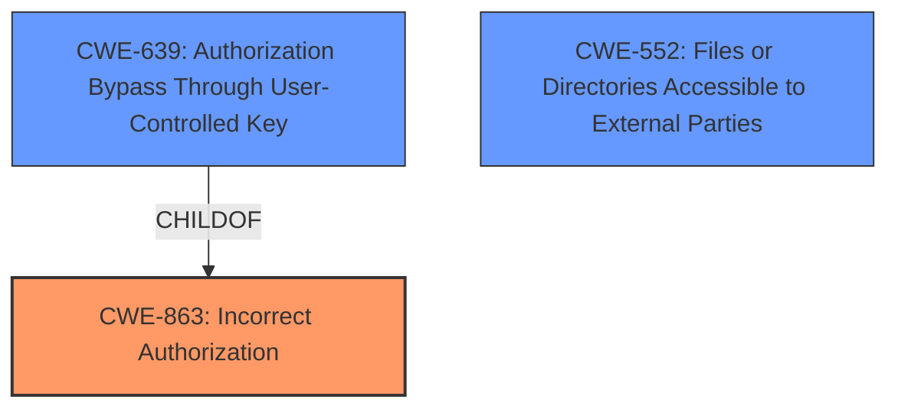

# Analysis for CVE-2022-0093

# Summary
| CWE ID | CWE Name | Confidence | CWE Abstraction Level | CWE Vulnerability Mapping Label | CWE-Vulnerability Mapping Notes |
|---|---|---|---|---|---|
| CWE-863 | Incorrect Authorization | 0.9 | Class | Primary CWE | Allowed-with-Review |
| CWE-639 | Authorization Bypass Through User-Controlled Key | 0.7 | Base | Secondary Candidate | Allowed |
| CWE-552 | Files or Directories Accessible to External Parties | 0.6 | Base | Secondary Candidate | Allowed |

## Evidence and Confidence

*   **Confidence Score:** 0.8
*   **Evidence Strength:** HIGH

## Relationship Analysis
The primary relationship impacting the decision is that CWE-639 (Authorization Bypass Through User-Controlled Key) is a child of CWE-863 (Incorrect Authorization). While CWE-639 is more specific, the vulnerability description focuses on the general incorrect authorization, rather than a user-controlled key specifically. CWE-552 (Files or Directories Accessible to External Parties) is considered because the ultimate impact is that sensitive information is accessed through RSS feeds, which are essentially files accessible to external parties. However, the root cause is in authorization, not directly in file access controls.

## Vulnerability Chain
The vulnerability chain starts with an **inconsistent authentication** mechanism, leading to **incorrect authorization**, and finally resulting in **access to sensitive information** via RSS feeds.

## Summary of Analysis
Initially, I considered CWE-639 because it is a more specific case of authorization bypass. However, the provided description emphasizes that the root cause is the **inconsistent authentication** checks across different parts of the application (expired password checks not consistently applied). The "CVE Reference Links Content Summary" states: "The primary weakness is the inconsistent application of password expiration checks. While most of the GitLab interface was blocked for users with expired passwords, RSS feeds and some API endpoints remained accessible." This suggests a broader problem of **incorrect authorization** (CWE-863) rather than just a specific bypass using user-controlled keys.

Therefore, CWE-863 (Incorrect Authorization) is the primary CWE, accurately reflecting the **incorrect** execution of the authorization check. The fact that users with expired passwords can still access sensitive data through RSS feeds means that the authorization logic **fails** to properly restrict access based on the password expiration status.

CWE-639 is a possible secondary CWE, since the bypass occurs by the system not properly checking data access operations to ensure that the user has entitlements to perform the requested data access, hence bypassing authorization checks in the system.

CWE-552 reflects the impact of the **incorrect authorization**, where files or directories (RSS feeds) become accessible to external parties (users with expired passwords).

The abstraction levels were considered. CWE-863 is a Class, but no more specific child CWE clearly matches the **inconsistent authentication** root cause. CWE-639 is a Base, but it is too specific, focusing on "user-controlled key" rather than a general **incorrect authorization** implementation.

The final decision is based on the evidence in the "CVE Reference Links Content Summary" and the broader context of the vulnerability description, which clearly points to an **incorrect authorization** problem rather than a specific bypass or file access control issue.