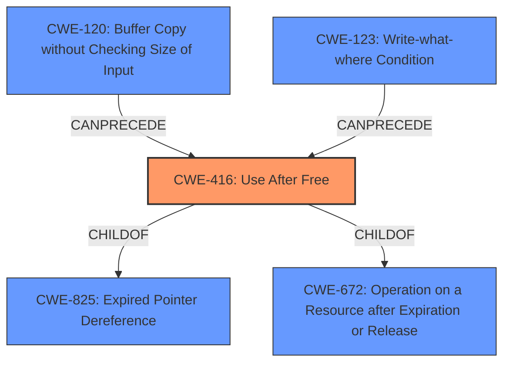

# Analysis Report for CVE-2022-0096

# Vulnerability Analysis Report: CVE-2022-0096

## Description


## Analysis (with Relationship Data)

# Summary
| CWE ID | CWE Name | Confidence | CWE Abstraction Level | CWE Vulnerability Mapping Label | CWE-Vulnerability Mapping Notes |
|---|---|---|---|---|---|
| CWE-416 | Use After Free | 1.0 | Variant | Allowed | Primary CWE |

## Evidence and Confidence

*   **Confidence Score:** 1.0
*   **Evidence Strength:** HIGH

## Relationship Analysis
The primary relationship influencing the decision is the direct match of the vulnerability description to CWE-416. CWE-416 is a variant of CWE-825 (Expired Pointer Dereference), CWE-672 (Operation on a Resource after Expiration or Release). The graph shows that CWE-416 can be preceded by CWE-120 (Buffer Copy without Checking Size of Input) and CWE-123 (Write-what-where Condition), indicating potential causes for the use-after-free condition.



## Vulnerability Chain
The vulnerability chain starts with the **use after free** condition in the Storage component. This leads to **heap corruption**, which can then be exploited by a remote attacker via a crafted HTML page. The chain is: **Use After Free** (CWE-416) -> **Heap Corruption** -> Remote Code Execution

## Summary of Analysis
The analysis is based on the vulnerability description and the CVE Reference Links Content Summary, both of which explicitly mention the **use after free** condition. The vulnerability description states: "Use after free in Storage in Google Chrome prior to 97.0.4692.71 allowed a remote attacker to potentially exploit **heap corruption** via a crafted HTML page." The CVE Reference Links Content Summary confirms this, stating the root cause as: "Use-after-free in the Storage component of the Chrome browser."

The selection of CWE-416 is based on the explicit mention of "use after free" in the vulnerability description and the confirmation in the CVE Reference Links Content Summary. The CWE-416 description aligns perfectly with the vulnerability, describing a scenario where "The product reuses or references memory after it has been freed." This direct match, along with the primary CWE match in similar CVE descriptions, gives high confidence in this assessment. The retriever results also list CWE-416 as the top candidate.

CWE-366, CWE-843, CWE-122, CWE-415, CWE-590, CWE-123, CWE-362, CWE-911, and CWE-1021 were considered but not selected. CWE-366 (Race Condition within a Thread), CWE-362 (Concurrent Execution using Shared Resource with Improper Synchronization ('Race Condition')) and CWE-911 (Improper Update of Reference Count) relate to concurrency issues, which are not explicitly mentioned in the description. CWE-843 (Access of Resource Using Incompatible Type ('Type Confusion')) and CWE-122 (Heap-based Buffer Overflow) and CWE-123 (Write-what-where Condition) relate to type confusion and buffer overflows, which are potential consequences of use-after-free but not the root cause in this case. CWE-415 (Double Free) and CWE-590 (Free of Memory not on the Heap) are memory management errors, but the description clearly indicates a use-after-free scenario. CWE-1021 (Improper Restriction of Rendered UI Layers or Frames) relates to UI issues, which are not relevant to this vulnerability.

The selected CWE is at the optimal level of specificity because it directly represents the **use after free** condition described in the vulnerability.


## CWE Relationship Analysis

Current CWEs represent these abstraction levels: .


### Vulnerability Chain Analysis

**Chain starting from CWE-825:**
- 825 (Expired Pointer Dereference) - ROOT


**Chain starting from CWE-672:**
- 672 (Operation on a Resource after Expiration or Release) - ROOT


### CWE Relationship Diagram

```mermaid
graph TD
    classDef primary fill:#f96,stroke:#333,stroke-width:2px
    classDef secondary fill:#69f,stroke:#333
    classDef tertiary fill:#9e9,stroke:#333
```


*Report generated on 2025-03-30 23:22:13*
