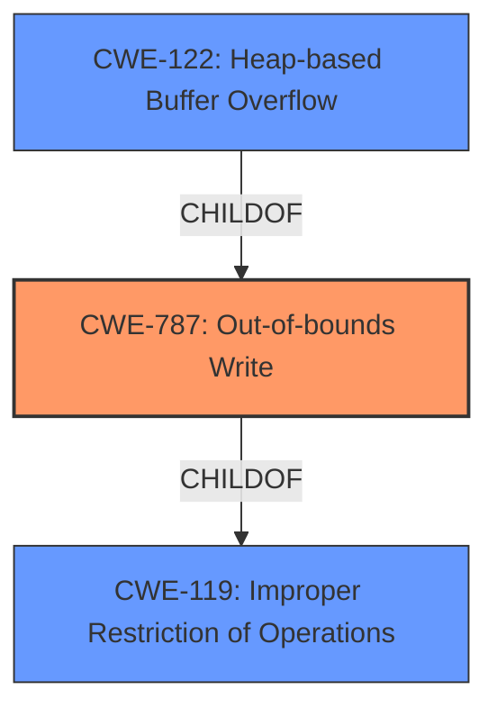

# Raw Analyzer Response for CVE-2022-0100

# Summary
| CWE ID | CWE Name | Confidence | CWE Abstraction Level | CWE Vulnerability Mapping Label | CWE-Vulnerability Mapping Notes |
|---|---|---|---|---|---|
| CWE-787 | Out-of-bounds Write | 1.0 | Base | Allowed | Primary CWE. The vulnerability is a heap buffer overflow, which falls under out-of-bounds write. |
| CWE-122 | Heap-based Buffer Overflow | 0.8 | Variant | Allowed | Secondary CWE. This is a more specific variant of CWE-787, indicating the overflow occurs on the heap. |
| CWE-119 | Improper Restriction of Operations within the Bounds of a Memory Buffer | 0.6 | Class | Discouraged | Secondary CWE. While a general buffer overflow, CWE-787 and CWE-122 are more specific. |

## Evidence and Confidence

*   **Confidence Score:** 0.9
*   **Evidence Strength:** HIGH

## Relationship Analysis
The primary CWE is CWE-787 (**Out-of-bounds Write**), which is a base-level CWE. CWE-122 (**Heap-based Buffer Overflow**) is a variant of CWE-787, providing more specificity. CWE-119 (**Improper Restriction of Operations within the Bounds of a Memory Buffer**) is a class-level CWE that is a parent of both CWE-787 and CWE-122. The relationships are hierarchical, with CWE-119 being the most general and CWE-122 being the most specific.

## Vulnerability Chain
The vulnerability chain starts with the **heap buffer overflow** (CWE-787), leading to heap corruption and potentially arbitrary code execution.

## Summary of Analysis
The analysis is based on the provided vulnerability description and CVE details. The description clearly states a **heap buffer overflow** in the Media streams API. This aligns directly with CWE-787 (**Out-of-bounds Write**) because a buffer overflow is a write past the allocated memory. The fact that it is a *heap* buffer overflow allows for the additional mapping of CWE-122 (**Heap-based Buffer Overflow**) as a secondary CWE.

The evidence from the vulnerability description key phrases:
- **rootcause:** **buffer overflow**
- **impact:** heap corruption

The evidence from the CVE Reference Links Content Summary:
*   The vulnerability is a heap buffer overflow in the Media streams API within the Chromium browser.
*   **Heap Buffer Overflow:** This indicates that the software writes data beyond the allocated buffer on the heap memory. This can lead to corruption of other data in the heap, application crashes, or, in some cases, arbitrary code execution.

The selection of CWE-787 is based on the **root cause** being a buffer overflow where data is written past the end of the allocated buffer. This is a direct match for CWE-787. CWE-122 is a more specific variant as it specifies that this **buffer overflow** occurs on the heap.

The relationship graph highlights the hierarchical nature of the CWEs. CWE-119 is a general class, while CWE-787 and CWE-122 are more specific. Given the available evidence, selecting CWE-787 and CWE-122 provides the most accurate representation of the vulnerability.

Relevant CWE Information:

# Enhanced Context (25 CWEs)
The following CWEs were identified as potentially relevant to this vulnerability:

## CWE-131: Incorrect Calculation of Buffer Size
**Abstraction Level**: Base
**Similarity Score**: 0.78
**Source**: dense

**Description**:
The product does not correctly calculate the size to be used when allocating a buffer, which could lead to a buffer overflow.

**Mapping Guidance**:
- Usage: Allowed
- Rationale: This CWE entry is at the Base level of abstraction, which is a preferred level of abstraction for mapping to the root causes of vulnerabilities.

*   Not Selected. There is no evidence provided in the description that the buffer size was incorrectly calculated.

## CWE-191: Integer Underflow (Wrap or Wraparound)
**Abstraction Level**: Base
**Similarity Score**: 0.77
**Source**: dense

**Description**:
The product subtracts one value from another, such that the result is less than the minimum allowable integer value, which produces a value that is not equal to the correct result.

**Mapping Guidance**:
- Usage: Allowed
- Rationale: This CWE entry is at the Base level of abstraction, which is a preferred level of abstraction for mapping to the root causes of vulnerabilities.

*   Not Selected. There is no evidence provided in the description that this vulnerability is due to an integer underflow.

## CWE-124: Buffer Underwrite ('Buffer Underflow')
**Abstraction Level**: Base
**Similarity Score**: 0.77
**Source**: dense

**Description**:
The product writes to a buffer using an index or pointer that references a memory location prior to the beginning of the buffer.

**Mapping Guidance**:
- Usage: Allowed
- Rationale: This CWE entry is at the Base level of abstraction, which is a preferred level of abstraction for mapping to the root causes of vulnerabilities.

*   Not Selected. The vulnerability description clearly says that it is a buffer overflow and not a buffer underflow.

## CWE-193: Off-by-one Error
**Abstraction Level**: Base
**Similarity Score**: 0.77
**Source**: dense

**Description**:
A product calculates or uses an incorrect maximum or minimum value that is 1 more, or 1 less, than the correct value.

**Mapping Guidance**:
- Usage: Allowed
- Rationale: This CWE entry is at the Base level of abstraction, which is a preferred level of abstraction for mapping to the root causes of vulnerabilities.

*   Not Selected. There is no evidence provided in the description that the buffer size was off by one.

## CWE-805: Buffer Access with Incorrect Length Value
**Abstraction Level**: Base
**Similarity Score**: 0.77
**Source**: dense

**Description**:
The product uses a sequential operation to read or write a buffer, but it uses an incorrect length value that causes it to access memory that is outside of the bounds of the buffer.

**Mapping Guidance**:
- Usage: Allowed
- Rationale: This CWE entry is at the Base level of abstraction, which is a preferred level of abstraction for mapping to the root causes of vulnerabilities.

*   Not Selected. There is no evidence provided in the description that an incorrect length value was used when accessing the buffer.

## CWE-126: Buffer Over-read
**Abstraction Level**: Variant
**Similarity Score**: 0.76
**Source**: dense

**Description**:
The product reads from a buffer using buffer access mechanisms such as indexes or pointers that reference memory locations after the targeted buffer.

**Mapping Guidance**:
- Usage: Allowed
- Rationale: This CWE entry is at the Variant level of abstraction, which is a preferred level of abstraction for mapping to the root causes of vulnerabilities.

*   Not Selected. The vulnerability description clearly states that the vulnerability is due to a buffer *overflow*, not a buffer *over-read*.

## CWE-197: Numeric Truncation Error
**Abstraction Level**: Base
**Similarity Score**: 0.75
**Source**: dense

**Description**:
Truncation errors occur when a primitive is cast to a primitive of a smaller size and data is lost in the conversion.

**Mapping Guidance**:
- Usage: Allowed
- Rationale: This CWE entry is at the Base level of abstraction, which is a preferred level of abstraction for mapping to the root causes of vulnerabilities.

*   Not Selected. There is no evidence provided in the description that the vulnerability is due to a numeric truncation error.

## CWE-125: Out-of-bounds Read
**Abstraction Level**: Base
**Similarity Score**: 0.75
**Source**: dense

**Description**:
The product reads data past the end, or before the beginning, of the intended buffer.

**Mapping Guidance**:
- Usage: Allowed
- Rationale: This CWE entry is at the Base level of abstraction, which is a preferred level of abstraction for mapping to the root causes of vulnerabilities.

*   Not Selected. The vulnerability description clearly states that the vulnerability is due to a buffer *overflow*, not a buffer *over-read*.

## CWE-366: Race Condition within a Thread
**Abstraction Level**: Base
**Similarity Score**: 0.75
**Source**: dense

**Description**:
If two threads of