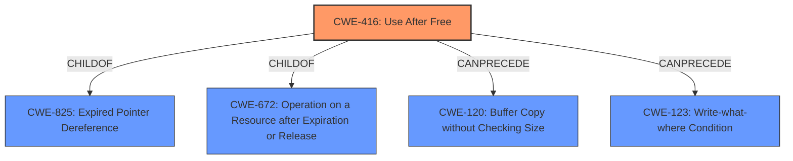

# Analysis Report for CVE-2022-0103

# Vulnerability Analysis Report: CVE-2022-0103

## Description


## Analysis (with Relationship Data)

# Summary
| CWE ID | CWE Name | Confidence | CWE Abstraction Level | CWE Vulnerability Mapping Label | CWE-Vulnerability Mapping Notes |
|---|---|---|---|---|---|
| **CWE-416** | Use After Free | 1.0 | Variant | Primary | Allowed |

## Evidence and Confidence

*   **Confidence Score:** 1.0
*   **Evidence Strength:** HIGH

## Relationship Analysis
The primary relationship that impacted my decision was the ChildOf relationship where CWE-416 is a variant of other CWEs like CWE-825 (Expired Pointer Dereference). The fact that CWE-416 is a Variant and the description clearly states "use after free" makes it the best and most specific match.



## Vulnerability Chain
The vulnerability chain starts with the **use after free** (**WEAKNESS**) which leads to heap corruption and the potential for arbitrary code execution.

## Summary of Analysis
The initial analysis strongly pointed towards CWE-416 because the **Vulnerability Description Key Phrases** included "**rootcause:** **use after free**". The **CVE Reference Links Content Summary** also stated, "The vulnerability is a use-after-free (UAF) error" and "Use-after-free vulnerability exists in SwiftShader". The primary CWE match from **CWE for similar CVE Descriptions** was also CWE-416. The retriever results listed CWE-416 as the top combined result.

Based on this evidence, CWE-416 is the most appropriate and specific classification.

Relevant CWE Information:

# Enhanced Context (25 CWEs)

## CWE-416: Use After Free
**Abstraction:** Variant
**Status:** Stable

### Description
The product reuses or references memory after it has been freed. At some point afterward, the memory may be allocated again and saved in another pointer, while the original pointer references a location somewhere within the new allocation. Any operations using the original pointer are no longer valid because the memory "belongs" to the code that operates on the new pointer.

### Mapping Guidance
**Usage:** Allowed
**Rationale:** This CWE entry is at the Variant level of abstraction, which is a preferred level of abstraction for mapping to the root causes of vulnerabilities.

### Explanation of why other CWEs were considered but not used:
*   CWE-366, CWE-843, CWE-122, CWE-415, CWE-113, CWE-123, CWE-362, CWE-911, CWE-1021: These CWEs were considered because they appeared in the Retriever Results. However, they do not specifically describe the **use after free** condition, making CWE-416 a more precise fit. While some of these could potentially be related or result from a use-after-free, they are not the root cause in this case.


## CWE Relationship Analysis

Current CWEs represent these abstraction levels: .


### Vulnerability Chain Analysis

**Chain starting from CWE-911:**
- 911 (Improper Update of Reference Count) - ROOT


**Chain starting from CWE-825:**
- 825 (Expired Pointer Dereference) - ROOT


### CWE Relationship Diagram

```mermaid
graph TD
    classDef primary fill:#f96,stroke:#333,stroke-width:2px
    classDef secondary fill:#69f,stroke:#333
    classDef tertiary fill:#9e9,stroke:#333
```


*Report generated on 2025-03-30 21:34:53*
