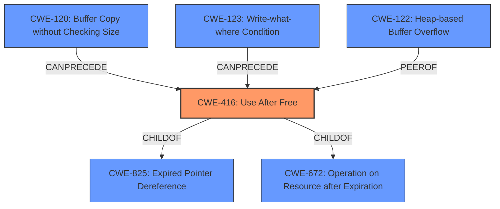

# Analysis Report for CVE-2022-0106

# Vulnerability Analysis Report: CVE-2022-0106

## Description


## Analysis (with Relationship Data)

# Summary
| CWE ID | CWE Name | Confidence | CWE Abstraction Level | CWE Vulnerability Mapping Label | CWE-Vulnerability Mapping Notes |
|---|---|---|---|---|---|
| CWE-416 | Use After Free | 1.0 | Variant | Allowed | Primary CWE |
| CWE-122 | Heap-based Buffer Overflow | 0.5 | Variant | Allowed | Secondary Candidate |

## Evidence and Confidence

*   **Confidence Score:** 0.75
*   **Evidence Strength:** HIGH

## Relationship Analysis
The primary CWE is CWE-416, which is a Variant. CWE-416 is child of CWE-825 (Expired Pointer Dereference) and CWE-672 (Operation on Resource after Expiration). CWE-416 can be preceded by CWE-120 (Buffer Copy without Checking Size) and CWE-123 (Write-what-where Condition).



## Vulnerability Chain
The vulnerability chain starts with a **use after free** (CWE-416), which allows a remote attacker to potentially exploit **heap corruption** (CWE-122) via a crafted HTML page.

## Summary of Analysis
The vulnerability is a **use-after-free** in the Autofill component of Google Chrome. An attacker can exploit this vulnerability by convincing a user to perform specific user gestures on a crafted HTML page, potentially leading to **heap corruption**.

The primary weakness is **CWE-416: Use After Free**. The vulnerability description explicitly states "Use after free in Autofill". The CVE Reference Links Content Summary also confirms the root cause as "Use after free". This aligns perfectly with the CWE-416 description: "The product reuses or references memory after it has been freed." The confidence score is high (1.0) because the evidence directly matches the CWE definition.

The secondary candidate weakness is **CWE-122: Heap-based Buffer Overflow**. The vulnerability description mentions potential **heap corruption**. While heap corruption can manifest in various ways, a heap-based buffer overflow is a common consequence. However, the description does not explicitly state a buffer overflow, so the confidence score is lower (0.5).

Other CWEs Considered:

*   CWE-415 (Double Free): While related to memory management, the vulnerability description doesn't explicitly mention a double free.
*   CWE-366 (Race Condition within a Thread): There is no evidence of a race condition in the provided description.
*   CWE-843 (Access of Resource Using Incompatible Type ('Type Confusion')): There is no evidence of type confusion in the provided description.
*   CWE-1021 (Improper Restriction of Rendered UI Layers or Frames): This CWE relates to clickjacking, which is not directly relevant to the described vulnerability.
*   CWE-123 (Write-what-where Condition): This is a potential impact of a use-after-free but not the root cause.
*   CWE-362 (Concurrent Execution using Shared Resource with Improper Synchronization ('Race Condition')): There is no evidence of a race condition in the provided description.
*   CWE-911 (Improper Update of Reference Count): There is no evidence of reference counting issues in the provided description.
*   CWE-404 (Improper Resource Shutdown or Release): This CWE is too general and doesn't specifically address the use-after-free condition.

The selection of CWE-416 is at the optimal level of specificity because it accurately represents the root cause of the vulnerability, which is the reuse of freed memory. The evidence supports this selection, and the CWE description aligns with the vulnerability details.


## CWE Relationship Analysis

Current CWEs represent these abstraction levels: .


### Vulnerability Chain Analysis

**Chain starting from CWE-825:**
- 825 (Expired Pointer Dereference) - ROOT


**Chain starting from CWE-843:**
- 843 (Access of Resource Using Incompatible Type ('Type Confusion')) - ROOT


### CWE Relationship Diagram

```mermaid
graph TD
    classDef primary fill:#f96,stroke:#333,stroke-width:2px
    classDef secondary fill:#69f,stroke:#333
    classDef tertiary fill:#9e9,stroke:#333
```


*Report generated on 2025-03-31 12:02:06*
