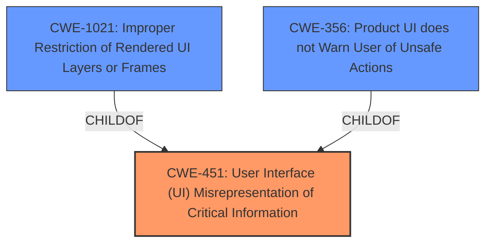

# Raw Analyzer Response for CVE-2022-0110

# Summary
| CWE ID    | CWE Name                                                                    | Confidence | CWE Abstraction Level | CWE Vulnerability Mapping Label | CWE-Vulnerability Mapping Notes |
| :---------- | :-------------------------------------------------------------------------- | :--------- | :---------------------- | :------------------------------ | :------------------------------ |
| CWE-451     | User Interface (UI) Misrepresentation of Critical Information             | 0.9        | Class                   | Primary                         | Allowed-with-Review           |
| CWE-1021    | Improper Restriction of Rendered UI Layers or Frames                     | 0.7        | Base                    | Secondary                       | Allowed                       |
| CWE-356     | Product UI does not Warn User of Unsafe Actions                          | 0.6        | Base                    | Secondary                       | Allowed                       |

## Evidence and Confidence

*   **Confidence Score:** 0.8
*   **Evidence Strength:** HIGH

## Relationship Analysis
The primary CWE is CWE-451, a Class-level weakness that encompasses UI misrepresentation. CWE-1021 (Improper Restriction of Rendered UI Layers or Frames) and CWE-356 (Product UI does not Warn User of Unsafe Actions) are considered as secondary candidates since they are related to the UI and can influence the security actions that a user may take without being properly informed.
The relationships highlight that CWE-1021 and CWE-356 are more specific Base-level weaknesses related to UI misrepresentation, which are encompassed by the broader Class-level CWE-451.

## Vulnerability Chain
The chain of events in this vulnerability is as follows:
1.  **Root Cause:** An **incorrect security UI in Autofill** (**CWE-451**) leads to...
2.  **Mechanism:** Improper or missing restrictions on UI rendering (**CWE-1021**) and **lack of warnings about unsafe actions** (**CWE-356**).
3.  **Impact:** A remote attacker can **spoof the contents of the Omnibox (URL bar)**, potentially tricking users into providing sensitive information or performing unintended actions.

## Summary of Analysis
The initial assessment, based on the vulnerability description, pointed towards issues related to UI misrepresentation and incorrect security handling. The Retriever Results highlighted CWE-451 as a strong candidate, along with other UI-related weaknesses.

The final decision is to assign **CWE-451 (User Interface (UI) Misrepresentation of Critical Information)** as the primary CWE. The vulnerability description explicitly mentions an "**incorrect security UI in Autofill**" which allowed an attacker to spoof the Omnibox. This aligns directly with the description of CWE-451, which states that the UI does not properly represent critical information to the user, allowing it to be obscured or spoofed.

The supporting evidence comes from the vulnerability description key phrases and the CVE Reference Links Content Summary, where the root cause is identified as an "**incorrect security UI in Autofill**". The impact is the ability to "spoof the contents of the Omnibox (URL bar)".

CWE-1021 and CWE-356 were also considered as secondary CWEs because they represent more specific aspects of the UI issue. CWE-1021 addresses improper restrictions on UI rendering, while CWE-356 focuses on the **lack of warnings about unsafe actions**. Both of these issues contribute to the overall UI misrepresentation but are not the primary root cause.

The selection of CWE-451 as the primary CWE is at the optimal level of specificity, given the provided evidence. While more specific weaknesses might exist, the available information does not provide sufficient detail to justify a more granular classification.

Relevant CWE Information:

# Enhanced Context (25 CWEs)

## CWE-1289: Improper Validation of Unsafe Equivalence in Input
**Abstraction Level**: Base
**Similarity Score**: 0.79
**Source**: dense

**Description**:
The product receives an input value that is used as a resource identifier or other type of reference, but it does not validate or incorrectly validates that the input is equivalent to a potentially-unsafe value.
**Why it was not selected:** This CWE is more related to input validation issues, which is not the case here where the UI is the weakness.

## CWE-451: User Interface (UI) Misrepresentation of Critical Information
**Abstraction Level**: Class
**Similarity Score**: 0.77
**Source**: dense

**Description**:
The user interface (UI) does not properly represent critical information to the user, allowing the information - or its source - to be obscured or spoofed. This is often a component in phishing attacks.
**Why it was selected:** This CWE perfectly describes the vulnerability where the autofill UI misrepresents the security aspect of the autofill function.

## CWE-843: Access of Resource Using Incompatible Type ('Type Confusion')
**Abstraction Level**: Base
**Similarity Score**: 0.76
**Source**: dense

**Description**:
The product allocates or initializes a resource such as a pointer, object, or variable using one type, but it later accesses that resource using a type that is incompatible with the original type.
**Why it was not selected:** This CWE is not applicable as there is no type confusion in this vulnerability.

## CWE-358: Improperly Implemented Security Check for Standard
**Abstraction Level**: Base
**Similarity Score**: 0.76
**Source**: dense

**Description**:
The product does not implement or incorrectly implements one or more security-relevant checks as specified by the design of a standardized algorithm, protocol, or technique.
**Why it was considered:** While the UI is incorrect, this could be argued as an improper security check.
**Why it was not selected:** More accurately describes missing security checks rather than UI representation.

## CWE-404: Improper Resource Shutdown or Release
**Abstraction Level**: Class
**Similarity Score**: 0.76
**Source**: dense

**Description**:
The product does not release or incorrectly releases a resource before it is made available for re-use.
**Why it was not selected:** This CWE is not related to the vulnerability.

## CWE-657: Violation of Secure Design Principles
**Abstraction Level**: Class
**Similarity Score**: 0.76
**Source**: dense

**Description**:
The product violates well-established principles for secure design.
**Why it was not selected:** Too generic and doesn't accurately reflect the vulnerability's root cause.

## CWE-754: Improper Check for Unusual or Exceptional Conditions
**Abstraction Level**: Class
**Similarity Score**: 0.75
**Source**: dense

**Description**:
The product does not check or incorrectly checks for unusual or exceptional conditions that are not expected to occur frequently during day to day operation of the product.
**Why it was not selected:** This CWE is not applicable to the vulnerability.

## CWE-667: Improper Locking
**Abstraction Level**: Class
**Similarity Score**: 0.75
**Source**: dense

**Description**:
The product does not properly acquire or release a lock on a resource, leading to unexpected resource state changes and behaviors.
**Why it was not selected:** This CWE is not applicable to the vulnerability.

## CWE-653: Improper Isolation or Compartmentalization
**Abstraction Level**: Class
**Similarity Score**: 0.75
**Source**: dense

**Description**:
The product does not properly compartmentalize or isolate functionality, processes, or resources that require different privilege levels, rights, or permissions.
**Why it was not selected:** This CWE is not applicable to the vulnerability.

## CWE-41: Improper Resolution of Path Equivalence
**Abstraction Level**: Base
**Similarity Score**: 0.75
**Source**: dense

**Description**:
The product is vulnerable to file system contents disclosure through path equivalence. Path equivalence involves the use of special characters in file and directory names. The associated manipulations are intended to generate multiple names for the same object.
**Why it was not selected:** This CWE is not applicable to the vulnerability.

## CWE-451: User Interface (UI) Misrepresentation of Critical Information
**Abstraction Level**: Class
**Similarity Score**: 6422.86
**Source**: sparse

**Description**:
The user interface (UI) does not properly represent critical information to the user, allowing the information - or its source - to be obscured or spoofed. This is often a component in phishing attacks.
**Why it was selected:** This CWE perfectly describes the vulnerability