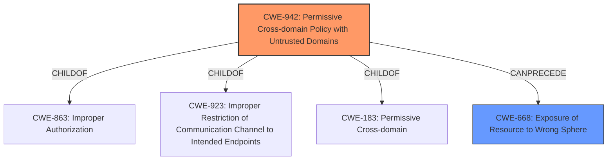

# Raw Analyzer Response for CVE-2022-0117

# Summary
| CWE ID  | CWE Name                                                                | Confidence | CWE Abstraction Level | CWE Vulnerability Mapping Label | CWE-Vulnerability Mapping Notes |
| ------- | ----------------------------------------------------------------------- | ---------- | --------------------- | ------------------------------- | ------------------------------- |
| CWE-942 | Permissive Cross-domain Policy with Untrusted Domains                    | 0.75       | Variant               | Allowed                         | Primary CWE                     |
| CWE-668 | Exposure of Resource to Wrong Sphere                                    | 0.65       | Class                 | Discouraged                     | Secondary Candidate             |

## Evidence and Confidence

*   **Confidence Score:** 0.70
*   **Evidence Strength:** MEDIUM

## Relationship Analysis
The primary CWE, CWE-942, represents a specific type of policy bypass related to cross-domain access. It is a variant of CWE-863 (Improper Authorization), CWE-923 (Improper Restriction of Communication Channel to Intended Endpoints), and CWE-183 (Permissive Cross-domain Policy). CWE-942 can precede CWE-668 (Exposure of Resource to Wrong Sphere), indicating a potential chain where a permissive policy leads to unintended access.

## Vulnerability Chain
The vulnerability chain starts with a **policy bypass** in Blink, which allows a remote attacker to **leak cross-origin data**. This can be mapped as:
1.  **ROOT CAUSE:** CWE-942 (Permissive Cross-domain Policy with Untrusted Domains) - The **policy bypass** likely stems from a misconfigured or overly permissive cross-domain policy.
2.  **IMPACT:** Data Leakage - The **leak cross-origin data** is the direct result of the bypassed policy.

## Summary of Analysis
The initial assessment considered various CWEs, but the primary focus was on those related to policy bypasses and cross-origin issues. The selection of CWE-942 is based on the vulnerability description, which explicitly mentions a **policy bypass** leading to cross-origin data leakage.

> Vulnerability Description: **Policy bypass** in Blink in Google Chrome prior to 97.0.4692.71 allowed a remote attacker to leak cross-origin data via a crafted HTML page.

The "CVE Reference Links Content Summary" section reinforces this understanding:

> root\_cause: "Policy bypass in Service Workers."
> weaknesses: ["Policy bypass"]
> impact: "A policy bypass vulnerability exists in Service Workers."

CWE-942 is at the Variant level, providing a more specific classification than a general "Improper Authorization" or "Policy Bypass" CWE. While other CWEs like CWE-416 (Use After Free) and CWE-451 (User Interface (UI) Misrepresentation of Critical Information) were considered, they do not directly address the root cause of a **policy bypass** leading to cross-origin data leakage. CWE-668 (Exposure of Resource to Wrong Sphere) is a plausible secondary candidate since the **policy bypass** leads to exposing data to the wrong sphere. However, it is a class level CWE and is discouraged. Therefore, I am choosing CWE-942 as the primary CWE with moderate confidence.

Relevant CWE Information:
# Enhanced Context (25 CWEs)
The following CWEs were identified as potentially relevant to this vulnerability:

## CWE-356: Product UI does not Warn User of Unsafe Actions
**Abstraction Level**: Base
**Similarity Score**: 0.82
**Source**: dense

**Description**:
The product's user interface does not warn the user before undertaking an unsafe action on behalf of that user. This makes it easier for attackers to trick users into inflicting damage to their system.

**Mapping Guidance**:
- Usage: Allowed
- Rationale: This CWE entry is at the Base level of abstraction, which is a preferred level of abstraction for mapping to the root causes of vulnerabilities.

## CWE-451: User Interface (UI) Misrepresentation of Critical Information
**Abstraction Level**: Class
**Similarity Score**: 0.80
**Source**: dense

**Description**:
The user interface (UI) does not properly represent critical information to the user, allowing the information - or its source - to be obscured or spoofed. This is often a component in phishing attacks.

**Mapping Guidance**:
- Usage: Allowed-with-Review
- Rationale: This CWE entry is a Class and might have Base-level children that would be more appropriate

## CWE-59: Improper Link Resolution Before File Access ('Link Following')
**Abstraction Level**: Base
**Similarity Score**: 0.79
**Source**: dense

**Description**:
The product attempts to access a file based on the filename, but it does not properly prevent that filename from identifying a link or shortcut that resolves to an unintended resource.

**Mapping Guidance**:
- Usage: Allowed
- Rationale: This CWE entry is at the Base level of abstraction, which is a preferred level of abstraction for mapping to the root causes of vulnerabilities.

## CWE-184: Incomplete List of Disallowed Inputs
**Abstraction Level**: Base
**Similarity Score**: 0.79
**Source**: dense

**Description**:
The product implements a protection mechanism that relies on a list of inputs (or properties of inputs) that are not allowed by policy or otherwise require other action to neutralize before additional processing takes place, but the list is incomplete.

**Mapping Guidance**:
- Usage: Allowed
- Rationale: This CWE entry is at the Base level of abstraction, which is a preferred level of abstraction for mapping to the root causes of vulnerabilities.

## CWE-41: Improper Resolution of Path Equivalence
**Abstraction Level**: Base
**Similarity Score**: 0.78
**Source**: dense

**Description**:
The product is vulnerable to file system contents disclosure through path equivalence. Path equivalence involves the use of special characters in file and directory names. The associated manipulations are intended to generate multiple names for the same object.

**Mapping Guidance**:
- Usage: Allowed
- Rationale: This CWE entry is at the Base level of abstraction, which is a preferred level of abstraction for mapping to the root causes of vulnerabilities.

## CWE-668: Exposure of Resource to Wrong Sphere
**Abstraction Level**: Class
**Similarity Score**: 0.78
**Source**: dense

**Description**:
The product exposes a resource to the wrong control sphere, providing unintended actors with inappropriate access to the resource.

**Mapping Guidance**:
- Usage: Discouraged
- Rationale: CWE-668 is high-level and is often misused as a catch-all when lower-level CWE IDs might be applicable. It is sometimes used for low-information vulnerability reports [REF-1287]. It is a level-1 Class (i.e., a child of a Pillar). It is not useful for trend analysis.

## CWE-754: Improper Check for Unusual or Exceptional Conditions
**Abstraction Level**: Class
**Similarity Score**: 0.77
**Source**: dense

**Description**:
The product does not check or incorrectly checks for unusual or exceptional conditions that are not expected to occur frequently during day to day operation of the product.

**Mapping Guidance**:
- Usage: Allowed-with-Review
- Rationale: This CWE entry is a Class and might have Base-level children that would be more appropriate

## CWE-1289: Improper Validation of Unsafe Equivalence in Input
**Abstraction Level**: Base
**Similarity Score**: 0.77
**Source**: dense

**Description**:
The product receives an input value that is used as a resource identifier or other type of reference, but it does not validate or incorrectly validates that the input is equivalent to a potentially-unsafe value.

**Mapping Guidance**:
- Usage: Allowed
- Rationale: This CWE entry is at the Base level of abstraction, which is a preferred level of abstraction for mapping to the root causes of vulnerabilities.

## CWE-73: External Control of File Name or Path
**Abstraction Level**: Base
**Similarity Score**: 0.76
**Source**: dense

**Description**:
The product allows user input to control or influence paths or file names that are used in filesystem operations.

**Mapping Guidance**:
- Usage: Allowed
- Rationale: This CWE entry is at the Base level of