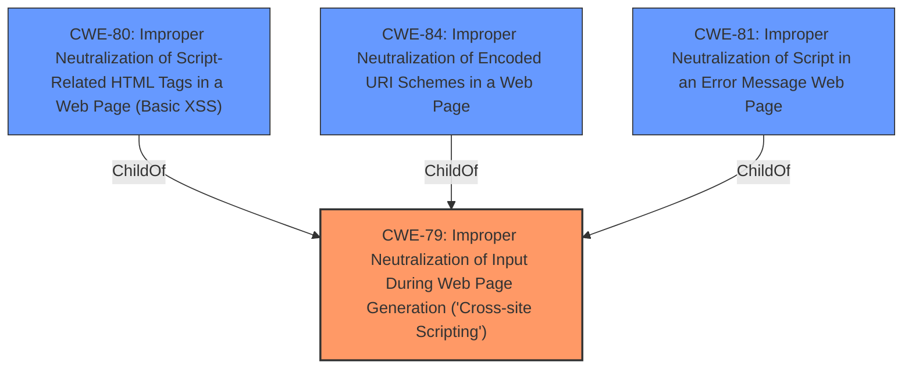

# Analysis Report for CVE-2022-0121

# Vulnerability Analysis Report: CVE-2022-0121

## Description


## Analysis (with Relationship Data)

# Summary
| CWE ID | CWE Name | Confidence | CWE Abstraction Level | CWE Vulnerability Mapping Label | CWE-Vulnerability Mapping Notes |
|---|---|---|---|---|---|
| CWE-79 | Improper Neutralization of Input During Web Page Generation ('Cross-site Scripting') | 1.0 | Base | Allowed | Primary CWE |

## Evidence and Confidence

*   **Confidence Score:** 1.0
*   **Evidence Strength:** HIGH

## Relationship Analysis
The primary relationship that influenced the decision was the parent-child relationship between CWE-79 and more specific variants. However, the description and supporting evidence did not provide enough detail to justify selecting a variant over the base CWE.



## Vulnerability Chain
The vulnerability chain starts with the **improper neutralization of input**, leading to the possibility of injecting malicious scripts into the web page, which results in Cross-Site Scripting (XSS).

## Summary of Analysis
The initial analysis strongly suggests CWE-79 as the primary weakness. The vulnerability description explicitly mentions "**Improper Neutralization of Input During Web Page Generation (Cross-site Scripting)**", which aligns perfectly with the definition of CWE-79. The CVE Reference Links Content Summary further supports this by detailing the **root cause** as an **insecure HTML iframe configuration** due to a **missing iframe sandbox**, allowing for potential XSS attacks. The provided evidence is strong and directly supports the selection of CWE-79 as the primary CWE.

The selection of CWE-79 is based on the following evidence:

*   **Vulnerability Description Key Phrases:** "**rootcause:** **Improper Neutralization of Input During Web Page Generation (Cross-site Scripting)**"
*   **CVE Reference Links Content Summary:** "**Missing iframe sandbox:** The primary vulnerability was the lack of a sandbox attribute on the HTML preview iframe. Without a sandbox, the iframe could execute scripts, make network requests, and access other resources, potentially leading to various security risks."
*   **CVE Reference Links Content Summary:** "Potential for XSS: The missing sandbox could allow a malicious user to inject Javascript code in the HTML preview, which could be executed in the context of the application."

The relationship graph was influential in evaluating the level of abstraction. While CWE-80, CWE-81, and CWE-84 are more specific variants of CWE-79, the provided information does not contain enough detail to determine if the vulnerability is specifically related to script-related HTML tags, error messages, or encoded URI schemes. Therefore, CWE-79 is chosen as the most appropriate and specific CWE based on the available evidence.

Other CWEs Considered But Not Used:

*   CWE-80: While related to XSS, it focuses specifically on script-related HTML tags. The provided description and summary do not explicitly mention this level of detail.
*   CWE-84: It focuses on the improper neutralization of encoded URI schemes. The provided description and summary do not explicitly mention this level of detail.
*   CWE-81: It focuses on improper neutralization of script in an error message. The provided description and summary do not explicitly mention this level of detail.
*   CWE-113: It focuses on improper neutralization of CRLF sequences in HTTP headers. The provided description and summary do not explicitly mention this.
*   CWE-352: It focuses on Cross-Site Request Forgery (CSRF). It is not directly related to the described vulnerability.
*   CWE-434: It focuses on Unrestricted Upload of File with Dangerous Type. It is not directly related to the described vulnerability.
*   CWE-78: It focuses on Improper Neutralization of Special Elements used in an OS Command ('OS Command Injection'). It is not directly related to the described vulnerability.
*   CWE-22: It focuses on Improper Limitation of a Pathname to a Restricted Directory ('Path Traversal'). It is not directly related to the described vulnerability.
*   CWE-494: It focuses on Download of Code Without Integrity Check. It is not directly related to the described vulnerability.
*   CWE-613: It focuses on Insufficient Session Expiration. It is not directly related to the described vulnerability.
*   CWE-390: It focuses on Detection of Error Condition Without Action. It is not directly related to the described vulnerability.
*   CWE-209: It focuses on Generation of Error Message Containing Sensitive Information. It is not directly related to the described vulnerability.
*   CWE-183: It focuses on Permissive List of Allowed Inputs. It is not directly related to the described vulnerability.
*   CWE-444: It focuses on Inconsistent Interpretation of HTTP Requests ('HTTP Request/Response Smuggling'). It is not directly related to the described vulnerability.
*   CWE-41: It focuses on Improper Resolution of Path Equivalence. It is not directly related to the described vulnerability.
*   CWE-1289: It focuses on Improper Validation of Unsafe Equivalence in Input. It is not directly related to the described vulnerability.
*   CWE-138: It focuses on Improper Neutralization of Special Elements. It is too general and is therefore not selected.
*   CWE-162: It focuses on Improper Neutralization of Trailing Special Elements. It is not directly related to the described vulnerability.
*   CWE-74: It focuses on Improper Neutralization of Special Elements in Output Used by a Downstream Component ('Injection'). It is too general and is therefore not selected.
*   CWE-116: It focuses on Improper Encoding or Escaping of Output. It is too general and is therefore not selected.
*   CWE-644: It focuses on Improper Neutralization of HTTP Headers for Scripting Syntax. It is not directly related to the described vulnerability.
*   CWE-184: It focuses on Incomplete List of Disallowed Inputs. It is not directly related to the described vulnerability.


## CWE Relationship Analysis

Current CWEs represent these abstraction levels: .


### Vulnerability Chain Analysis

**Chain starting from CWE-41:**
- 41 (Improper Resolution of Path Equivalence) - ROOT


**Chain starting from CWE-494:**
- 494 (Download of Code Without Integrity Check) - ROOT


### CWE Relationship Diagram

```mermaid
graph TD
    classDef primary fill:#f96,stroke:#333,stroke-width:2px
    classDef secondary fill:#69f,stroke:#333
    classDef tertiary fill:#9e9,stroke:#333
```


*Report generated on 2025-03-31 03:01:42*
