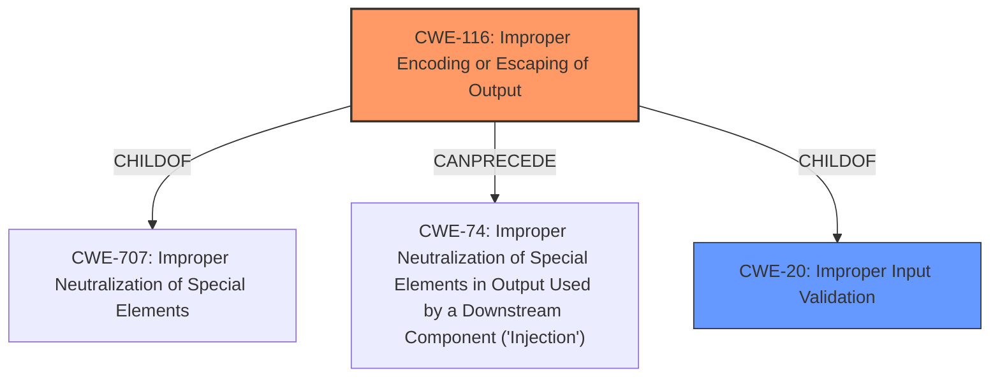

# Raw Analyzer Response for CVE-2022-0124

# Summary
| CWE ID | CWE Name | Confidence | CWE Abstraction Level | CWE Vulnerability Mapping Label | CWE-Vulnerability Mapping Notes |
|---|---|---|---|---|---|
| CWE-116 | Improper Encoding or Escaping of Output | 0.9 | Class | Allowed-with-Review | Primary CWE |
| CWE-20 | Improper Input Validation | 0.7 | Class | Allowed | Secondary CWE |

## Evidence and Confidence

*   **Confidence Score:** 0.8
*   **Evidence Strength:** HIGH

## Relationship Analysis
The primary CWE is CWE-116, which is a Class-level weakness. It has a parent CWE, CWE-707 (Improper Neutralization of Special Elements), and can precede CWE-74 (Improper Neutralization of Special Elements in Output Used by a Downstream Component ('Injection')). CWE-20 is a parent of CWE-116, indicating a relationship where improper input validation can lead to improper output encoding or escaping. Choosing CWE-116 as primary is based on the fact the **improper encoding or escaping** is the more specific root cause than the **improper input validation.**

## Vulnerability Chain
The vulnerability chain begins with **improper input validation** (CWE-20), leading to **improper encoding or escaping of output** (CWE-116). This allows an attacker to craft malicious URLs that are sent to Slack, potentially leading to further exploitation such as browser attacks or credential theft.

## Summary of Analysis
The initial assessment focused on the provided vulnerability description and the associated CVE reference. The description highlights that the GitLab Slack integration **incorrectly validates user input** which allows the crafting of malicious URLs. The CVE reference confirms that the Slack integration was **not properly escaping Slack macros** present in Merge Request titles before sending notifications to Slack. This **lack of input sanitization** and **improper neutralization of special elements** led to the vulnerability.

The Retriever Results suggested several CWEs, including CWE-116 (Improper Encoding or Escaping of Output), CWE-1333 (Inefficient Regular Expression Complexity), and CWE-1286 (Improper Validation of Syntactic Correctness of Input). After reviewing the CWE specifications, CWE-116 emerged as the most relevant because the core issue involves the **improper handling of output encoding**, specifically the **failure to escape Slack macros**.

The relationship analysis revealed that CWE-116 is a child of CWE-707 (Improper Neutralization of Special Elements) and can precede CWE-74 (Improper Neutralization of Special Elements in Output Used by a Downstream Component ('Injection')). Given the context, the more general CWE-20 (Improper Input Validation) also applies since the **improper encoding/escaping** is a consequence of **improper validation**.

The mapping guidance for CWE-116 suggests examining its children for a better fit, but none of the children are as applicable as CWE-116 itself. The guidance also allows using CWE-116 with review, acknowledging its Class-level abstraction. CWE-20 is allowed and represents the broader problem.

Therefore, the selected CWEs are at the optimal level of specificity. CWE-116 accurately captures the **improper encoding** aspect, while CWE-20 acknowledges the **improper input validation** that led to this issue.

Relevant CWE Information:

# Enhanced Context (25 CWEs)
The following CWEs were identified as potentially relevant to this vulnerability:

## CWE-639: Authorization Bypass Through User-Controlled Key
**Abstraction Level**: Base
**Similarity Score**: 0.75
**Source**: dense

**Description**:
The system's authorization functionality does not prevent one user from gaining access to another user's data or record by modifying the key value identifying the data.

**Mapping Guidance**:
- Usage: Allowed
- Rationale: This CWE entry is at the Base level of abstraction, which is a preferred level of abstraction for mapping to the root causes of vulnerabilities.

## CWE-1289: Improper Validation of Unsafe Equivalence in Input
**Abstraction Level**: Base
**Similarity Score**: 0.74
**Source**: dense

**Description**:
The product receives an input value that is used as a resource identifier or other type of reference, but it does not validate or incorrectly validates that the input is equivalent to a potentially-unsafe value.

**Mapping Guidance**:
- Usage: Allowed
- Rationale: This CWE entry is at the Base level of abstraction, which is a preferred level of abstraction for mapping to the root causes of vulnerabilities.

## CWE-668: Exposure of Resource to Wrong Sphere
**Abstraction Level**: Class
**Similarity Score**: 0.74
**Source**: dense

**Description**:
The product exposes a resource to the wrong control sphere, providing unintended actors with inappropriate access to the resource.

**Mapping Guidance**:
- Usage: Discouraged
- Rationale: CWE-668 is high-level and is often misused as a catch-all when lower-level CWE IDs might be applicable. It is sometimes used for low-information vulnerability reports [REF-1287]. It is a level-1 Class (i.e., a child of a Pillar). It is not useful for trend analysis.

## CWE-404: Improper Resource Shutdown or Release
**Abstraction Level**: Class
**Similarity Score**: 0.74
**Source**: dense

**Description**:
The product does not release or incorrectly releases a resource before it is made available for re-use.

**Mapping Guidance**:
- Usage: Allowed-with-Review
- Rationale: This CWE entry is a Class and might have Base-level children that would be more appropriate

## CWE-41: Improper Resolution of Path Equivalence
**Abstraction Level**: Base
**Similarity Score**: 0.74
**Source**: dense

**Description**:
The product is vulnerable to file system contents disclosure through path equivalence. Path equivalence involves the use of special characters in file and directory names. The associated manipulations are intended to generate multiple names for the same object.

**Mapping Guidance**:
- Usage: Allowed
- Rationale: This CWE entry is at the Base level of abstraction, which is a preferred level of abstraction for mapping to the root causes of vulnerabilities.

## CWE-807: Reliance on Untrusted Inputs in a Security Decision
**Abstraction Level**: Base
**Similarity Score**: 0.74
**Source**: dense

**Description**:
The product uses a protection mechanism that relies on the existence or values of an input, but the input can be modified by an untrusted actor in a way that bypasses the protection mechanism.

**Mapping Guidance**:
- Usage: Allowed
- Rationale: This CWE entry is at the Base level of abstraction, which is a preferred level of abstraction for mapping to the root causes of vulnerabilities.

## CWE-405: Asymmetric Resource Consumption (Amplification)
**Abstraction Level**: Class
**Similarity Score**: 0.74
**Source**: dense

**Description**:
The product does not properly control situations in which an adversary can cause the product to consume or produce excessive resources without requiring the adversary to invest equivalent work or otherwise prove authorization, i.e., the adversary's influence is "asymmetric."

**Mapping Guidance**:
- Usage: Allowed-with-Review
- Rationale: This CWE entry is a Class and might have Base-level children that would be more appropriate

## CWE-664: Improper Control of a Resource Through its Lifetime
**Abstraction Level**: Pillar
**Similarity Score**: 0.74
**Source**: dense

**Description**:
The product does not maintain or incorrectly maintains control over a resource throughout its lifetime of creation, use, and release.

**Mapping Guidance**:
- Usage: Discouraged
- Rationale: This CWE entry is high-level when lower-level children are available.

## CWE-1390: Weak Authentication
**Abstraction Level**: Class
**Similarity Score**: 0.74
**Source**: dense

**Description**:
The product uses an authentication mechanism to restrict access to specific users or identities, but the mechanism does not sufficiently prove that the claimed identity is correct.

**Mapping Guidance**:
- Usage: Allowed-with-Review
- Rationale: This CWE entry is a Class and might have Base-level children that would be more appropriate

## CWE-74: Improper Neutralization of Special Elements in Output Used by a Downstream Component