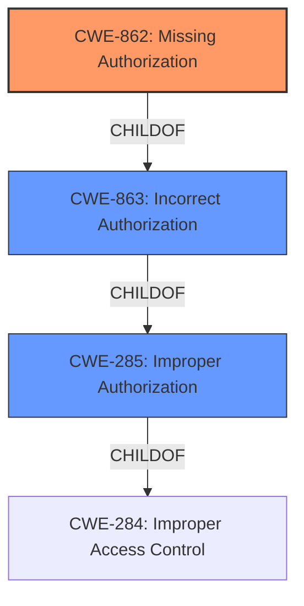

# Analysis Report for CVE-2022-0152

# Vulnerability Analysis Report: CVE-2022-0152

## Description


## Analysis (with Relationship Data)

# Summary
| CWE ID | CWE Name | Confidence | CWE Abstraction Level | CWE Vulnerability Mapping Label | CWE-Vulnerability Mapping Notes |
|---|---|---|---|---|---|
| **CWE-862** | **Missing Authorization** | 0.9 | Base | Primary | Allowed |
| CWE-863 | Incorrect Authorization | 0.7 | Class | Secondary | Allowed-with-Review |
| CWE-285 | Improper Authorization | 0.6 | Class | Secondary | Discouraged |

## Evidence and Confidence

*   **Confidence Score:** 0.9
*   **Evidence Strength:** HIGH

## Relationship Analysis
The primary CWE selected is CWE-862 **Missing Authorization** due to the explicit mention of **missing** permission checks in the vulnerability description. CWE-863 *Incorrect Authorization* and CWE-285 *Improper Authorization* were considered as parent Classes but deemed less specific.



## Vulnerability Chain
The vulnerability chain starts with the **missing** authorization check (CWE-862), which leads to unauthorized access to sensitive security report findings and summaries. This results in information exposure, where vulnerability names and counts of scanned resources are accessible to unauthorized users.

## Summary of Analysis
The initial analysis focused on the **missing** permission checks for specific fields in the GraphQL API, which is the root cause. The retriever results suggested CWE-863 *Incorrect Authorization* and CWE-285 *Improper Authorization*. However, based on the CVE Reference Links Content Summary, the root cause is explicitly a **missing** authorization check. Thus, CWE-862 *Missing Authorization* is the more appropriate and specific CWE. The graph relationships show that CWE-862 is a child of CWE-863, which is a child of CWE-285. Thus, selecting CWE-862 provides the optimal level of specificity.

Relevant CWE Information:

# Enhanced Context (25 CWEs)

## CWE-862: Missing Authorization
**CWE-862 Missing Authorization** is the primary CWE. The CVE description explicitly states: "Root cause: **Missing** permission checks for the `Pipeline#securityReportFindings` and `Pipeline#securityReportSummary` fields in the GraphQL API." This directly aligns with the definition of CWE-862, where the system fails to perform an authorization check before granting access to a resource. The security implication is that unauthorized users can access sensitive information, leading to potential data breaches and other security incidents. This CWE is at the Base level of abstraction, which is the preferred level. The "Usage" is "Allowed."

## CWE-863: Incorrect Authorization
**CWE-863 Incorrect Authorization** was considered because it is a parent of CWE-862. While the vulnerability involves an authorization issue, the root cause is specifically the **missing** check, making CWE-862 a more precise fit. The "Usage" is "Allowed-with-Review" and mapping guidance suggests examining children of this entry to see if there is a better fit.

## CWE-285: Improper Authorization
**CWE-285 Improper Authorization** was also considered because it is a parent of CWE-863. However, this CWE is too high-level and less descriptive than CWE-862. The "Usage" is "Discouraged" and mapping guidance suggests mapping to children CWEs such as CWE-862 and CWE-863 instead.


## CWE Relationship Analysis

Current CWEs represent these abstraction levels: .


### Vulnerability Chain Analysis

**Chain starting from CWE-862:**
- 862 (Missing Authorization) - ROOT


**Chain starting from CWE-285:**
- 285 (Improper Authorization) - ROOT


### CWE Relationship Diagram

```mermaid
graph TD
    classDef primary fill:#f96,stroke:#333,stroke-width:2px
    classDef secondary fill:#69f,stroke:#333
    classDef tertiary fill:#9e9,stroke:#333
```


*Report generated on 2025-03-30 17:53:32*
