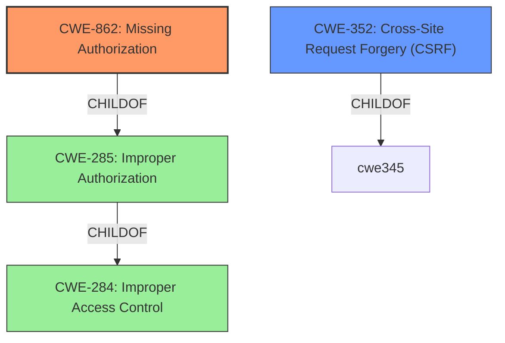

# Enhanced Analysis for CVE-2022-0164

# Summary
| CWE ID | CWE Name | Confidence | CWE Abstraction Level | CWE Vulnerability Mapping Label | CWE-Vulnerability Mapping Notes |
|---|---|---|---|---|---|
| CWE-862 | Missing Authorization | 0.9 | Class | Allowed-with-Review | The plugin **does not perform an authorization check** when an actor attempts to access a resource or perform an action. |
| CWE-352 | Cross-Site Request Forgery (CSRF) | 0.9 | Compound | Allowed | The plugin **lacks a Cross-Site Request Forgery (CSRF) token**, making it possible for an attacker to trick an authenticated user into unintentionally sending emails. |

## Evidence and Confidence

*   **Confidence Score:** 0.9
*   **Evidence Strength:** HIGH

## Relationship Analysis
The primary weakness is the **lack of authorization** (CWE-862) for the `coming_soon_send_mail` AJAX action. This allows any authenticated user, even those with low-level roles, to trigger the email sending functionality, which they should not be able to do. The secondary weakness is the **missing CSRF protection** (CWE-352), allowing attackers to trick users into sending requests.



## Vulnerability Chain
The vulnerability chain starts with the **lack of authorization** (CWE-862) and **CSRF protection** (CWE-352) for the `coming_soon_send_mail` AJAX action. Because of this **missing authorization**, a low-privileged user can send emails to all subscribed users through the plugin's mailing list functionality.
  - **Root Cause:** **Lack of authorization and CSRF checks**
  - **Weakness:** Missing Authorization (CWE-862), Missing CSRF Protection (CWE-352)
  - **Impact:** Unauthorized Email Sending

## Summary of Analysis
The initial analysis focused on the **lack of authorization** and **CSRF protection** in the plugin's AJAX action, which aligns with CWE-862 and CWE-352 respectively. The provided evidence, specifically the "Vulnerability Description Key Phrases" (**lack of authorization and CSRF checks**) and "CVE Reference Links Content Summary" clearly support these classifications.

The retriever results and graph relationships further reinforce this assessment. CWE-862 (Missing Authorization) is a child of CWE-285 (Improper Authorization), which is a child of CWE-284 (Improper Access Control). While CWE-284 is a higher-level classification and discouraged, CWE-862 is a more specific and appropriate choice. The "Mapping Guidance" for CWE-862 suggests examining its children for a better fit, but none of them are more appropriate in this case.

CWE-352 (Cross-Site Request Forgery) accurately captures the **missing CSRF protection**, which allows attackers to trick users into sending unintended requests. The "Mapping Guidance" for CWE-352 allows its use as a Compound weakness.

The selected CWEs are at the optimal level of specificity because they directly address the root causes of the vulnerability: the **lack of authorization checks** and **CSRF protection** in the plugin's AJAX action.

Relevant CWE Information:

# Enhanced Context (25 CWEs)
The following CWEs were identified as potentially relevant to this vulnerability:

## CWE-807: Reliance on Untrusted Inputs in a Security Decision
**Abstraction Level**: Base
**Similarity Score**: 0.77
**Source**: dense

**Description**:
The product uses a protection mechanism that relies on the existence or values of an input, but the input can be modified by an untrusted actor in a way that bypasses the protection mechanism.

**Mapping Guidance**:
- Usage: Allowed
- Rationale: This CWE entry is at the Base level of abstraction, which is a preferred level of abstraction for mapping to the root causes of vulnerabilities.
**Why it was not selected:** There is no evidence that the code relies on untrusted inputs in a security decision.

## CWE-639: Authorization Bypass Through User-Controlled Key
**Abstraction Level**: Base
**Similarity Score**: 0.76
**Source**: dense

**Description**:
The system's authorization functionality does not prevent one user from gaining access to another user's data or record by modifying the key value identifying the data.

**Mapping Guidance**:
- Usage: Allowed
- Rationale: This CWE entry is at the Base level of abstraction, which is a preferred level of abstraction for mapping to the root causes of vulnerabilities.
**Why it was not selected:** There is no evidence that the user is controlling the key to bypass authorization.

## CWE-472: External Control of Assumed-Immutable Web Parameter
**Abstraction Level**: Base
**Similarity Score**: 0.76
**Source**: dense

**Description**:
The web application does not sufficiently verify inputs that are assumed to be immutable but are actually externally controllable, such as hidden form fields.

**Mapping Guidance**:
- Usage: Allowed
- Rationale: This CWE entry is at the Base level of abstraction, which is a preferred level of abstraction for mapping to the root causes of vulnerabilities.
**Why it was not selected:** There is no evidence that the issue is related to externally controllable parameters.

## CWE-1390: Weak Authentication
**Abstraction Level**: Class
**Similarity Score**: 0.75
**Source**: dense

**Description**:
The product uses an authentication mechanism to restrict access to specific users or identities, but the mechanism does not sufficiently prove that the claimed identity is correct.

**Mapping Guidance**:
- Usage: Allowed-with-Review
- Rationale: This CWE entry is a Class and might have Base-level children that would be more appropriate
**Why it was not selected:** The issue is not a *weak* authentication mechanism but a **missing** authorization check.

## CWE-303: Incorrect Implementation of Authentication Algorithm
**Abstraction Level**: Base
**Similarity Score**: 0.75
**Source**: dense

**Description**:
The requirements for the product dictate the use of an established authentication algorithm, but the implementation of the algorithm is incorrect.

**Mapping Guidance**:
- Usage: Allowed
- Rationale: This CWE entry is at the Base level of abstraction, which is a preferred level of abstraction for mapping to the root causes of vulnerabilities.
**Why it was not selected:** The issue is not related to an incorrect implementation of the authentication algorithm.

## CWE-1289: Improper Validation of Unsafe Equivalence in Input
**Abstraction Level**: Base
**Similarity Score**: 0.75
**Source**: dense

**Description**:
The product receives an input value that is used as a resource identifier or other type of reference, but it does not validate or incorrectly validates that the input is equivalent to a potentially-unsafe value.

**Mapping Guidance**:
- Usage: Allowed
- Rationale: This CWE entry is at the Base level of abstraction, which is a preferred level of abstraction for mapping to the root causes of vulnerabilities.
**Why it was not selected:** There is no evidence that the input validation is the issue.

## CWE-74: Improper Neutralization of Special Elements in Output Used by a Downstream Component ('Injection')
**Abstraction Level**: Class
**Similarity Score**: 0.75
**Source**: dense

**Description**:
The product constructs all or part of a command, data structure, or record using externally-influenced input from an upstream component, but it does not neutralize or incorrectly neutralizes special elements that could modify how it is parsed or interpreted when it is sent to a downstream component.

**Mapping Guidance**:
- Usage: Discouraged
- Rationale: CWE-74 is high-level and often misused when lower-level weaknesses are more appropriate.
**Why it was not selected:** There is no evidence of an injection vulnerability.

## CWE-799: Improper Control of Interaction Frequency
**Abstraction Level**: Class
**Similarity Score**: 0.75
**Source**: dense

**Description**:
The product does not properly limit the number or frequency of interactions that it has with an actor, such as the number of incoming requests.

**Mapping Guidance**:
- Usage: Allowed-with-Review
- Rationale: This CWE entry is a Class and might have Base-level children that would be more appropriate
**Why it was not selected:** There is no evidence that the issue is


## CWE Relationship Analysis

Current CWEs represent these abstraction levels: .


### Vulnerability Chain Analysis

**Chain starting from CWE-862:**
- 862 (Missing Authorization) - ROOT


**Chain starting from CWE-472:**
- 472 (External Control of Assumed-Immutable Web Parameter) - ROOT


### CWE Relationship Diagram

```mermaid
graph TD
    classDef primary fill:#f96,stroke:#333,stroke-width:2px
    classDef secondary fill:#69f,stroke:#333
    classDef tertiary fill:#9e9,stroke:#333
```