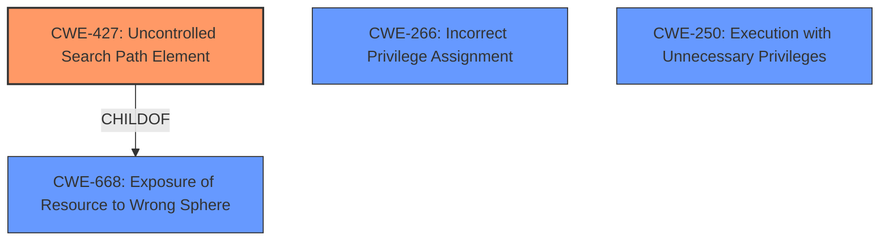

# Analysis for CVE-2022-0166

# Summary
| CWE ID  | CWE Name                                                                                                                                    | Confidence | CWE Abstraction Level | CWE Vulnerability Mapping Label | CWE-Vulnerability Mapping Notes |
|---------|---------------------------------------------------------------------------------------------------------------------------------------------|------------|-----------------------|---------------------------------|---------------------------------|
| CWE-427 | Uncontrolled Search Path Element                                                                                                              | 0.9        | Base                  | Allowed                         | Primary CWE                     |
| CWE-266 | Incorrect Privilege Assignment                                                                                                               | 0.6        | Base                  | Allowed                         | Secondary Candidate             |
| CWE-250 | Execution with Unnecessary Privileges                                                                                                           | 0.5        | Base                  | Allowed                         | Secondary Candidate             |

## Evidence and Confidence

*   **Confidence Score:** 0.8
*   **Evidence Strength:** HIGH

## Relationship Analysis
The primary CWE identified is CWE-427, "Uncontrolled Search Path Element." This is a Base level CWE, which is the preferred level of abstraction. This CWE is related to CWE-668 (Exposure of Resource to Wrong Sphere) through a ChildOf relationship, indicating that the uncontrolled search path leads to the exposure of a resource to an unintended actor. CWE-427 is also PeerOf CWE-426 (Untrusted Search Path), but in this vulnerability, the search path is not modifiable, but one element in the search path can be controlled by the attacker.

## Vulnerability Chain
The vulnerability chain starts with the **incorrect configuration** of the McAfee Agent, where the `OPENSSLDIR` variable points to a location writable by low-privilege users. This leads to an **uncontrolled search path element** (CWE-427), allowing an attacker to place a malicious `openssl.cnf` file. The McAfee Agent's privileged service then loads this malicious file, resulting in **privilege escalation** and the ability to **execute arbitrary code with SYSTEM privileges**.

## Summary of Analysis
The analysis is primarily based on the provided evidence, including the vulnerability description and the CVE Reference Links Content Summary. The key evidence supporting CWE-427 is:
- "McAfee Agent uses openssl.cnf during the build process to specify the OPENSSLDIR variable as a subdirectory within the installation directory. A low privilege user could have created subdirectories and executed arbitrary code with SYSTEM privileges by creating the appropriate pathway to the specifically created malicious openssl.cnf file."
- "The vulnerability is due to the use of an `OPENSSLDIR` variable by the McAfee Agent that points to a location where an unprivileged Windows user can place files."
- "The `OPENSSLDIR` variable is set to a directory writable by unprivileged users, allowing them to place a malicious openssl.cnf file. The McAfee Agent's privileged service then utilizes this OpenSSL component, loading the malicious file."

The retriever results also support this with CWE-427 listed as the top result. The graph relationships indicate that CWE-427 leads to CWE-668 (Exposure of Resource to Wrong Sphere), which is a Class level CWE. Therefore, CWE-427 is at the optimal level of specificity.

CWE-266, Incorrect Privilege Assignment, was considered as a secondary CWE because the **incorrect configuration** of the `OPENSSLDIR` variable can be seen as an **incorrect assignment** of privileges. However, the root cause is more accurately described by CWE-427. CWE-250 Execution with Unnecessary Privileges was considered because the McAfee Agent's privileged service loads the malicious file.

# Enhanced Context (25 CWEs)
The following CWEs were identified as potentially relevant to this vulnerability:

## CWE-59: Improper Link Resolution Before File Access ('Link Following')
**Abstraction Level**: Base
**Similarity Score**: 0.78
**Source**: dense

**Description**:
The product attempts to access a file based on the filename, but it does not properly prevent that filename from identifying a link or shortcut that resolves to an unintended resource.

**Mapping Guidance**:
- Usage: Allowed
- Rationale: This CWE entry is at the Base level of abstraction, which is a preferred level of abstraction for mapping to the root causes of vulnerabilities.

CWE-59 was not selected because the vulnerability is not about following links, but about loading a configuration file from a location where an attacker can place a file.

## CWE-266: Incorrect Privilege Assignment
**Abstraction Level**: Base
**Similarity Score**: 0.78
**Source**: dense

**Description**:
A product incorrectly assigns a privilege to a particular actor, creating an unintended sphere of control for that actor.

**Mapping Guidance**:
- Usage: Allowed
- Rationale: This CWE entry is at the Base level of abstraction, which is a preferred level of abstraction for mapping to the root causes of vulnerabilities.

CWE-266 was selected as a secondary candidate because the **incorrect configuration** of the `OPENSSLDIR` variable can be seen as an **incorrect assignment** of privileges to the low privilege user.

## CWE-274: Improper Handling of Insufficient Privileges
**Abstraction Level**: Base
**Similarity Score**: 0.78
**Source**: dense

**Description**:
The product does not handle or incorrectly handles when it has insufficient privileges to perform an operation, leading to resultant weaknesses.

**Mapping Guidance**:
- Usage: Discouraged
- Rationale: This CWE entry could be deprecated in a future version of CWE.

CWE-274 was not selected because the vulnerability is not about the product not handling insufficient privileges, but about the product loading a configuration file from a location where an attacker can place a file.

## CWE-280: Improper Handling of Insufficient Permissions or Privileges 
**Abstraction Level**: Base
**Similarity Score**: 0.78
**Source**: dense

**Description**:
The product does not handle or incorrectly handles when it has insufficient privileges to access resources or functionality as specified by their permissions. This may cause it to follow unexpected code paths that may leave the product in an invalid state.

**Mapping Guidance**:
- Usage: Allowed
- Rationale: This CWE entry is at the Base level of abstraction, which is a preferred level of abstraction for mapping to the root causes of vulnerabilities.

CWE-280 was not selected because the vulnerability is not about the product not handling insufficient privileges, but about the product loading a configuration file from a location where an attacker can place a file.

## CWE-267: Privilege Defined With Unsafe Actions
**Abstraction Level**: Base
**Similarity Score**: 0.77
**Source**: dense

**Description**:
A particular privilege, role, capability, or right can be used to perform unsafe actions that were not intended, even when it is assigned to the correct entity.

**Mapping Guidance**:
- Usage: Allowed
- Rationale: This CWE entry is at the Base level of abstraction, which is a preferred level of abstraction for mapping to the root causes of vulnerabilities.

CWE-267 was not selected because the vulnerability is not about a privilege being used to perform unsafe actions, but about the product loading a configuration file from a location where an attacker can place a file.

## CWE-668: Exposure of Resource to Wrong Sphere
**Abstraction Level**: Class
**Similarity Score**: 0.77
**Source**: dense

**Description**:
The product exposes a resource to the wrong control sphere, providing unintended actors with inappropriate access to the resource.

**Mapping Guidance**:
- Usage: Discouraged
- Rationale: CWE-668 is high-level and is often misused as a catch-all when lower-level CWE IDs might be applicable. It is sometimes used for low-information vulnerability reports [REF-1287]. It is a level-1 Class (i.e., a child of a Pillar). It is not useful for trend analysis.

CWE-668 was not selected because CWE-427 is a more specific CWE that describes the root cause of the vulnerability.

## CWE-41: Improper Resolution of Path Equivalence
**Abstraction Level**: Base
**Similarity Score**: 0.77
**Source**: dense

**Description**:
The product is vulnerable to file system contents disclosure through path equivalence. Path equivalence involves the use of special characters in file and directory names. The associated manipulations are intended to generate multiple names for the same object.

**Mapping Guidance**:
- Usage: Allowed
- Rationale: This CWE entry is at the Base level of abstraction, which is a preferred level of abstraction for mapping to the root causes of vulnerabilities.

CWE-41 was not selected because the vulnerability is not about path