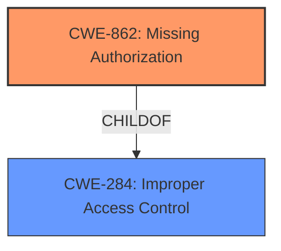

# Analysis for CVE-2022-0178

# Summary
| CWE ID | CWE Name | Confidence | CWE Abstraction Level | CWE Vulnerability Mapping Label | CWE-Vulnerability Mapping Notes |
|---|---|---|---|---|---|
| CWE-862 | Missing Authorization | 0.9 | Class | Primary | Allowed-with-Review |
| CWE-284 | Improper Access Control | 0.6 | Pillar | Secondary | Discouraged |

## Evidence and Confidence

*   **Confidence Score:** 0.9
*   **Evidence Strength:** HIGH

## Relationship Analysis
The primary CWE is CWE-862 **Missing Authorization**, a Class-level CWE. It is a child of CWE-284 **Improper Access Control**, which is a Pillar-level CWE. CWE-862 is preferred over CWE-284 due to its greater specificity. There are no relevant chain relationships for this specific vulnerability.

## Vulnerability Chain
The vulnerability chain starts with a **missing authorization** check, leading to the impact of unauthorized API key creation and potential access to sensitive data.

## Summary of Analysis
The initial assessment, based on the vulnerability description and CVE reference, points to a **missing authorization** check when creating API keys, allowing unauthorized users to access the API key creation functionality.

The primary CWE selected is CWE-862 **Missing Authorization**. This is based on the explicit **rootcause** of "**missing authorization**" and the commit message "Fixes auth controls on api key creation". The CWE description matches the vulnerability.

CWE-284 **Improper Access Control** was considered as a higher-level abstraction. However, CWE-862 provides a more specific classification. The mapping guidance for CWE-284 discourages its use due to its high-level nature, recommending more specific descendants like CWE-862.

The selected CWE is at the optimal level of specificity. CWE-862 accurately represents the vulnerability, focusing on the absence of an authorization check. The evidence supports this classification, as the commit directly addresses the **missing authorization** control on API key creation.

Relevant CWE Information:

# Enhanced Context (25 CWEs)

## CWE-639: Authorization Bypass Through User-Controlled Key
**Abstraction Level**: Base
**Similarity Score**: 0.76
**Source**: dense

**Description**:
The system's authorization functionality does not prevent one user from gaining access to another user's data or record by modifying the key value identifying the data.

**Mapping Guidance**:
- Usage: Allowed
- Rationale: This CWE entry is at the Base level of abstraction, which is a preferred level of abstraction for mapping to the root causes of vulnerabilities.

This CWE was not selected because the vulnerability is not about modifying a key to gain access to another user's data.

## CWE-807: Reliance on Untrusted Inputs in a Security Decision
**Abstraction Level**: Base
**Similarity Score**: 0.75
**Source**: dense

**Description**:
The product uses a protection mechanism that relies on the existence or values of an input, but the input can be modified by an untrusted actor in a way that bypasses the protection mechanism.

**Mapping Guidance**:
- Usage: Allowed
- Rationale: This CWE entry is at the Base level of abstraction, which is a preferred level of abstraction for mapping to the root causes of vulnerabilities.

This CWE was not selected because the vulnerability is not about an untrusted input bypassing a protection mechanism.

## CWE-1390: Weak Authentication
**Abstraction Level**: Class
**Similarity Score**: 0.74
**Source**: dense

**Description**:
The product uses an authentication mechanism to restrict access to specific users or identities, but the mechanism does not sufficiently prove that the claimed identity is correct.

**Mapping Guidance**:
- Usage: Allowed-with-Review
- Rationale: This CWE entry is a Class and might have Base-level children that would be more appropriate

This CWE was not selected because the vulnerability is not about a weak authentication mechanism. It is about a **missing authorization** check after authentication.