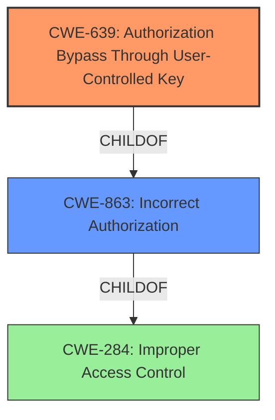

# Raw Analyzer Response for CVE-2022-0203

# Summary

| CWE ID | CWE Name | Confidence | CWE Abstraction Level | CWE Vulnerability Mapping Label | CWE-Vulnerability Mapping Notes |
|---|---|---|---|---|---|
| CWE-284 | Improper Access Control | 0.8 | Pillar | Discouraged | The highest level of abstraction and not useful for trend analysis. |
| CWE-863 | Incorrect Authorization | 0.9 | Class | Allowed-with-Review | A more specific class of access control issues, but still requires examining its children for a better fit. |
| CWE-639 | Authorization Bypass Through User-Controlled Key | 0.95 | Base | Allowed | A specific type of authorization bypass, where the key is user-controlled, directly addressing the weakness. |

## Evidence and Confidence

*   **Confidence Score:** 0.95
*   **Evidence Strength:** HIGH

## Relationship Analysis

The primary relationship influencing the CWE selection is the hierarchical relationship. CWE-284 (Improper Access Control) is a Pillar, making it too broad. CWE-863 (Incorrect Authorization) is a Class, a child of CWE-284, and represents a more specific type of access control issue. CWE-639 (Authorization Bypass Through User-Controlled Key) is a Base-level CWE and a child of both CWE-863 and CWE-284, offering the most specific and accurate representation of the vulnerability. The progression from general access control issues to a specific authorization bypass through user-controlled keys guided the selection.

## Vulnerability Chain

The vulnerability chain involves the following:

1.  **Root Cause:** **Improper Access Control** due to **lack of validation** when deleting payment methods.
2.  **Weakness:** Ability to delete payment methods associated with payments/expenses.
3.  **Impact:** Data corruption/inconsistency, application errors.

The chain highlights the lack of validation as the initial flaw, leading to the vulnerability where associated payment methods can be deleted, ultimately resulting in data integrity issues.

## Summary of Analysis

The initial assessment considered the retriever results and the vulnerability description's key phrases. The description explicitly mentions "**Improper Access Control**," which initially suggested CWE-284. However, CWE-284 is a high-level Pillar and discouraged for use. The retriever results also suggested CWE-863 (Incorrect Authorization) and CWE-639 (Authorization Bypass Through User-Controlled Key).

After reviewing the complete CWE specifications, CWE-639 emerged as the most appropriate choice. The CVE Reference Links Content Summary indicates that the vulnerability arises from the ability to delete payment methods even when they are associated with existing payments or expenses. This aligns with CWE-639's description: "The system's authorization functionality does not prevent one user from gaining access to another user's data or record by modifying the key value identifying the data." In this case, the "key value" can be interpreted as the identifier for the payment method being deleted.

The decision to select CWE-639 is based on the evidence from the CVE Reference Links Content Summary: "The vulnerability arises from the ability to delete payment methods even when they are associated with existing payments or expenses." This demonstrates that the authorization process fails to prevent an action (deletion) on a resource (payment method) based on its association with other data. The fact that an authenticated user (with privileges to delete payment methods) can bypass this restriction solidifies the relevance of CWE-639.

The selected CWE is at the optimal level of specificity because it directly addresses the root cause: the **improper authorization** mechanism that allows deletion of associated payment methods. It's a Base-level CWE, which is the preferred level of abstraction.

Relevant CWE Information:

# Enhanced Context (25 CWEs)
The following CWEs were identified as potentially relevant to this vulnerability:

## CWE-472: External Control of Assumed-Immutable Web Parameter
**Abstraction Level**: Base
**Similarity Score**: 0.80
**Source**: dense

**Description**:
The web application does not sufficiently verify inputs that are assumed to be immutable but are actually externally controllable, such as hidden form fields.

**Mapping Guidance**:
- Usage: Allowed
- Rationale: This CWE entry is at the Base level of abstraction, which is a preferred level of abstraction for mapping to the root causes of vulnerabilities.

## CWE-639: Authorization Bypass Through User-Controlled Key
**Abstraction Level**: Base
**Similarity Score**: 0.77
**Source**: dense

**Description**:
The system's authorization functionality does not prevent one user from gaining access to another user's data or record by modifying the key value identifying the data.

**Mapping Guidance**:
- Usage: Allowed
- Rationale: This CWE entry is at the Base level of abstraction, which is a preferred level of abstraction for mapping to the root causes of vulnerabilities.

## CWE-807: Reliance on Untrusted Inputs in a Security Decision
**Abstraction Level**: Base
**Similarity Score**: 0.77
**Source**: dense

**Description**:
The product uses a protection mechanism that relies on the existence or values of an input, but the input can be modified by an untrusted actor in a way that bypasses the protection mechanism.

**Mapping Guidance**:
- Usage: Allowed
- Rationale: This CWE entry is at the Base level of abstraction, which is a preferred level of abstraction for mapping to the root causes of vulnerabilities.

## CWE-552: Files or Directories Accessible to External Parties
**Abstraction Level**: Base
**Similarity Score**: 0.77
**Source**: dense

**Description**:
The product makes files or directories accessible to unauthorized actors, even though they should not be.

**Mapping Guidance**:
- Usage: Allowed
- Rationale: This CWE entry is at the Base level of abstraction, which is a preferred level of abstraction for mapping to the root causes of vulnerabilities.

## CWE-41: Improper Resolution of Path Equivalence
**Abstraction Level**: Base
**Similarity Score**: 0.77
**Source**: dense

**Description**:
The product is vulnerable to file system contents disclosure through path equivalence. Path equivalence involves the use of special characters in file and directory names. The associated manipulations are intended to generate multiple names for the same object.

**Mapping Guidance**:
- Usage: Allowed
- Rationale: This CWE entry is at the Base level of abstraction, which is a preferred level of abstraction for mapping to the root causes of vulnerabilities.

## CWE-73: External Control of File Name or Path
**Abstraction Level**: Base
**Similarity Score**: 0.77
**Source**: dense

**Description**:
The product allows user input to control or influence paths or file names that are used in filesystem operations.

**Mapping Guidance**:
- Usage: Allowed
- Rationale: This CWE entry is at the Base level of abstraction, which is a preferred level of abstraction for mapping to the root causes of vulnerabilities.

## CWE-668: Exposure of Resource to Wrong Sphere
**Abstraction Level**: Class
**Similarity Score**: 0.76
**Source**: dense

**Description**:
The product exposes a resource to the wrong control sphere, providing unintended actors with inappropriate access to the resource.

**Mapping Guidance**:
- Usage: Discouraged
- Rationale: CWE-668 is high-level and is often misused as a catch-all when lower-level CWE IDs might be applicable. It is sometimes used for low-information vulnerability reports [REF-1287]. It is a level-1 Class (i.e., a child of a Pillar). It is not useful for trend analysis.

## CWE-74: Improper Neutralization of Special Elements in Output Used by a Downstream Component ('Injection')
**Abstraction Level**: Class
**Similarity Score**: 0.76
**Source**: dense

**Description**:
The product constructs all or part of a command, data structure, or record using externally-influenced input from an upstream component, but it does not neutralize or incorrectly neutralizes special elements that could modify how it is parsed or interpreted when it is sent to a downstream component.

**Mapping Guidance**:
- Usage: Discouraged
- Rationale: CWE-74 is high-level and often misused when lower-level weaknesses are more appropriate.

## CWE-274: Improper Handling of Insufficient Privileges
**Abstraction Level**: Base
**Similarity Score**: 0.76
**Source**: dense

**Description**:
The product does not handle or incorrectly handles when it has insufficient privileges to perform an operation, leading to resultant weaknesses.

**Mapping Guidance**:
- Usage: Discour