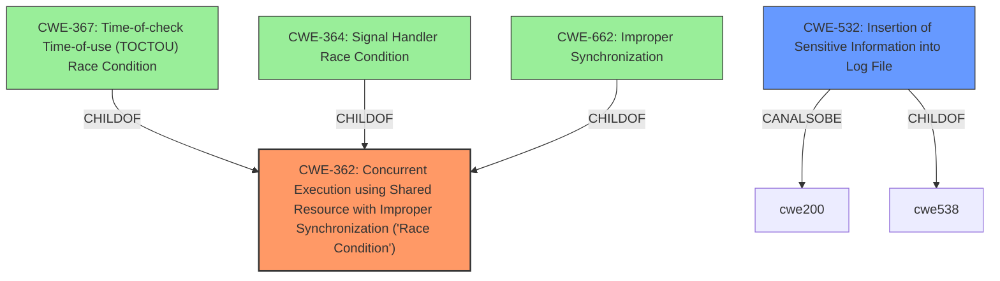

# Raw Analyzer Response for CVE-2022-0207

# Summary
| CWE ID | CWE Name | Confidence | CWE Abstraction Level | CWE Vulnerability Mapping Label | CWE-Vulnerability Mapping Notes |
|---|---|---|---|---|---|
| CWE-362 | Concurrent Execution using Shared Resource with Improper Synchronization ('Race Condition') | 1.0 | Class | Allowed-with-Review | Primary CWE |
| CWE-532 | Insertion of Sensitive Information into Log File | 0.7 | Base | Allowed | Secondary Candidate |

## Evidence and Confidence

*   **Confidence Score:** 0.9
*   **Evidence Strength:** HIGH

## Relationship Analysis
The primary CWE, CWE-362, is a class-level CWE, which means we should examine its children to see if a more specific CWE is applicable. However, the provided information does not give enough specifics to definitively choose a child CWE. CWE-362 is related to CWE-662 (Improper Synchronization), but CWE-662 is discouraged due to its higher abstraction level. CWE-367 (Time-of-check Time-of-use (TOCTOU) Race Condition) is a child of CWE-362, but this vulnerability does not involve a check and subsequent use, so it is not applicable. CWE-364 (Signal Handler Race Condition) is another child of CWE-362, but this vulnerability does not involve signal handlers.

The secondary CWE, CWE-532, is related to CWE-200 (Information Exposure) and CWE-538 (Insertion of Information). It is at the Base level of abstraction.

## Vulnerability Chain
The vulnerability chain starts with a **race condition** (CWE-362) in the vdsm functionality to obfuscate sensitive values in log files. Because of this **race condition**, the intended obfuscation may fail, leading to sensitive values being stored in clear text (CWE-532). This can then lead to exposure of sensitive information.

## Summary of Analysis
Based on the vulnerability description and supporting evidence, the primary weakness is a **race condition** (CWE-362) within the vdsm's logging mechanism. The key phrases explicitly mention "race condition" as the root cause. The CVE reference summary confirms this, stating "Race condition in the logging mechanism when obfuscating sensitive values."

The race condition can result in sensitive values being logged in cleartext. The best fit for that result is CWE-532 (Insertion of Sensitive Information into Log File).

CWE-362 is chosen as the primary CWE because it accurately represents the root cause. While it is a class-level CWE, the provided details are insufficient to select a more specific base-level CWE.

CWE-532 accurately represents the impact.

Relevant CWE Information:

# Enhanced Context (25 CWEs)
The following CWEs were identified as potentially relevant to this vulnerability:

## CWE-312: Cleartext Storage of Sensitive Information
**Abstraction Level**: Base
**Similarity Score**: 0.78
**Source**: dense

**Description**:
The product stores sensitive information in cleartext within a resource that might be accessible to another control sphere.

**Mapping Guidance**:
- Usage: Allowed
- Rationale: This CWE entry is at the Base level of abstraction, which is a preferred level of abstraction for mapping to the root causes of vulnerabilities.

## Technical Explanation for CWE-362
*   **How the vulnerability's details match the CWE's characteristics:** The vulnerability involves a **race condition** where multiple threads or processes are accessing and modifying a shared resource (the log file and the obfuscation mechanism) concurrently without proper synchronization. This improper synchronization leads to a timing window where sensitive data can be logged before it is obfuscated.
*   **The security implications and potential impact:** The security implication is the potential disclosure of sensitive information like passwords in log files.
*   **Any parent-child relationships or chain patterns that influenced your mapping:** CWE-362 is a class-level CWE, and while its children were considered, the available evidence was insufficient to definitively select a more specific child CWE.
*   **Whether the weakness is primary or secondary in the vulnerability:** This is the primary weakness, as the **race condition** is the root cause of the vulnerability.
*   **How the official MITRE mapping guidance influenced your decision:** The MITRE mapping guidance suggests examining the children of class-level CWEs to find a better fit. However, in this case, the evidence does not support a more specific child CWE.

## Technical Explanation for CWE-532
*   **How the vulnerability's details match the CWE's characteristics:** The vulnerability results in sensitive information being written to a log file in cleartext due to the **race condition**.
*   **The security implications and potential impact:** The security implication is the potential disclosure of sensitive information like passwords in log files.
*   **Any parent-child relationships or chain patterns that influenced your mapping:** CWE-532 is related to CWE-200 (Information Exposure) and CWE-538 (Insertion of Information). It is at the Base level of abstraction.
*   **Whether the weakness is primary or secondary in the vulnerability:** This is a secondary weakness, as it is the result of the **race condition**.
*   **How the official MITRE mapping guidance influenced your decision:** The MITRE mapping guidance suggests using Base level CWEs, and this is a Base level CWE.