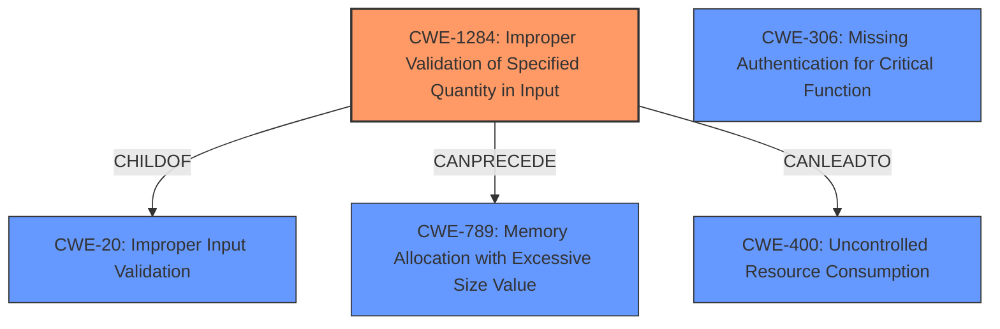

# Enhanced Analysis for CVE-2022-0214

# Summary
| CWE ID    | CWE Name                                                        | Confidence | CWE Abstraction Level | CWE Vulnerability Mapping Label | CWE-Vulnerability Mapping Notes |
| :-------- | :-------------------------------------------------------------- | :--------- | :-------------------- | :------------------------------ | :------------------------------ |
| CWE-1284  | Improper Validation of Specified Quantity in Input              | 0.9        | Base                  | Primary CWE                     | Allowed                       |
| CWE-400   | Uncontrolled Resource Consumption                               | 0.7        | Class                  | Secondary Candidate             | Allowed with Review                       |
| CWE-306   | Missing Authentication for Critical Function                   | 0.6        | Base                  | Secondary Candidate             | Allowed                       |

## Evidence and Confidence

*   **Confidence Score:** 0.8
*   **Evidence Strength:** HIGH

## Relationship Analysis
The primary CWE is CWE-1284 (**Improper Validation of Specified Quantity in Input**), a **Base** level CWE. This is related to CWE-20 (**Improper Input Validation**) as a child. CWE-1284 can precede CWE-789 (**Memory Allocation with Excessive Size Value**).

CWE-400 (**Uncontrolled Resource Consumption**) is a Class-level CWE that could result from the **Improper Validation of Specified Quantity in Input**.

CWE-306 (**Missing Authentication for Critical Function**) is a **Base** level CWE that could also contribute to the vulnerability.



## Vulnerability Chain
The chain of events is as follows:
1.  **Root Cause:** **Improper Validation of Specified Quantity in Input** (CWE-1284) - The plugin does not validate the length of data from unauthenticated users.
2.  Missing Authentication (CWE-306) enables unauthenticated users to send data.
3.  **Impact:** Uncontrolled Resource Consumption (CWE-400), leading to Denial of Service.

## Summary of Analysis
The initial analysis identified that the Custom Popup Builder WordPress plugin before 1.3.1 is vulnerable to a Denial of Service (DoS) attack. The root cause is the **lack of validation** on the length of data sent by unauthenticated users. This data is autoloaded on every page, which can lead to excessive resource consumption.

The primary CWE selected is CWE-1284 (**Improper Validation of Specified Quantity in Input**). This CWE accurately describes the core issue of the plugin failing to validate the length of the data it receives. The vulnerability description states that the data is "not validated in length," which directly aligns with the definition of CWE-1284.
> "The plugin loads popup data on every page, and this data can be sent by unauthenticated users without validation of the data's length."

The retriever results listed CWE-1284 as the top combined result, further supporting this selection.

CWE-400 (**Uncontrolled Resource Consumption**) is considered a secondary CWE because the **lack of validation** (CWE-1284) leads to this condition. An attacker can send a large amount of data, causing the server to consume excessive resources.

CWE-306 (**Missing Authentication for Critical Function**) is also a secondary candidate. The fact that an unauthenticated user can send the malicious data contributes to the vulnerability's exploitability.

CWE-20 (**Improper Input Validation**) was considered as a parent of CWE-1284, but CWE-1284 is more specific and therefore more appropriate.

The selected CWEs are at the optimal level of specificity. CWE-1284 is a Base level CWE, which is preferred for mapping to root causes. CWE-400 is a Class level CWE that describes the impact of the vulnerability. CWE-306 is a Base level CWE that describes another contributing factor.

Relevant CWE Information:

# Enhanced Context (25 CWEs)
The following CWEs were identified as potentially relevant to this vulnerability:

## CWE-472: External Control of Assumed-Immutable Web Parameter
**Abstraction Level**: Base
**Similarity Score**: 0.77
**Source**: dense

**Description**:
The web application does not sufficiently verify inputs that are assumed to be immutable but are actually externally controllable, such as hidden form fields.

**Mapping Guidance**:
- Usage: Allowed
- Rationale: This CWE entry is at the Base level of abstraction, which is a preferred level of abstraction for mapping to the root causes of vulnerabilities.

## CWE-425: Direct Request ('Forced Browsing')
**Abstraction Level**: Base
**Similarity Score**: 0.77
**Source**: dense

**Description**:
The web application does not adequately enforce appropriate authorization on all restricted URLs, scripts, or files.

**Mapping Guidance**:
- Usage: Allowed
- Rationale: This CWE entry is at the Base level of abstraction, which is a preferred level of abstraction for mapping to the root causes of vulnerabilities.

## CWE-74: Improper Neutralization of Special Elements in Output Used by a Downstream Component ('Injection')
**Abstraction Level**: Class
**Similarity Score**: 0.77
**Source**: dense

**Description**:
The product constructs all or part of a command, data structure, or record using externally-influenced input from an upstream component, but it does not neutralize or incorrectly neutralizes special elements that could modify how it is parsed or interpreted when it is sent to a downstream component.

**Mapping Guidance**:
- Usage: Discouraged
- Rationale: CWE-74 is high-level and often misused when lower-level weaknesses are more appropriate.

## CWE-41: Improper Resolution of Path Equivalence
**Abstraction Level**: Base
**Similarity Score**: 0.77
**Source**: dense

**Description**:
The product is vulnerable to file system contents disclosure through path equivalence. Path equivalence involves the use of special characters in file and directory names. The associated manipulations are intended to generate multiple names for the same object.

**Mapping Guidance**:
- Usage: Allowed
- Rationale: This CWE entry is at the Base level of abstraction, which is a preferred level of abstraction for mapping to the root causes of vulnerabilities.

## CWE-639: Authorization Bypass Through User-Controlled Key
**Abstraction Level**: Base
**Similarity Score**: 0.77
**Source**: dense

**Description**:
The system's authorization functionality does not prevent one user from gaining access to another user's data or record by modifying the key value identifying the data.

**Mapping Guidance**:
- Usage: Allowed
- Rationale: This CWE entry is at the Base level of abstraction, which is a preferred level of abstraction for mapping to the root causes of vulnerabilities.

## CWE-807: Reliance on Untrusted Inputs in a Security Decision
**Abstraction Level**: Base
**Similarity Score**: 0.77
**Source**: dense

**Description**:
The product uses a protection mechanism that relies on the existence or values of an input, but the input can be modified by an untrusted actor in a way that bypasses the protection mechanism.

**Mapping Guidance**:
- Usage: Allowed
- Rationale: This CWE entry is at the Base level of abstraction, which is a preferred level of abstraction for mapping to the root causes of vulnerabilities.

## CWE-184: Incomplete List of Disallowed Inputs
**Abstraction Level**: Base
**Similarity Score**: 0.77
**Source**: dense

**Description**:
The product implements a protection mechanism that relies on a list of inputs (or properties of inputs) that are not allowed by policy or otherwise require other action to neutralize before additional processing takes place, but the list is incomplete.

**Mapping Guidance**:
- Usage: Allowed
- Rationale: This CWE entry is at the Base level of abstraction, which is a preferred level of abstraction for mapping to the root causes of vulnerabilities.

## CWE-1289: Improper Validation of Unsafe Equivalence in Input
**Abstraction Level**: Base
**Similarity Score**: 0.76
**Source**: dense

**Description**:
The product receives an input value that is used as a resource identifier or other type of reference, but it does not validate or incorrectly validates that the input is equivalent to a potentially-unsafe value.

**Mapping Guidance**:


## CWE Relationship Analysis

Current CWEs represent these abstraction levels: .


### Vulnerability Chain Analysis

**Chain starting from CWE-425:**
- 425 (Direct Request ('Forced Browsing')) - ROOT


**Chain starting from CWE-472:**
- 472 (External Control of Assumed-Immutable Web Parameter) - ROOT


### CWE Relationship Diagram

```mermaid
graph TD
    classDef primary fill:#f96,stroke:#333,stroke-width:2px
    classDef secondary fill:#69f,stroke:#333
    classDef tertiary fill:#9e9,stroke:#333
```