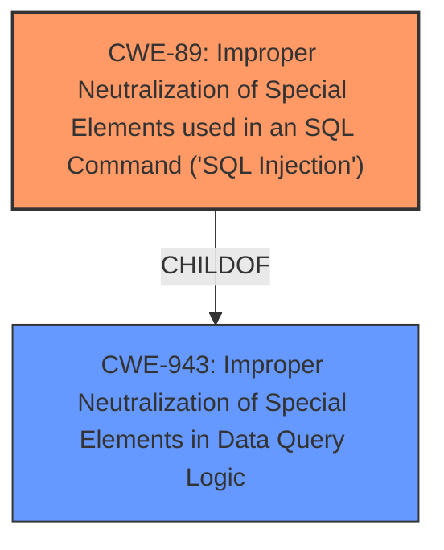

# Raw Analyzer Response for CVE-2022-0224

# Summary
| CWE ID | CWE Name | Confidence | CWE Abstraction Level | CWE Vulnerability Mapping Label | CWE-Vulnerability Mapping Notes |
|---|---|---|---|---|---|
| CWE-89 | Improper Neutralization of Special Elements used in an SQL Command ('SQL Injection') | 1.0 | Base | Allowed | Primary CWE |
| CWE-943 | Improper Neutralization of Special Elements in Data Query Logic | 0.7 | Class | Allowed-with-Review | Secondary Candidate |

## Evidence and Confidence

*   **Confidence Score:** 1.0
*   **Evidence Strength:** HIGH

## Relationship Analysis
The primary CWE, CWE-89, is a base level CWE that falls under the class CWE-943 (Improper Neutralization of Special Elements in Data Query Logic). CWE-89 is a child of CWE-943. The analysis focused on identifying the most specific CWE that accurately describes the vulnerability, leading to the selection of CWE-89.

## Vulnerability Chain
The vulnerability chain starts with the **Improper Neutralization of Special Elements** in user-provided input. This leads to the construction of a malicious SQL query, resulting in SQL injection. The impact of this injection can range from unauthorized data access to complete database compromise.

## Summary of Analysis
The initial analysis identified a clear case of SQL injection due to **improper neutralization** of user input within an SQL query. The evidence from the "CVE Reference Links Content Summary" clearly states that the `search_users` array was directly incorporated into the SQL query without proper sanitization. The commit addressing the vulnerability sanitizes the input, confirming the root cause. The selection of CWE-89 is based on this direct evidence and its alignment with the CWE's description.

The graph relationships support the decision, as CWE-89 is a specific type of CWE-943. The choice of CWE-89 is at the optimal level of specificity because the vulnerability is explicitly related to SQL commands.

Relevant CWE Information:

# Enhanced Context (25 CWEs)
The following CWEs were identified as potentially relevant to this vulnerability:

## CWE-943: Improper Neutralization of Special Elements in Data Query Logic
**Abstraction Level**: Class
**Similarity Score**: 0.78
**Source**: dense

**Description**:
The product generates a query intended to access or manipulate data in a data store such as a database, but it does not neutralize or incorrectly neutralizes special elements that can modify the intended logic of the query.

**Mapping Guidance**:
- Usage: Allowed-with-Review
- Rationale: This CWE entry is a Class and might have Base-level children that would be more appropriate

## CWE-89: Improper Neutralization of Special Elements used in an SQL Command ('SQL Injection')
**Abstraction:** Base
**Similarity Score**: 4.33
**Source**: graph

**Description**:
CWE-89: Improper Neutralization of Special Elements used in an SQL Command ('SQL Injection')

**Mapping Guidance**:
- Usage: Allowed
- Rationale: This CWE entry is at the Base level of abstraction, which is a preferred level of abstraction for mapping to the root causes of vulnerabilities.

**Relationships**:
- CHILDOF -> CWE-74
- CHILDOF -> CWE-943

## Vulnerability Description
dolibarr is vulnerable to **Improper Neutralization of Special Elements** used in an SQL Command

### Vulnerability Description Key Phrases
- **rootcause:** **Improper Neutralization of Special Elements**
- **vector:** SQL injection
- **product:** dolibarr

## CVE Reference Links Content Summary
The provided content relates to a commit in the Dolibarr project which addresses a potential SQL injection vulnerability.

**Root Cause:**
The vulnerability stems from the **improper sanitization** of user-provided input within an SQL query. Specifically, the `search_users` array, containing user IDs, was directly incorporated into the SQL query using `implode(', ', $search_users)`, without proper sanitization.

**Weaknesses/Vulnerabilities:**
- SQL Injection: Directly concatenating user input into an SQL query without proper sanitization allows an attacker to inject malicious SQL code.

**Impact of Exploitation:**
- Unauthorized Data Access: An attacker could gain unauthorized access to sensitive data stored in the database.
- Data Modification/Deletion:  An attacker could potentially modify or delete data within the database.
- Complete Database Compromise: Depending on database permissions, the attacker could gain full control over the database.

**Attack Vectors:**
- Malicious Input: An attacker could manipulate the `search_users` parameter to include malicious SQL code.

**Additional Notes:**
- The commit `b9b45fb50618aa8053961f50bc8604b188d0ea79` addresses this vulnerability by sanitizing the `search_users` array using `$db->sanitize(implode(', ', $search_users))`. This prevents the injection of malicious SQL code by encoding or escaping special characters.

**CWE-89: Improper Neutralization of Special Elements used in an SQL Command ('SQL Injection')**
The product constructs all or part of an SQL command using externally-influenced input from an upstream component, but it does not neutralize or incorrectly neutralizes special elements that could modify the intended SQL command when it is sent to a downstream component. The "CVE Reference Links Content Summary" section provides direct evidence of this, stating that the `search_users` array was incorporated into the SQL query without proper sanitization. This aligns perfectly with the CWE-89 description. The security implications include unauthorized data access, data modification, or complete database compromise.

**CWE-943: Improper Neutralization of Special Elements in Data Query Logic**
The product generates a query intended to access or manipulate data in a data store such as a database, but it does not neutralize or incorrectly neutralizes special elements that can modify the intended logic of the query. This CWE is a class and a parent of CWE-89. While applicable, CWE-89 is more precise.

**CWEs Considered But Not Used**
Several other CWEs were considered but ultimately not selected because they were either too general (e.g., CWE-138) or did not specifically address the SQL injection aspect of the vulnerability (e.g., CWE-1336, CWE-1236). For example, CWE-138 is a class-level CWE describing **improper neutralization of special elements** but does not specify the context of an SQL command. CWE-943, while relevant as a parent, is less specific than CWE-89.