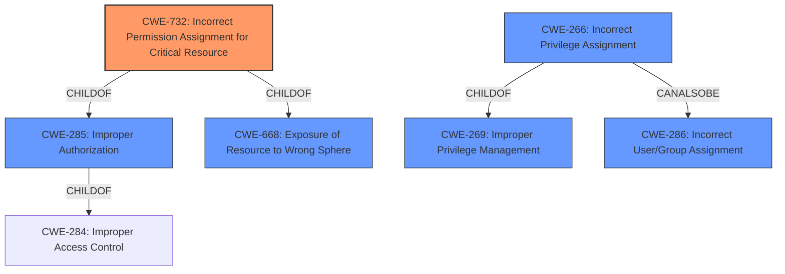

# Raw Analyzer Response for CVE-2022-0277

# Summary
| CWE ID | CWE Name | Confidence | CWE Abstraction Level | CWE Vulnerability Mapping Label | CWE-Vulnerability Mapping Notes |
|---|---|---|---|---|---|
| CWE-732 | Incorrect Permission Assignment for Critical Resource | 1.0 | Class | Allowed-with-Review | Primary CWE |
| CWE-266 | Incorrect Privilege Assignment | 0.7 | Base | Allowed | Secondary Candidate |
| CWE-285 | Improper Authorization | 0.5 | Class | Discouraged | Secondary Candidate |

## Evidence and Confidence

*   **Confidence Score:** 0.9
*   **Evidence Strength:** HIGH

## Relationship Analysis
The primary CWE, CWE-732 **Incorrect Permission Assignment for Critical Resource**, is a child of CWE-285 **Improper Authorization** and CWE-668 **Exposure of Resource to Wrong Sphere**. CWE-266 **Incorrect Privilege Assignment** can also be related to CWE-286 **Incorrect User/Group Assignment**.
This relationship structure helps to understand that the vulnerability is specifically about assigning incorrect permissions, making CWE-732 more appropriate than its parents.

## Vulnerability Chain
The vulnerability chain starts with the **incorrect permission assignment** to the `users/search_authors` API endpoint, making it accessible to unauthorized users. This leads to potential information disclosure.

## Summary of Analysis
The initial analysis pointed towards **CWE-732: Incorrect Permission Assignment for Critical Resource** based on the vulnerability description key phrases, especially "**Incorrect Permission Assignment for Critical Resource**". The CVE Reference Links Content Summary confirms that the **root cause** was an API endpoint (`users/search_authors`) being accessible to all users when it should have been restricted to administrators. The change from `api_expose` to `api_expose_admin` clearly indicates a permission issue.

While CWE-285 **Improper Authorization** is a parent of CWE-732, it is too general. CWE-732 is more specific and accurately captures the essence of the vulnerability, which involves an incorrect assignment of permissions for a critical resource.

CWE-266 **Incorrect Privilege Assignment** was also considered. However, CWE-732 is more fitting because the vulnerability is about the permission assigned to a resource rather than a privilege assigned to an actor.

The retriever results listed CWE-732 as the top candidate, further solidifying the selection. The MITRE mapping guidance for CWE-732 advises caution because it is often misused for vulnerabilities where permissions are not checked. However, in this case, the evidence clearly shows an **incorrect permission assignment**, not a missing check.

Relevant CWE Information:

# Enhanced Context (25 CWEs)
The following CWEs were identified as potentially relevant to this vulnerability:

## CWE-1336: Improper Neutralization of Special Elements Used in a Template Engine
**Abstraction Level**: Base

## CWE-74: Improper Neutralization of Special Elements in Output Used by a Downstream Component ('Injection')
**Abstraction Level**: Class

## CWE-915: Improperly Controlled Modification of Dynamically-Determined Object Attributes
**Abstraction Level**: Base

## CWE-639: Authorization Bypass Through User-Controlled Key
**Abstraction Level**: Base

## CWE-1289: Improper Validation of Unsafe Equivalence in Input
**Abstraction Level**: Base

## CWE-266: Incorrect Privilege Assignment
**Abstraction Level**: Base

## CWE-184: Incomplete List of Disallowed Inputs
**Abstraction Level**: Base

## CWE-668: Exposure of Resource to Wrong Sphere
**Abstraction Level**: Class

## CWE-425: Direct Request ('Forced Browsing')
**Abstraction Level**: Base

## CWE-41: Improper Resolution of Path Equivalence
**Abstraction Level**: Base

## CWE-863: Incorrect Authorization
**Abstraction Level**: Class

## CWE-285: Improper Authorization
**Abstraction Level**: Class

## CWE-1336: Improper Neutralization of Special Elements Used in a Template Engine
**Abstraction Level**: Base

## CWE-639: Authorization Bypass Through User-Controlled Key
**Abstraction Level**: Base

## CWE-732: Incorrect Permission Assignment for Critical Resource
**Abstraction Level**: Class

## CWE-386: Symbolic Name not Mapping to Correct Object
**Abstraction Level**: base

## CWE-79: Improper Neutralization of Input During Web Page Generation ('Cross-site Scripting')
**Abstraction Level**: base

## CWE-367: Time-of-check Time-of-use (TOCTOU) Race Condition
**Abstraction Level**: base

## CWE-708: Incorrect Ownership Assignment
**Abstraction Level**: base

## CWE-178: Improper Handling of Case Sensitivity
**Abstraction Level**: base

## CWE-502: Deserialization of Untrusted Data
**Abstraction Level**: base

## CWE-94: Improper Control of Generation of Code ('Code Injection')
**Abstraction Level**: base

## CWE-494: Download of Code Without Integrity Check
**Abstraction Level**: base

## CWE-252: Unchecked Return Value
**Abstraction Level**: base

## CWE-942: Permissive Cross-domain Policy with Untrusted Domains
**Abstraction Level**: variant

**CWE-732: Incorrect Permission Assignment for Critical Resource** is chosen as the primary CWE because it directly reflects the **incorrect assignment of permissions** to a resource, leading to unauthorized access. The other CWEs were considered but deemed less accurate or too general for the specifics of this vulnerability. The confidence is high (0.9) due to the clear evidence from the CVE description and supporting analysis.