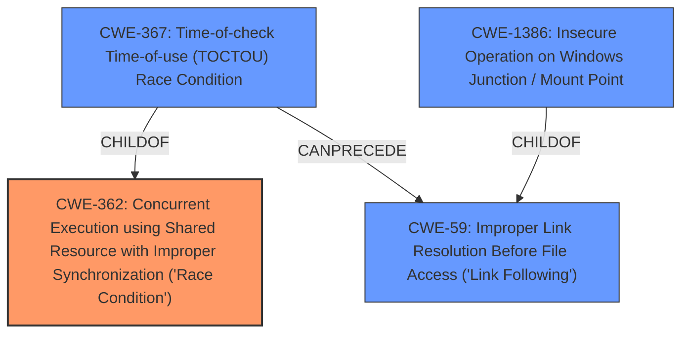

# Analysis Report for CVE-2022-0280

# Vulnerability Analysis Report: CVE-2022-0280

## Description


## Analysis (with Relationship Data)

# Summary
| CWE ID | CWE Name | Confidence | CWE Abstraction Level | CWE Vulnerability Mapping Label | CWE-Vulnerability Mapping Notes |
|---|---|---|---|---|---|
| CWE-362 | Concurrent Execution using Shared Resource with Improper Synchronization ('Race Condition') | 1.0 | Class | Primary | Allowed-with-Review |
| CWE-367 | Time-of-check Time-of-use (TOCTOU) Race Condition | 0.7 | Base | Secondary | Allowed |
| CWE-59 | Improper Link Resolution Before File Access ('Link Following') | 0.6 | Base | Secondary | Allowed |
| CWE-1386 | Insecure Operation on Windows Junction / Mount Point | 0.5 | Base | Secondary | Allowed |

## Evidence and Confidence

*   **Confidence Score:** 0.8
*   **Evidence Strength:** MEDIUM

## Relationship Analysis
The primary CWE is CWE-362, a Class-level CWE representing a general **race condition**. CWE-367 is a ChildOf CWE-362 and represents a specific type of **race condition**, where the state of a resource is checked and then used, but the state can change in between. CWE-59 can result from a **race condition** and is often related to symlink issues. CWE-1386 is a child of CWE-59 and describes insecure operations on Windows junctions and mount points, which can be exploited via **race conditions**.



## Vulnerability Chain
The vulnerability chain starts with a **race condition** (CWE-362), specifically a Time-of-Check Time-of-Use (TOCTOU) vulnerability (CWE-367). This **race condition** enables an attacker to replace a file with a symbolic link (CWE-59). The insecure handling of the symlink leads to arbitrary file deletion, potentially causing denial of service and privilege elevation. In a Windows environment, this might involve insecure operations on junctions/mount points (CWE-1386).

## Summary of Analysis
The vulnerability involves a **race condition** in the QuickClean feature of McAfee Total Protection. The core issue is that the product doesn't properly synchronize access to shared resources during file operations, allowing a local user to exploit a **race condition** to create symlinks and delete arbitrary files.

The primary CWE is CWE-362 (Concurrent Execution using Shared Resource with Improper Synchronization ('Race Condition')), as the vulnerability stems from **improper synchronization** in a concurrent environment. The vulnerability description explicitly mentions a "**race condition**," making CWE-362 the most appropriate high-level classification.

CWE-367 (Time-of-check Time-of-use (TOCTOU) Race Condition) is also relevant because the attacker likely exploits a time window between when the product checks the state of a file and when it uses that file.

CWE-59 (Improper Link Resolution Before File Access ('Link Following')) is applicable since the attack exploits symlinks. The product fails to prevent the filename from resolving to an unintended resource.

CWE-1386 (Insecure Operation on Windows Junction / Mount Point) is also relevant as the exploit involves symlinks on a Windows system, suggesting the possibility of exploiting Windows junctions or mount points.

While CWE-269 (Improper Privilege Management) and CWE-732 (Incorrect Permission Assignment for Critical Resource) were considered, they were deemed less relevant as the root cause is the **race condition**, not a direct issue with privilege management or permission assignment. Similarly, CWE-20 (Improper Input Validation) is too generic.

The selection of CWE-362 as the primary CWE, with CWE-367, CWE-59, and CWE-1386 as secondary CWEs, provides a comprehensive and specific representation of the vulnerability.

Relevant CWE Information:

# Enhanced Context (25 CWEs)

## CWE-1289: Improper Validation of Unsafe Equivalence in Input
**Abstraction Level**: Base
**Similarity Score**: 0.80
**Source**: dense

**Description**:
The product receives an input value that is used as a resource identifier or other type of reference, but it does not validate or incorrectly validates that the input is equivalent to a potentially-unsafe value.

**Mapping Guidance**:
- Usage: Allowed
- Rationale: This CWE entry is at the Base level of abstraction, which is a preferred level of abstraction for mapping to the root causes of vulnerabilities.

## CWE-59: Improper Link Resolution Before File Access ('Link Following')
**Abstraction Level**: Base
**Similarity Score**: 0.77
**Source**: dense

**Description**:
The product attempts to access a file based on the filename, but it does not properly prevent that filename from identifying a link or shortcut that resolves to an unintended resource.

**Mapping Guidance**:
- Usage: Allowed
- Rationale: This CWE entry is at the Base level of abstraction, which is a preferred level of abstraction for mapping to the root causes of vulnerabilities.

## CWE-184: Incomplete List of Disallowed Inputs
**Abstraction Level**: Base
**Similarity Score**: 0.76
**Source**: dense

**Description**:
The product implements a protection mechanism that relies on a list of inputs (or properties of inputs) that are not allowed by policy or otherwise require other action to neutralize before additional processing takes place, but the list is incomplete.

**Mapping Guidance**:
- Usage: Allowed
- Rationale: This CWE entry is at the Base level of abstraction, which is a preferred level of abstraction for mapping to the root causes of vulnerabilities.

## CWE-367: Time-of-check Time-of-use (TOCTOU) Race Condition
**Abstraction Level**: Base
**Similarity Score**: 0.76
**Source**: dense

**Description**:
The product checks the state of a resource before using that resource, but the resource's state can change between the check and the use in a way that invalidates the results of the check. This can cause the product to perform invalid actions when the resource is in an unexpected state.

**Mapping Guidance**:
- Usage: Allowed
- Rationale: This CWE entry is at the Base level of abstraction, which is a preferred level of abstraction for mapping to the root causes of vulnerabilities.

## CWE-41: Improper Resolution of Path Equivalence
**Abstraction Level**: Base
**Similarity Score**: 0.76
**Source**: dense

**Description**:
The product is vulnerable to file system contents disclosure through path equivalence. Path equivalence involves the use of special characters in file and directory names. The associated manipulations are intended to generate multiple names for the same object.

**Mapping Guidance**:
- Usage: Allowed
- Rationale: This CWE entry is at the Base level of abstraction, which is a preferred level of abstraction for mapping to the root causes of vulnerabilities.

## CWE-73: External Control of File Name or Path
**Abstraction Level**: Base
**Similarity Score**: 0.76
**Source**: dense

**Description**:
The product allows user input to control or influence paths or file names that are used in filesystem operations.

**Mapping Guidance**:
- Usage: Allowed
- Rationale: This CWE entry is at the Base level of abstraction, which is a preferred level of abstraction for mapping to the root causes of vulnerabilities.

## CWE-807: Reliance on Untrusted Inputs in a Security Decision
**Abstraction Level**: Base
**Similarity Score**: 0.76
**Source**: dense

**Description**:
The product uses a protection mechanism that relies on the existence or values of an input, but the input can be modified by an untrusted actor in a way that bypasses the protection mechanism.

**Mapping Guidance**:
- Usage: Allowed
- Rationale: This CWE entry is at the Base level of abstraction, which is a preferred level of abstraction for mapping to the root causes of vulnerabilities.

## CWE-183: Permissive List of Allowed Inputs
**Abstraction Level**: Base
**Similarity Score**: 0.76
**Source**: dense

**Description**:
The product implements a protection mechanism that relies on a list of inputs (or properties of inputs) that are explicitly allowed by policy because the inputs are assumed to be safe, but the list is too permissive - that is


## CWE Relationship Analysis

Current CWEs represent these abstraction levels: .


### Vulnerability Chain Analysis

**Chain starting from CWE-367:**
- 367 (Time-of-check Time-of-use (TOCTOU) Race Condition) - ROOT


**Chain starting from CWE-41:**
- 41 (Improper Resolution of Path Equivalence) - ROOT


### CWE Relationship Diagram

```mermaid
graph TD
    classDef primary fill:#f96,stroke:#333,stroke-width:2px
    classDef secondary fill:#69f,stroke:#333
    classDef tertiary fill:#9e9,stroke:#333
```


*Report generated on 2025-03-31 01:28:36*
