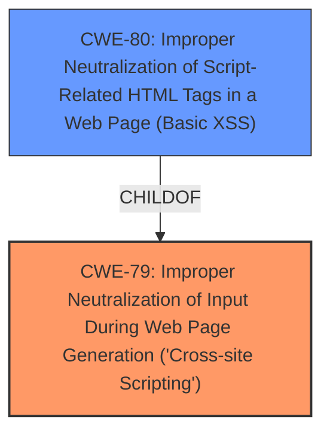

# Raw Analyzer Response for CVE-2022-0282

# Summary
| CWE ID | CWE Name | Confidence | CWE Abstraction Level | CWE Vulnerability Mapping Label | CWE-Vulnerability Mapping Notes |
|---|---|---|---|---|---|
| CWE-79 | Improper Neutralization of Input During Web Page Generation ('Cross-site Scripting') | 1.0 | Base | Allowed | Primary CWE |

## Evidence and Confidence

*   **Confidence Score:** 1.0
*   **Evidence Strength:** HIGH

## Relationship Analysis
The primary relationship that influenced the decision was the ChildOf relationship between CWE-80 and CWE-79, however, the vulnerability description does not specify which HTML tag is not being neutralized, so the more generic CWE-79 was selected.

## Vulnerability Chain
The vulnerability chain starts with the **improper neutralization** of input, leading directly to cross-site scripting.

## Summary of Analysis
The initial analysis strongly pointed towards CWE-79, supported by the vulnerability description, key phrases, and CVE reference summary. The **weakness** is **cross-site scripting** due to the comment body **not being properly sanitized**. The Retriever Results also listed CWE-79 as the top result. The relationship analysis confirmed that choosing CWE-79 is appropriate because it is at the Base level.

Relevant CWE Information:

# Enhanced Context (25 CWEs)

## CWE-80: Improper Neutralization of Script-Related HTML Tags in a Web Page (Basic XSS)
**Abstraction Level**: Variant
**Similarity Score**: 0.82
**Source**: dense

**Description**:
The product receives input from an upstream component, but it does not neutralize or incorrectly neutralizes special characters such as "<", ">", and "&" that could be interpreted as web-scripting elements when they are sent to a downstream component that processes web pages.

**Mapping Guidance**:
- Usage: Allowed
- Rationale: This CWE entry is at the Variant level of abstraction, which is a preferred level of abstraction for mapping to the root causes of vulnerabilities.

## CWE-79: Improper Neutralization of Input During Web Page Generation ('Cross-site Scripting')
**Abstraction Level**: Base
**Similarity Score**: 8036.13
**Source**: sparse

**Description**:
The product does not neutralize or incorrectly neutralizes user-controllable input before it is placed in output that is used as a web page that is served to other users.

**Mapping Guidance**:
- Usage: Allowed
- Rationale: This CWE entry is at the Base level of abstraction, which is a preferred level of abstraction for mapping to the root causes of vulnerabilities.

The vulnerability is due to the comment body **not being properly sanitized** before being displayed on the page, allowing an attacker to inject malicious scripts. This aligns perfectly with the description of CWE-79, which states that the product "does not neutralize or incorrectly neutralizes user-controllable input before it is placed in output that is used as a web page that is served to other users."

CWE-80 was considered as a more specific option, but there was no information about which HTML tags were not being neutralized, and therefore CWE-79 was selected.