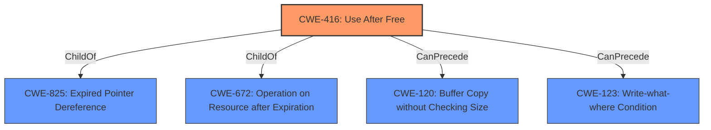

# Raw Analyzer Response for CVE-2022-0289

# Summary
| CWE ID | CWE Name | Confidence | CWE Abstraction Level | CWE Vulnerability Mapping Label | CWE-Vulnerability Mapping Notes |
|---|---|---|---|---|---|
| CWE-416 | Use After Free | 1.0 | Variant | Allowed | Primary CWE |

## Evidence and Confidence

*   **Confidence Score:** 1.0
*   **Evidence Strength:** HIGH

## Relationship Analysis
The primary relationship is that CWE-416 is a Variant. The retriever results and the vulnerability description point to a use-after-free condition, and CWE-416 accurately represents this specific type of memory corruption.

## Vulnerability Chain
The vulnerability chain starts with the **use after free** condition, which allows a remote attacker to potentially exploit **heap corruption**. The final impact isn't specified, but use-after-free can lead to arbitrary code execution, crashes, and information disclosure.

## Summary of Analysis
The analysis strongly supports classifying this vulnerability as CWE-416.

- The vulnerability description explicitly mentions "**use after free**" as the root cause.
- The "**heap corruption**" mentioned in the vulnerability description aligns with the potential impact of a use-after-free vulnerability.
- The "CWE for similar CVE Descriptions" section lists CWE-416 as the Primary CWE Match and the Top CWE.
- The CVE Reference Links Content Summary confirms the "Use-after-free" as the root cause of the vulnerability.
- Retriever results list CWE-416 as the top result.
- CWE-416 is a Variant, which is a preferred level of abstraction.

The evidence from the vulnerability description, similar CVEs, and retriever results consistently points to CWE-416 as the most accurate classification.

Other CWEs Considered:
- CWE-122: While **heap corruption** is mentioned, the root cause is the use-after-free, not a heap overflow directly.
- CWE-366, CWE-362: These relate to race conditions, but there's no explicit evidence of a race condition in the provided description.
- CWE-843: This relates to type confusion. No mention of type issues in the description.
- CWE-451: This is related to User Interface Misrepresentation, but the vulnerability is related to memory management and code execution.

Based on the evidence, CWE-416 is the most specific and accurate representation of the vulnerability.