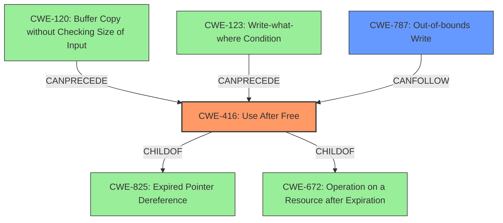

# Analysis Report for CVE-2022-0293

# Vulnerability Analysis Report: CVE-2022-0293

## Description


## Analysis (with Relationship Data)

# Summary
| CWE ID | CWE Name | Confidence | CWE Abstraction Level | CWE Vulnerability Mapping Label | CWE-Vulnerability Mapping Notes |
|---|---|---|---|---|---|
| CWE-416 | Use After Free | 1.0 | Variant | Primary | Allowed |
| CWE-787 | Out-of-bounds Write | 0.6 | Base | Secondary | Allowed |

## Evidence and Confidence

*   **Confidence Score:** 0.9
*   **Evidence Strength:** HIGH

## Relationship Analysis
The primary CWE, CWE-416 (Use After Free), is a variant of CWE-825 (Expired Pointer Dereference), CWE-672 (Operation on a Resource after Expiration). CWE-416 can be caused by CWE-120 (Buffer Copy without Checking Size of Input) or CWE-123 (Write-what-where Condition). The secondary CWE, CWE-787 (Out-of-bounds Write), is related to memory corruption and can be a consequence of the Use After Free. The hierarchical and chain relationships support the selection of CWE-416 as the primary cause, with CWE-787 as a potential impact.



## Vulnerability Chain
The vulnerability chain starts with a **use after free** (CWE-416) within the Web packaging component of Google Chrome. This **use after free** can lead to **heap corruption**, which in turn can allow a remote attacker to potentially exploit the vulnerability via a crafted HTML page. The **heap corruption** is further classified as an Out-of-bounds Write (CWE-787).

## Summary of Analysis
The initial analysis identified the **use after free** as the root cause of the vulnerability, which leads to **heap corruption**. The provided information, including the "Vulnerability Description Key Phrases" and "CVE Reference Links Content Summary", explicitly states the **rootcause** as "**use after free**" and the **weakness** as "**heap corruption**". The Retriever Results also lists CWE-416 as the top candidate. The relationship analysis confirms that CWE-416 is a variant-level CWE, which is the preferred level of abstraction. Based on this evidence, CWE-416 is the primary CWE.

The **heap corruption** can be further classified as CWE-787 (Out-of-bounds Write). While the description doesn't explicitly say "out-of-bounds write", **heap corruption** often involves writing data to memory locations that are outside the intended buffer, making CWE-787 a relevant secondary CWE.

The evidence provided strongly supports the selection of CWE-416 as the primary CWE. The selection of CWE-787 as a secondary CWE is based on the understanding of **heap corruption** and its potential implications.

Relevant CWE Information:

# Enhanced Context (25 CWEs)
The following CWEs were identified as potentially relevant to this vulnerability:

## CWE-416: Use After Free
**Abstraction Level**: Variant
**Similarity Score**: 0.342 (sparse)

**Description**:
The product reuses or references memory after it has been freed. At some point afterward, the memory may be allocated again and saved in another pointer, while the original pointer references a location somewhere within the new allocation. Any operations using the original pointer are no longer valid because the memory "belongs" to the code that operates on the new pointer.

**Mapping Guidance**:
- Usage: Allowed
- Rationale: This CWE entry is at the Variant level of abstraction, which is a preferred level of abstraction for mapping to the root causes of vulnerabilities.

## CWE-787: Out-of-bounds Write
**Abstraction Level**: base
**Similarity Score**: 4.33 (graph)

**Description**:
CWE-787: Out-of-bounds Write

**Mapping Guidance**:
- Usage: Allowed
- Rationale: This CWE entry is at the Base level of abstraction, which is a preferred level of abstraction for mapping to the root causes of vulnerabilities.

## CWE-123: Write-what-where Condition
**Abstraction Level**: Base
While this CWE describes an arbitrary write, it is not as direct a consequence of the **use after free** as the out-of-bounds write. Therefore, it was considered but not selected.

## CWE-415: Double Free
**Abstraction Level**: Variant
While related to memory management, a double free isn't directly indicated in the description. The vulnerability is a **use after free**, not freeing the same memory twice. Therefore, it was considered but not selected.

## CWE-366: Race Condition within a Thread
**Abstraction Level**: Base
A race condition isn't explicitly mentioned or implied in the vulnerability description. The root cause is the **use after free**, not a synchronization issue. Therefore, it was considered but not selected.

## CWE-843: Access of Resource Using Incompatible Type ('Type Confusion')
**Abstraction Level**: Base
Type confusion isn't explicitly mentioned or implied in the vulnerability description. The root cause is the **use after free**, not using the wrong type to access memory. Therefore, it was considered but not selected.

## CWE-122: Heap-based Buffer Overflow
**Abstraction Level**: Variant
While **heap corruption** is mentioned, a buffer overflow isn't explicitly described. The **use after free** leads to **heap corruption**, which can then be exploited. The more direct consequence is the out-of-bounds write, so CWE-787 is favored. Therefore, it was considered but not selected.

## CWE-451: User Interface (UI) Misrepresentation of Critical Information
**Abstraction Level**: Class
This CWE relates to UI misrepresentation, which is not relevant to this vulnerability. Therefore, it was considered but not selected.

## CWE-362: Concurrent Execution using Shared Resource with Improper Synchronization ('Race Condition')
**Abstraction Level**: Class
This CWE relates to race conditions, which are not relevant to this vulnerability. Therefore, it was considered but not selected.

## CWE-911: Improper Update of Reference Count
**Abstraction Level**: Base
This CWE relates to reference counting, which is not relevant to this vulnerability. Therefore, it was considered but not selected.

## CWE-356: Product UI does not Warn User of Unsafe Actions
**Abstraction Level**: Base
This CWE relates to the UI not warning users, which is not relevant to this vulnerability. Therefore, it was considered but not selected.


## CWE Relationship Analysis

Current CWEs represent these abstraction levels: .


### Vulnerability Chain Analysis

**Chain starting from CWE-825:**
- 825 (Expired Pointer Dereference) - ROOT


**Chain starting from CWE-356:**
- 356 (Product UI does not Warn User of Unsafe Actions) - ROOT


### CWE Relationship Diagram

```mermaid
graph TD
    classDef primary fill:#f96,stroke:#333,stroke-width:2px
    classDef secondary fill:#69f,stroke:#333
    classDef tertiary fill:#9e9,stroke:#333
```


*Report generated on 2025-03-31 07:21:50*
