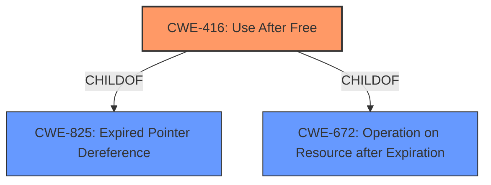

# Analysis Report for CVE-2022-0296

# Vulnerability Analysis Report: CVE-2022-0296

## Description


## Analysis (with Relationship Data)

# Summary
| CWE ID | CWE Name | Confidence | CWE Abstraction Level | CWE Vulnerability Mapping Label | CWE-Vulnerability Mapping Notes |
|---|---|---|---|---|---|
| CWE-416 | Use After Free | 1.0 | Variant | Allowed | Primary CWE |

## Evidence and Confidence

*   **Confidence Score:** 1.0
*   **Evidence Strength:** HIGH

## Relationship Analysis
The primary relationship that influenced the decision was the direct match of the vulnerability description's root cause to CWE-416. While other CWEs like CWE-366 (Race Condition), CWE-122 (Heap-based Buffer Overflow), and CWE-843 (Type Confusion) were considered, none of them directly reflected the **use after free** condition as accurately as CWE-416. CWE-416 is a variant, which is a preferred level of abstraction.



## Vulnerability Chain
The vulnerability chain starts with the **use after free** condition (CWE-416), potentially leading to **heap corruption**. The vulnerability occurs in the printing functionality of Google Chrome and can be triggered by a remote attacker through a crafted HTML page.

## Summary of Analysis
The analysis strongly supports mapping this vulnerability to CWE-416 (Use After Free).

The vulnerability description explicitly states "**use after free** in Printing," which aligns perfectly with the CWE-416 description: "The product reuses or references memory after it has been freed." The CVE Reference Links Content Summary reinforces this, stating, "Root cause of vulnerability: Use after free in Printing" and "Weaknesses/vulnerabilities present: The vulnerability is a Use-After-Free condition, where a pointer to a memory location is used after the memory has been freed."

CWE-416 is at the Variant level of abstraction, which is a preferred level. The mapping guidance for CWE-416 states "Usage: Allowed" and "Rationale: This CWE entry is at the Variant level of abstraction, which is a preferred level of abstraction for mapping to the root causes of vulnerabilities."

Other CWEs were considered, but none matched the core **use after free** condition as directly and accurately as CWE-416. For example, while **heap corruption** is mentioned, it is a consequence of the **use after free**, not the root cause. CWE-122 (Heap-based Buffer Overflow) was therefore not selected.

Relevant CWE Information:
- CWE-416: Use After Free
- CWE-366: Race Condition within a Thread
- CWE-122: Heap-based Buffer Overflow
- CWE-843: Access of Resource Using Incompatible Type ('Type Confusion')
- CWE-362: Concurrent Execution using Shared Resource with Improper Synchronization ('Race Condition')
- CWE-1021: Improper Restriction of Rendered UI Layers or Frames
- CWE-364: Signal Handler Race Condition
- CWE-415: Double Free
- CWE-665: Improper Initialization
- CWE-911: Improper Update of Reference Count


## CWE Relationship Analysis

Current CWEs represent these abstraction levels: .


### Vulnerability Chain Analysis

**Chain starting from CWE-825:**
- 825 (Expired Pointer Dereference) - ROOT


**Chain starting from CWE-843:**
- 843 (Access of Resource Using Incompatible Type ('Type Confusion')) - ROOT


### CWE Relationship Diagram

```mermaid
graph TD
    classDef primary fill:#f96,stroke:#333,stroke-width:2px
    classDef secondary fill:#69f,stroke:#333
    classDef tertiary fill:#9e9,stroke:#333
```


*Report generated on 2025-03-30 13:58:38*
