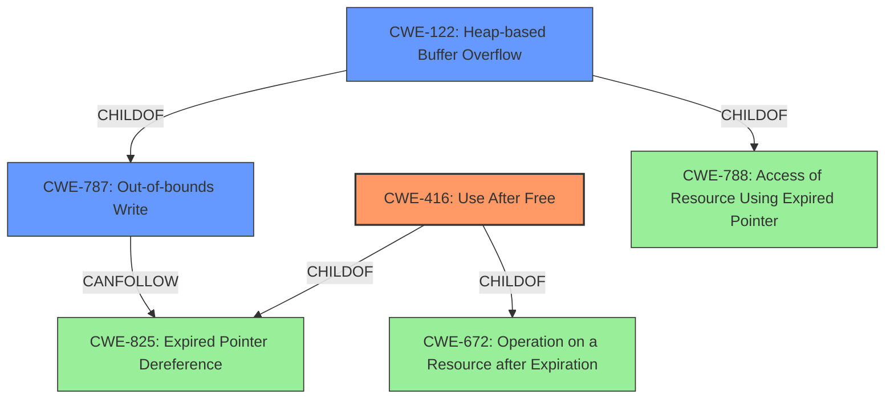

# Raw Analyzer Response for CVE-2022-0298

# Summary
| CWE ID  | CWE Name                                                                                               | Confidence | CWE Abstraction Level | CWE Vulnerability Mapping Label | CWE-Vulnerability Mapping Notes |
| :-------- | :------------------------------------------------------------------------------------------------------- | :---------- | :---------------------- | :------------------------------ | :--------------------------------- |
| CWE-416 | Use After Free                                                                                           | 1          | Variant                 | Allowed                       | Primary CWE                        |
| CWE-787 | Out-of-bounds Write                                                                                         | 0.5         | Base                      | Allowed                     | Secondary Candidate                 |
| CWE-122 | Heap-based Buffer Overflow                                                                                         | 0.4         | Variant                 | Allowed                       | Secondary Candidate                 |

## Evidence and Confidence

*   **Confidence Score:** 0.9
*   **Evidence Strength:** HIGH

## Relationship Analysis
The primary relationship influencing the decision is the direct match of the "Use after free" root cause to CWE-416, a Variant level CWE. The secondary consideration is the potential for **heap corruption** to manifest as an Out-of-bounds Write (CWE-787) or Heap-based Buffer Overflow (CWE-122) after the initial use-after-free.

## Vulnerability Chain
The vulnerability chain starts with a **use after free** condition in the Scheduling component, leading to **heap corruption**. This **heap corruption** can then potentially lead to an out-of-bounds write or other memory corruption issues.

## Summary of Analysis
The primary assessment is based on the explicit "Use after free" root cause identified in the vulnerability description and CVE Reference Links Content Summary:
*   **Vulnerability Description Key Phrases:** "**rootcause:** **use after free**"
*   **CVE Reference Links Content Summary:** `"root_cause": "Use after free in Scheduling."`
*   **CVE Reference Links Content Summary:** `"weaknesses": ["Use after free"]`

This directly aligns with CWE-416. The other CWEs are considered secondary because they describe potential consequences or related conditions of the **use after free**, but are not the root cause itself. CWE-787 and CWE-122 describe ways that **heap corruption** can manifest after the initial vulnerability.

The selection of CWE-416 as the primary CWE is at the optimal level of specificity because it directly describes the root cause. Other CWEs, while potentially related, represent consequences or contributing factors rather than the initial error.

Relevant CWE Information:

# Enhanced Context (25 CWEs)

## CWE-667: Improper Locking
**Abstraction Level**: Class
**Similarity Score**: 0.79
**Source**: dense

**Description**:
The product does not properly acquire or release a lock on a resource, leading to unexpected resource state changes and behaviors.

**Mapping Guidance**:
- Usage: Allowed-with-Review
- Rationale: This CWE entry is a Class and might have Base-level children that would be more appropriate

*Not Selected*: This CWE is not selected because the provided information does not describe any locking issues.

## CWE-356: Product UI does not Warn User of Unsafe Actions
**Abstraction Level**: Base
**Similarity Score**: 0.79
**Source**: dense

**Description**:
The product's user interface does not warn the user before undertaking an unsafe action on behalf of that user. This makes it easier for attackers to trick users into inflicting damage to their system.

**Mapping Guidance**:
- Usage: Allowed
- Rationale: This CWE entry is at the Base level of abstraction, which is a preferred level of abstraction for mapping to the root causes of vulnerabilities.

*Not Selected*: This CWE is not selected because the vulnerability is not directly related to the product UI or user interaction.

## CWE-404: Improper Resource Shutdown or Release
**Abstraction Level**: Class
**Similarity Score**: 0.79
**Source**: dense

**Description**:
The product does not release or incorrectly releases a resource before it is made available for re-use.

**Mapping Guidance**:
- Usage: Allowed-with-Review
- Rationale: This CWE entry is a Class and might have Base-level children that would be more appropriate

*Not Selected*: This is too general and the root cause is more precisely "Use After Free".

## CWE-226: Sensitive Information in Resource Not Removed Before Reuse
**Abstraction Level**: Base
**Similarity Score**: 0.78
**Source**: dense

**Description**:
The product releases a resource such as memory or a file so that it can be made available for reuse, but it does not clear or "zeroize" the information contained in the resource before the product performs a critical state transition or makes the resource available for reuse by other entities.

**Mapping Guidance**:
- Usage: Allowed
- Rationale: This CWE entry is at the Base level of abstraction, which is a preferred level of abstraction for mapping to the root causes of vulnerabilities.

*Not Selected*: This is not about sensitive information, but about general memory corruption.

## CWE-754: Improper Check for Unusual or Exceptional Conditions
**Abstraction Level**: Class
**Similarity Score**: 0.78
**Source**: dense

**Description**:
The product does not check or incorrectly checks for unusual or exceptional conditions that are not expected to occur frequently during day to day operation of the product.

**Mapping Guidance**:
- Usage: Allowed-with-Review
- Rationale: This CWE entry is a Class and might have Base-level children that would be more appropriate

*Not Selected*: This CWE does not describe the root cause of the vulnerability which is "Use After Free".

## CWE-366: Race Condition within a Thread
**Abstraction Level**: Base
**Similarity Score**: 0.78
**Source**: dense

**Description**:
If two threads of execution use a resource simultaneously, there exists the possibility that resources may be used while invalid, in turn making the state of execution undefined.

**Mapping Guidance**:
- Usage: Allowed
- Rationale: This CWE entry is at the Base level of abstraction, which is a preferred level of abstraction for mapping to the root causes of vulnerabilities.

*Not Selected*: Although a race condition could potentially lead to a use-after-free, there's no evidence provided that a race condition is involved in this specific vulnerability. Therefore, it's not appropriate to assign CWE-366 as the primary cause.

## CWE-703: Improper Check or Handling of Exceptional Conditions
**Abstraction Level**: Pillar
**Similarity Score**: 0.78
**Source**: dense

**Description**:
The product does not properly anticipate or handle exceptional conditions that rarely occur during normal operation of the product.

**Mapping Guidance**:
- Usage: Discouraged
- Rationale: This CWE entry is extremely high-level, a Pillar.

*Not Selected*: Too abstract.

## CWE-668: Exposure of Resource to Wrong Sphere
**Abstraction Level**: Class
**Similarity Score**: 0.78
**Source**: dense

**Description**:
The product exposes a resource to the wrong control sphere, providing unintended actors with inappropriate access to the resource.

**Mapping Guidance**:
- Usage: Discouraged
- Rationale: CWE-668 is high-level and is often misused as a catch-all when lower-level CWE IDs might be applicable. It is sometimes used for low-information vulnerability reports [REF-1287]. It is a level-1 Class (i.e., a child of a Pillar). It is not useful for trend analysis.

*Not Selected*: This CWE does not describe the root cause of the vulnerability which is "Use After Free".

## CWE-362: Concurrent Execution using Shared Resource with Improper Synchronization ('Race Condition')
**Abstraction Level**: Class
**Similarity Score**: 0.78
**Source**: dense

**Description**:
The product contains a concurrent code sequence that requires temporary, exclusive access to a shared resource