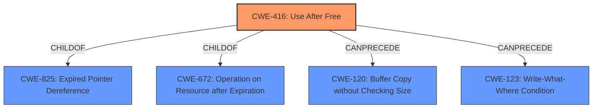

# Raw Analyzer Response for CVE-2022-0304

# Summary
| CWE ID | CWE Name | Confidence | CWE Abstraction Level | CWE Vulnerability Mapping Label | CWE-Vulnerability Mapping Notes |
|---|---|---|---|---|---|
| CWE-416 | Use After Free | 1.0 | Variant | Allowed | Primary CWE |

## Evidence and Confidence

*   **Confidence Score:** 1.0
*   **Evidence Strength:** HIGH

## Relationship Analysis
The primary relationship that influenced the decision was the ChildOf relationship between CWE-416 and CWE-825 (Expired Pointer Dereference), and CWE-672 (Operation on Resource after Expiration). While CWE-825 and CWE-672 are more general, CWE-416 directly addresses the **use-after-free** condition, making it a more specific and appropriate choice. The `CanPrecede` relationship to CWE-120 (Buffer Copy without Checking Size) and CWE-123 (Write-What-Where Condition) suggest potential consequences of a **use-after-free**, but these are impacts rather than root causes. The variant level of CWE-416 aligns with the specificity of the vulnerability description.

## Vulnerability Chain
The vulnerability chain starts with the **use-after-free** condition (CWE-416), potentially leading to **heap corruption**. The vulnerability description indicates that a remote attacker can exploit this by convincing a user to interact with a crafted HTML page. While the exact steps for the exploit are not detailed due to restricted bug details, the chain can be summarized as:

1.  **Root Cause:** **Use-after-free** (CWE-416) in Bookmarks component.
2.  **Weakness:** **Heap corruption**.
3.  **Exploit Vector:** Crafted HTML page and user interaction.
4.  **Attacker:** Remote attacker.

## Summary of Analysis
The analysis is primarily based on the vulnerability description and the "CVE Reference Links Content Summary." The description explicitly states "**Use after free**" as the root cause. The "CVE Reference Links Content Summary" confirms this with the entry: `"root_cause": "Use after free in Bookmarks."`

The graph relationships helped confirm that CWE-416 is the most specific and accurate representation of the vulnerability. While other CWEs like CWE-366 (Race Condition within a Thread) and CWE-787 (Out-of-bounds Write) were considered, they do not directly address the **use-after-free** condition described in the vulnerability.

CWE-416 is selected because it directly maps to the **root cause** described. It is a variant-level CWE, providing a sufficient level of specificity for the vulnerability.

Relevant CWE Information:

# Enhanced Context (25 CWEs)

## CWE-366: Race Condition within a Thread
**Abstraction Level**: Base
**Similarity Score**: 0.79
**Source**: dense

**Description**:
If two threads of execution use a resource simultaneously, there exists the possibility that resources may be used while invalid, in turn making the state of execution undefined.

**Mapping Guidance**:
- Usage: Allowed
- Rationale: This CWE entry is at the Base level of abstraction, which is a preferred level of abstraction for mapping to the root causes of vulnerabilities.

*Justification for not selecting:* While race conditions can lead to **use-after-free** conditions, the provided vulnerability description does not explicitly mention a race condition. Therefore, CWE-366 is not selected.

## CWE-404: Improper Resource Shutdown or Release
**Abstraction Level**: Class
**Similarity Score**: 0.78
**Source**: dense

**Description**:
The product does not release or incorrectly releases a resource before it is made available for re-use.

**Mapping Guidance**:
- Usage: Allowed-with-Review
- Rationale: This CWE entry is a Class and might have Base-level children that would be more appropriate

*Justification for not selecting:* This CWE describes a general class of resource management issues, but it does not specifically address the **use-after-free** condition.

## CWE-226: Sensitive Information in Resource Not Removed Before Reuse
**Abstraction Level**: Base
**Similarity Score**: 0.78
**Source**: dense

**Description**:
The product releases a resource such as memory or a file so that it can be made available for reuse, but it does not clear or "zeroize" the information contained in the resource before the product performs a critical state transition or makes the resource available for reuse by other entities.

**Mapping Guidance**:
- Usage: Allowed
- Rationale: This CWE entry is at the Base level of abstraction, which is a preferred level of abstraction for mapping to the root causes of vulnerabilities.

*Justification for not selecting:* This CWE is about sensitive data leakage upon reuse, not the memory management issue described in the vulnerability.

## CWE-911: Improper Update of Reference Count
**Abstraction Level**: Base
**Similarity Score**: 0.78
**Source**: dense

**Description**:
The product uses a reference count to manage a resource, but it does not update or incorrectly updates the reference count.

**Mapping Guidance**:
- Usage: Allowed
- Rationale: This CWE entry is at the Base level of abstraction, which is a preferred level of abstraction for mapping to the root causes of vulnerabilities.

*Justification for not selecting:* This CWE describes an issue related to reference counting, which is not mentioned in the vulnerability description.

## CWE-667: Improper Locking
**Abstraction Level**: Class
**Similarity Score**: 0.78
**Source**: dense

**Description**:
The product does not properly acquire or release a lock on a resource, leading to unexpected resource state changes and behaviors.

**Mapping Guidance**:
- Usage: Allowed-with-Review
- Rationale: This CWE entry is a Class and might have Base-level children that would be more appropriate

*Justification for not selecting:* This CWE addresses locking issues, not memory management problems.

## CWE-362: Concurrent Execution using Shared Resource with Improper Synchronization ('Race Condition')
**Abstraction Level**: Class
**Similarity Score**: 0.76
**Source**: dense

**Description**:
The product contains a concurrent code sequence that requires temporary, exclusive access to a shared resource, but a timing window exists in which the shared resource can be modified by another code sequence operating concurrently.

**Mapping Guidance**:
- Usage: Allowed-with-Review
- Rationale: This CWE entry is a Class and might have Base-level children that would be more appropriate

*Justification for not selecting:* Similar to CWE-366, a race condition is not explicitly mentioned in the vulnerability description.

## CWE-415: Double Free
**Abstraction Level**: Variant
**Similarity Score**: 0.76
**Source**: dense

**Description**:
The product calls free() twice on the same memory address, potentially leading to modification of unexpected memory locations.

**Mapping Guidance**:
- Usage: Allowed
- Rationale: This CWE entry is at the Variant level of abstraction, which is a preferred level of abstraction for mapping to the root causes of vulnerabilities.

*Justification for not selecting:* While a double free is a related memory management issue, the description specifically mentions **use-after-free**, not a double free.

## CWE-662: Improper Synchronization
**Abstraction Level**: Class
**Similarity Score**: 0.76
**Source**: dense

**Description**:
The product utilizes multiple threads or processes to allow temporary access to a shared resource that can only be exclusive to one process at a time, but it does not properly synchronize these actions, which might cause simultaneous accesses of this resource by multiple threads or processes.

**Mapping Guidance**:
- Usage: Discouraged
- Rationale: This CWE entry is a level-1 Class (i.e., a child of a Pillar). It might have lower-level children that would be more appropriate

*Justification for not selecting:* This CWE focuses on synchronization issues, not the memory management issue of **use-after-free**.

## CWE-665: Improper Initialization
**Abstraction Level**: Class
**Similarity Score**: 0.76