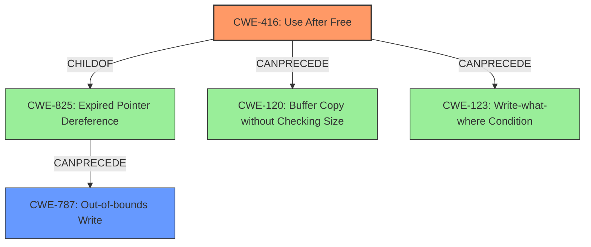

# Enhanced Analysis for CVE-2022-0307

# Summary
| CWE ID | CWE Name | Confidence | CWE Abstraction Level | CWE Vulnerability Mapping Label | CWE-Vulnerability Mapping Notes |
|---|---|---|---|---|---|
| CWE-416 | Use After Free | 1 | Variant | Allowed | Primary CWE |
| CWE-787 | Out-of-bounds Write | 0.5 | Base | Allowed | Secondary Candidate |

## Evidence and Confidence

*   **Confidence Score:** 0.8
*   **Evidence Strength:** HIGH

## Relationship Analysis
The primary CWE is CWE-416 **Use After Free**, which is a variant level CWE. It is related to CWE-825 **Expired Pointer Dereference** (Parent) and can precede CWE-120 **Buffer Copy without Checking Size** and CWE-123 **Write-what-where Condition**. CWE-787 **Out-of-bounds Write** is also considered because **heap corruption** is mentioned, which is often caused by out-of-bounds write. CWE-787 can be preceded by CWE-825 **Expired Pointer Dereference**.



## Vulnerability Chain
The vulnerability chain starts with a **use after free** (CWE-416), which can lead to **heap corruption**. The **heap corruption** could involve overwriting heap metadata, which might then lead to an out-of-bounds write (CWE-787) when the corrupted metadata is used in a subsequent allocation.

## Summary of Analysis
The primary **rootcause** of the vulnerability is **use after free**, as stated in the vulnerability description and the CVE Reference Links Content Summary. This maps directly to CWE-416 **Use After Free**, which is a Variant-level CWE and is allowed for mapping. The vulnerability description also mentions **heap corruption**, which is a common symptom of memory corruption vulnerabilities like **use after free** or out-of-bounds write.

The evidence from the vulnerability description is:
*   "**Use after free** in Optimization Guide in Google Chrome prior to 97.0.4692.99 allowed a remote attacker who convinced a user to engage in specific user interaction to potentially exploit **heap corruption** via a crafted HTML page."
*   "**rootcause:** **use after free**"
*   "**weakness:** **heap corruption**"

The evidence from the CVE Reference Links Content Summary is:
```
{
  "vulnerability_details": {
    "CVE-2022-0307": {
      "root_cause": "Use after free",
      "weaknesses": [
        "Use after free"
      ],
      "impact": "Undefined behavior, potentially leading to crashes or arbitrary code execution.",
      "attack_vectors": "The specific attack vector is not detailed, but it is within the Optimization Guide component of Chrome.",
       "required_capabilities": "An attacker would likely need to trigger specific interactions with the Optimization Guide feature. Details on specific capabilities are not available, however the attack would likely need to be a user of the Chrome browser."
    }
  }
}
```

The graph relationships show that CWE-416 can precede CWE-120 and CWE-123, indicating potential consequences of the **use after free**. The mention of "heap corruption" suggests that CWE-787 **Out-of-bounds Write** might also be relevant, although the primary **rootcause** remains the **use after free**.

The selected CWEs are at the optimal level of specificity, with CWE-416 being a Variant and directly representing the **rootcause** of the vulnerability.

Other CWEs Considered:

*   CWE-366 **Race Condition within a Thread**: While race conditions can sometimes lead to **use after free** vulnerabilities, there is no explicit mention of concurrency or threading issues in this vulnerability description. Therefore, this CWE is not selected.
*   CWE-122 **Heap-based Buffer Overflow**: While **heap corruption** is mentioned, the primary **rootcause** is **use after free**, not a buffer overflow. Therefore, this CWE is not selected as the primary CWE. It could be a secondary effect, but the evidence doesn't strongly support it.
*   CWE-843 **Access of Resource Using Incompatible Type ('Type Confusion')**: There is no mention of type confusion in the vulnerability description. Therefore, this CWE is not selected.
*   CWE-362 **Concurrent Execution using Shared Resource with Improper Synchronization ('Race Condition')**: Same reason as CWE-366, there is no explicit mention of concurrency or threading issues.
*   CWE-356 **Product UI does not Warn User of Unsafe Actions**: This CWE is related to user interaction and warnings, but the core vulnerability is memory corruption due to **use after free**. Therefore, this CWE is not selected.
*   CWE-364 **Signal Handler Race Condition**: This CWE is specific to signal handlers and race conditions, which are not mentioned in the vulnerability description. Therefore, this CWE is not selected.
*   CWE-415 **Double Free**: While double free is a memory corruption issue, the **rootcause** is **use after free**, not a double free. Therefore, this CWE is not selected.
*   CWE-665 **Improper Initialization**: There is no mention of improper initialization in the vulnerability description. Therefore, this CWE is not selected.
*   CWE-404 **Improper Resource Shutdown or Release**: While related to resource management, the **rootcause** is **use after free**, not a general resource shutdown issue. Therefore, this CWE is not selected.


## CWE Relationship Analysis

Current CWEs represent these abstraction levels: .


### Vulnerability Chain Analysis

**Chain starting from CWE-825:**
- 825 (Expired Pointer Dereference) - ROOT


**Chain starting from CWE-843:**
- 843 (Access of Resource Using Incompatible Type ('Type Confusion')) - ROOT


### CWE Relationship Diagram

```mermaid
graph TD
    classDef primary fill:#f96,stroke:#333,stroke-width:2px
    classDef secondary fill:#69f,stroke:#333
    classDef tertiary fill:#9e9,stroke:#333
```