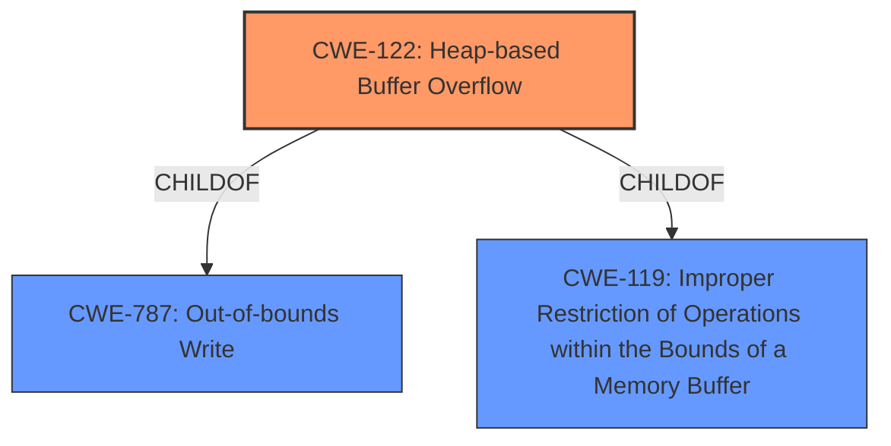

# Analysis Report for CVE-2022-0310

# Vulnerability Analysis Report: CVE-2022-0310

## Description


## Analysis (with Relationship Data)

# Summary
| CWE ID  | CWE Name   | Confidence | CWE Abstraction Level | CWE Vulnerability Mapping Label | CWE-Vulnerability Mapping Notes |
|----------------|-----------------------------------------------------------------|----------------|--------------------------|-----------------------------------|-------------------------------------------------------------------------------------------------------------------|
| CWE-122  | Heap-based Buffer Overflow    | 1  | Variant  | Primary  | Allowed: This CWE entry is at the Variant level of abstraction, which is a preferred level of abstraction for mapping to the root causes of vulnerabilities. |
| CWE-119  | Improper Restriction of Operations within the Bounds of a Memory Buffer | 0.7  | Class  | Secondary | Discouraged: CWE-119 is commonly misused in low-information vulnerability reports when lower-level CWEs could be used instead, or when more details about the vulnerability are available. |

## Evidence and Confidence

*   **Confidence Score:** 1
*   **Evidence Strength:** HIGH

## Relationship Analysis
The primary CWE, CWE-122, is a variant of CWE-787 (Out-of-bounds Write) and CWE-119 (Improper Restriction of Operations within the Bounds of a Memory Buffer). The secondary CWE, CWE-119, is a class-level CWE, and mapping guidance discourages its use when more specific CWEs are available. Because the vulnerability is specifically a heap-based buffer overflow, CWE-122 is a more appropriate and specific choice.



## Vulnerability Chain
The vulnerability chain is a **heap buffer overflow** which leads to potential **heap corruption**.

## Summary of Analysis
The initial assessment focused on identifying the most specific CWE that accurately reflects the vulnerability description, which explicitly states a "**heap buffer overflow**." The "**heap buffer overflow**" is the **weakness**. The evidence provided in the "Vulnerability Description Key Phrases" and "CVE Reference Links Content Summary" confirms this.

The selection of CWE-122 is based on the explicit mention of "heap buffer overflow" in the vulnerability description and the supporting evidence. The relationship analysis confirms that CWE-122 is a child of CWE-119 and CWE-787, providing a more specific classification.

Relevant CWE Information:

# Enhanced Context (25 CWEs)
The following CWEs were identified as potentially relevant to this vulnerability:

## CWE-415: Double Free
**Abstraction Level**: Variant
**Similarity Score**: 0.77
**Source**: dense
**Description**:
The product calls free() twice on the same memory address, potentially leading to modification of unexpected memory locations.
**Justification for Exclusion:** This CWE describes a double free vulnerability, which is distinct from a heap buffer overflow.

## CWE-226: Sensitive Information in Resource Not Removed Before Reuse
**Abstraction Level**: Base
**Similarity Score**: 0.77
**Source**: dense
**Description**:
The product releases a resource such as memory or a file so that it can be made available for reuse, but it does not clear or "zeroize" the information contained in the resource before the product performs a critical state transition or makes the resource available for reuse by other entities.
**Justification for Exclusion:** This CWE describes a failure to clear sensitive information, which is distinct from a heap buffer overflow.

## CWE-366: Race Condition within a Thread
**Abstraction Level**: Base
**Similarity Score**: 0.77
**Source**: dense
**Description**:
If two threads of execution use a resource simultaneously, there exists the possibility that resources may be used while invalid, in turn making the state of execution undefined.
**Justification for Exclusion:** This CWE describes a race condition, which is distinct from a heap buffer overflow.

## CWE-404: Improper Resource Shutdown or Release
**Abstraction Level**: Class
**Similarity Score**: 0.76
**Source**: dense
**Description**:
The product does not release or incorrectly releases a resource before it is made available for re-use.
**Justification for Exclusion:** This CWE describes a failure to properly release resources, which is distinct from a heap buffer overflow.

## CWE-131: Incorrect Calculation of Buffer Size
**Abstraction Level**: Base
**Similarity Score**: 0.75
**Source**: dense
**Description**:
The product does not correctly calculate the size to be used when allocating a buffer, which could lead to a buffer overflow.
**Justification for Exclusion:** While incorrect buffer size calculation can lead to a buffer overflow, the root cause described in the vulnerability is the overflow itself, not the calculation.

## CWE-667: Improper Locking
**Abstraction Level**: Class
**Similarity Score**: 0.75
**Source**: dense
**Description**:
The product does not properly acquire or release a lock on a resource, leading to unexpected resource state changes and behaviors.
**Justification for Exclusion:** This CWE describes improper locking, which is distinct from a heap buffer overflow.

## CWE-191: Integer Underflow (Wrap or Wraparound)
**Abstraction Level**: Base
**Similarity Score**: 0.75
**Source**: dense
**Description**:
The product subtracts one value from another, such that the result is less than the minimum allowable integer value, which produces a value that is not equal to the correct result.
**Justification for Exclusion:** This CWE describes an integer underflow, which is distinct from a heap buffer overflow.

## CWE-193: Off-by-one Error
**Abstraction Level**: Base
**Similarity Score**: 0.74
**Source**: dense
**Description**:
A product calculates or uses an incorrect maximum or minimum value that is 1 more, or 1 less, than the correct value.
**Justification for Exclusion:** While off-by-one errors can lead to buffer overflows, the root cause described in the vulnerability is the overflow itself.

## CWE-362: Concurrent Execution using Shared Resource with Improper Synchronization ('Race Condition')
**Abstraction Level**: Class
**Similarity Score**: 0.74
**Source**: dense
**Description**:
The product contains a concurrent code sequence that requires temporary, exclusive access to a shared resource, but a timing window exists in which the shared resource can be modified by another code sequence operating concurrently.
**Justification for Exclusion:** This CWE describes a race condition, which is distinct from a heap buffer overflow.

## CWE-125: Out-of-bounds Read
**Abstraction Level**: Base
**Similarity Score**: 0.74
**Source**: dense
**Description**:
The product reads data past the end, or before the beginning, of the intended buffer.
**Justification for Exclusion:** This CWE describes an out-of-bounds read, while the vulnerability is an out-of-bounds write (overflow).

## CWE-190: Integer Overflow or Wraparound
**Abstraction Level**: Base
**Similarity Score**: 6230.79
**Source**: sparse
**Description**:
The product performs a calculation that can produce an integer overflow or wraparound when the logic assumes that the resulting value will always be larger than the original value.
**Justification for Exclusion:** Integer overflows can lead to buffer overflows but this is not stated as the root cause.

## CWE-125: Out-of-bounds Read
**Abstraction Level**: Base
**Similarity Score**: 5875.78
**Source**: sparse
**Description**:
The product reads data past the end, or before the beginning, of the intended buffer.
**Justification for Exclusion:** This CWE describes an out-of-bounds read, while the vulnerability is an out-of-bounds write (overflow).

## CWE-193: Off-by-one Error
**Abstraction Level**: Base
**Similarity Score**: 5776.77
**Source**: sparse
**Description**:
A product calculates or uses an incorrect maximum or minimum value that is 1 more, or 1 less, than the correct value.
**Justification for Exclusion:** While off-by-one errors can lead to buffer overflows, the root cause described in the vulnerability is the overflow itself.

## CWE-119: Improper Restriction of Operations within the Bounds of a Memory Buffer
**Abstraction Level**: Class
**Similarity Score**: 5662.00
**Source**: sparse
**Description**:
The product performs operations on a memory buffer, but it reads from or writes to a memory location outside the buffer's intended boundary.
**Justification for Exclusion:** This CWE is too general and doesn't specify the heap.

## CWE-415:


## CWE Relationship Analysis

Current CWEs represent these abstraction levels: .


### Vulnerability Chain Analysis

**Chain starting from CWE-131:**
- 131 (Incorrect Calculation of Buffer Size) - ROOT


**Chain starting from CWE-226:**
- 226 (Sensitive Information in Resource Not Removed Before Reuse) - ROOT


### CWE Relationship Diagram

```mermaid
graph TD
    classDef primary fill:#f96,stroke:#333,stroke-width:2px
    classDef secondary fill:#69f,stroke:#333
    classDef tertiary fill:#9e9,stroke:#333
```


*Report generated on 2025-03-30 23:13:11*
