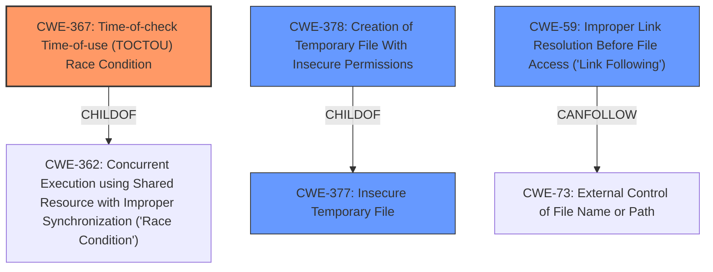

# Enhanced Analysis for CVE-2022-0315

# Summary
| CWE ID | CWE Name | Confidence | CWE Abstraction Level | CWE Vulnerability Mapping Label | CWE-Vulnerability Mapping Notes |
|---|---|---|---|---|---|
| CWE-367 | Time-of-check Time-of-use (TOCTOU) Race Condition | 0.9 | Base | Allowed | Primary CWE: The vulnerability stems from the use of `tempfile.mktemp()`, which creates a temporary file name but does not create the file itself. This can lead to race conditions and potential for attackers to create files with the same name before the application does.|
| CWE-377 | Insecure Temporary File | 0.7 | Class | Allowed-with-Review | Secondary CWE: This class covers the general issue of insecure temporary files. |
| CWE-378 | Creation of Temporary File With Insecure Permissions | 0.6 | Base | Allowed | Secondary CWE: This describes creating temporary files without appropriate controls. |
| CWE-59 | Improper Link Resolution Before File Access ('Link Following') | 0.5 | Base | Allowed | Secondary CWE: An attacker could create a symlink with the same name as the intended temporary file, leading to the application accessing an unintended resource.|

## Evidence and Confidence

*   **Confidence Score:** 0.8
*   **Evidence Strength:** HIGH

## Relationship Analysis
The primary CWE is CWE-367, which represents the TOCTOU race condition. CWE-377 (Insecure Temporary File) is a class-level CWE that broadly describes the issue, while CWE-378 (Creation of Temporary File With Insecure Permissions) is a more specific base-level CWE detailing the insecure permission aspect. CWE-59 (Improper Link Resolution Before File Access ('Link Following')) is included because the race condition could allow an attacker to create a symlink with the same name as the intended temporary file.



## Vulnerability Chain
The vulnerability chain starts with the **insecure temporary file handling** due to the use of `tempfile.mktemp()`. This leads to a **Time-of-Check Time-of-Use (TOCTOU) race condition** where an attacker can create a file with the same name before the application. An attacker could create a symlink which leads to **Improper Link Resolution Before File Access ('Link Following')**. This can then lead to arbitrary code execution or privilege escalation.

## Summary of Analysis
The primary weakness is CWE-367, stemming from the **rootcause** of using `tempfile.mktemp()`. The vulnerability description clearly indicates a TOCTOU race condition.
> The vulnerability stems from the use of `tempfile.mktemp()`, which creates a temporary file name, but does not create the file itself. This can lead to race conditions and potential for attackers to create files with the same name before the application does (Time-of-check Time-of-use TOCTOU).

This is further supported by the CVE Reference Links Content Summary, which explicitly mentions the race condition. The choice of CWE-367 is at the base level of abstraction, which is the preferred level.

CWE-377 is also included because the high-level issue is about insecure temporary files.

CWE-378 is also included because it is at the base level of abstraction, and because the insecure permissions are inherited by the created temporary files.

CWE-59 is a possibility. The attacker could create a symlink with the same name as the intended temporary file, leading to the application accessing an unintended resource, but this is a secondary effect of the race condition.

I considered CWE-379 (Creation of Temporary File in Directory with Insecure Permissions), but it is less relevant because the issue is primarily with the file creation itself, not necessarily the directory permissions.

I considered CWE-676 (Use of Potentially Dangerous Function), as `tempfile.mktemp()` is a potentially dangerous function, but the core issue is the race condition, making CWE-367 more appropriate.

The final selection is based on the evidence of the TOCTOU race condition resulting from the use of an insecure function for temporary file creation.


## CWE Relationship Analysis

Current CWEs represent these abstraction levels: .


### Vulnerability Chain Analysis

**Chain starting from CWE-377:**
- 377 (Insecure Temporary File) - ROOT


**Chain starting from CWE-73:**
- 73 (External Control of File Name or Path) - ROOT


### CWE Relationship Diagram

```mermaid
graph TD
    classDef primary fill:#f96,stroke:#333,stroke-width:2px
    classDef secondary fill:#69f,stroke:#333
    classDef tertiary fill:#9e9,stroke:#333
```