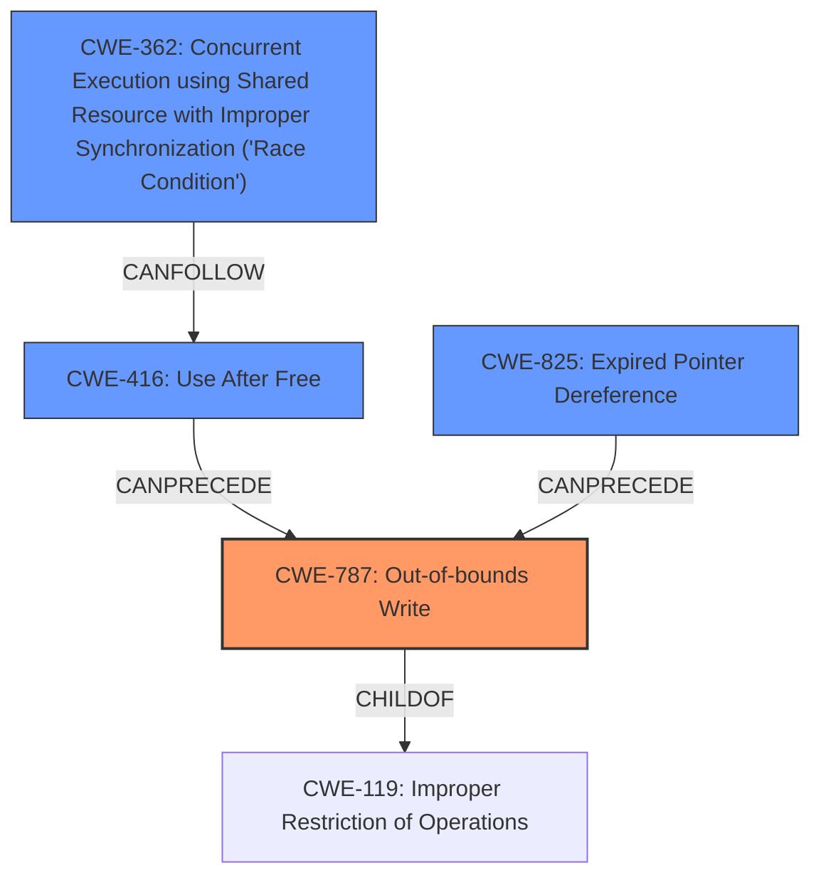

# Raw Analyzer Response for CVE-2022-0330

# Summary
| CWE ID  | CWE Name                                                                                                 | Confidence | CWE Abstraction Level | CWE Vulnerability Mapping Label | CWE-Vulnerability Mapping Notes |
| :-------- | :--------------------------------------------------------------------------------------------------------- | :---------- | :---------------------- | :-------------------------------- | :-------------------------------- |
| CWE-787   | Out-of-bounds Write                                                                                        | 0.9         | Base                    | Primary                           | Allowed                         |
| CWE-825   | Expired Pointer Dereference                                                                                | 0.7         | Base                    | Secondary                         | Allowed                         |
| CWE-416   | Use After Free                                                                                             | 0.6         | Variant                 | Secondary                         | Allowed                         |
| CWE-362   | Concurrent Execution using Shared Resource with Improper Synchronization ('Race Condition') | 0.5         | Class                     | Secondary                         | Allowed-with-Review          |

## Evidence and Confidence

*   **Confidence Score:** 0.8
*   **Evidence Strength:** HIGH

## Relationship Analysis
The primary CWE is CWE-787 **(Out-of-bounds Write)**, which is a child of CWE-119 **(Improper Restriction of Operations within the Bounds of a Memory Buffer)**. The vulnerability involves writing data past the end of the intended buffer, directly corresponding to CWE-787. The secondary CWEs, CWE-825 **(Expired Pointer Dereference)** and CWE-416 **(Use After Free)**, relate to memory management issues that can lead to out-of-bounds writes. CWE-362 **(Concurrent Execution using Shared Resource with Improper Synchronization ('Race Condition'))** is considered due to the potential for concurrent access to GPU memory, which could exacerbate the vulnerability. Abstraction levels were considered to pick the most specific CWE available.

## Vulnerability Chain
The vulnerability chain starts with a **missing TLB flush** upon releasing memory, leading to the possibility of **random memory access** by malicious userspace code. This can result in an **out-of-bounds write (CWE-787)**, potentially preceded by an **expired pointer dereference (CWE-825)** or **use-after-free (CWE-416)** condition. If the GPU memory is accessed concurrently without proper synchronization, a **race condition (CWE-362)** could further exacerbate the issue.

## Summary of Analysis
The initial assessment focused on the **root cause** being **a random memory access flaw** due to a **missing TLB flush**, leading to potential memory corruption. The primary CWE, CWE-787, was selected because the vulnerability description explicitly mentions that the flaw allows a user to run malicious code on the GPU, leading to system crashes or privilege escalation which are impacts of memory corruption. The CVE reference summary highlights that the underlying reason is a missing TLB flush upon releasing memory, allowing access to random memory pages.

The selection of CWE-787 is further supported by the CVE description stating that without an active IOMMU, malicious userspace can gain access to random memory pages. This aligns with the characteristics of an out-of-bounds write.

The graph relationships helped in identifying potential secondary CWEs such as CWE-825 and CWE-416. CWE-362 was considered due to the concurrent nature of GPU operations.

The selected CWEs are at the optimal level of specificity because they directly address the technical details of the vulnerability, particularly the memory corruption aspect and the missing TLB flush. The evidence explicitly supports the out-of-bounds write condition.

Other CWEs considered but not used:
*   CWE-281 **(Improper Preservation of Permissions)**: Permissions are not the primary concern. The core issue is memory corruption.
*   CWE-415 **(Double Free)**: Double freeing is not mentioned in the description.
*   CWE-909 **(Missing Initialization of Resource)** and CWE-908 **(Use of Uninitialized Resource)**: The primary issue is not the lack of initialization but the improper handling of memory release via TLB flush.
*   CWE-123 **(Write-what-where Condition)**: While related, CWE-787 is a more specific description of the actual flaw.
*   CWE-367 **(Time-of-check Time-of-use (TOCTOU) Race Condition)**: While a race condition might be present, TOCTOU is not the main issue.
*   CWE-476 **(NULL Pointer Dereference)**: No mention of NULL pointer dereference.
*   CWE-1284 **(Improper Validation of Specified Quantity in Input)**: Not directly related to quantity validation but memory access control.