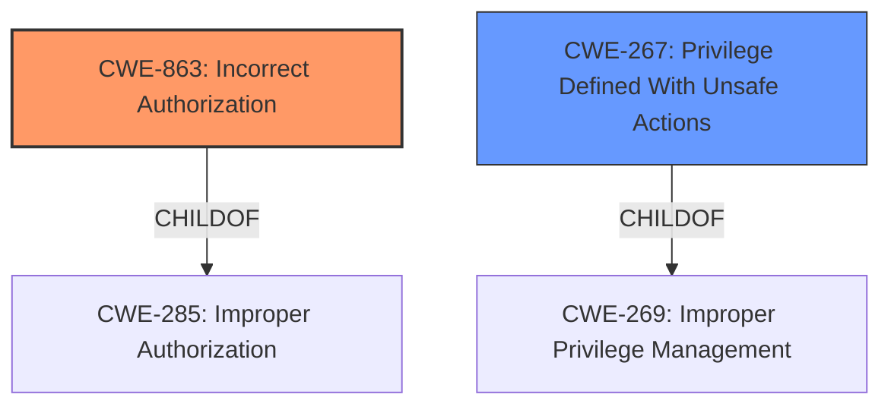

# Raw Analyzer Response for CVE-2022-0333

# Summary
| CWE ID  | CWE Name                                                 | Confidence | CWE Abstraction Level | CWE Vulnerability Mapping Label | CWE-Vulnerability Mapping Notes |
| :-------- | :------------------------------------------------------- | :--------- | :---------------------- | :------------------------------ | :------------------------------ |
| CWE-863   | Incorrect Authorization                                  | 0.9        | Class                   | Primary                         | Allowed-with-Review           |
| CWE-267   | Privilege Defined With Unsafe Actions                  | 0.8        | Base                    | Secondary                       | Allowed                       |

## Evidence and Confidence

*   **Confidence Score:** 0.85
*   **Evidence Strength:** HIGH

## Relationship Analysis
The primary relationship is that CWE-267 is a child of CWE-269 (Improper Privilege Management), showing a hierarchical relationship. This suggests that CWE-267 provides a more specific view of privilege management issues. The retriever results also list related CWEs such as CWE-863 (Incorrect Authorization) and CWE-862 (Missing Authorization), which are children of CWE-285 (Improper Authorization). This indicates that the core issue revolves around authorization and privilege management. CWE-863 and CWE-267 seems like a good fit to define this **weakness**.

## Vulnerability Chain
The vulnerability chain involves:
1.  **Root Cause:** The `calendarmanageentries` capability allows access and modification of all calendar events.
2.  **Weakness:** **Incorrect** authorization or **improper** privilege management.
3.  **Impact:** Unauthorized access and modification of user-level calendar events, leading to privacy violations and data corruption.

## Summary of Analysis
The initial analysis focused on identifying the **root cause** of the vulnerability, which is the **incorrect assignment and enforcement of the `calendarmanageentries` capability**. The "Vulnerability Description Key Phrases" section highlights that "**The calendarmanageentries capability allowed managers to access or modify any calendar event**," which directly points to an authorization issue.

The retriever results suggested several CWEs related to authorization and privilege management. After careful review, CWE-863 (Incorrect Authorization) and CWE-267 (Privilege Defined With Unsafe Actions) were deemed the most appropriate.

CWE-863 describes a scenario where "The product performs an authorization check when an actor attempts to access a resource or perform an action, but it does not correctly perform the check." This aligns with the vulnerability description, as the `calendarmanageentries` capability check was performed, but it incorrectly allowed access to user-level events.

CWE-267 highlights a situation where "A particular privilege, role, capability, or right can be used to perform unsafe actions that were not intended, even when it is assigned to the correct entity." This accurately reflects the fact that the `calendarmanageentries` capability, although assigned to managers, was misused to access user-level events, which was not the intended behavior.

The relationship graph shows that CWE-863 is a child of CWE-285 (Improper Authorization), suggesting that it provides a more specific classification. Similarly, CWE-267 is a child of CWE-269 (Improper Privilege Management), indicating a more targeted focus on privilege-related issues.

The final decision to select CWE-863 and CWE-267 was based on the fact that they accurately represent the **root cause** of the vulnerability and provide a clear understanding of the underlying weakness. These CWEs are at an appropriate level of specificity (Base and Class) and are supported by the evidence provided in the vulnerability description and the retriever results.

CWE-862 (Missing Authorization) was considered but not selected because the issue wasn't a complete lack of authorization checks, but rather an incorrect implementation of the authorization process as the "**calendarmanageentries capability allowed managers to access or modify any calendar event**" when it shouldn't have.

CWE-639 (Authorization Bypass Through User-Controlled Key) was also considered but deemed less relevant as the vulnerability did not involve user-controlled keys or direct object references. The issue stemmed from the incorrect assignment of capabilities, not from manipulating keys to bypass authorization checks.